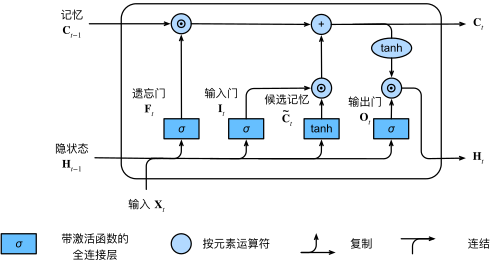

长短期记忆网络的设计比门控循环单元稍微复杂一些， 却比门控循环单元早诞生了近20年。

### 门控记忆元

为了控制记忆元，我们需要许多门。 其中一个门用来从单元中输出条目，我们将其称为*输出门*（output gate）。 另外一个门用来决定何时将数据读入单元，我们将其称为*输入门*（input gate）。 我们还需要一种机制来重置单元的内容，由*遗忘门*（forget gate）来管理， 这种设计的动机与门控循环单元相同， 能够通过专用机制决定什么时候记忆或忽略隐状态中的输入。

当前时间步的输入和前一个时间步的隐状态 作为数据送入长短期记忆网络的门中，如图所示

输入门是 $\mathbf{I}_t \in \mathbb{R}^{n \times h}$， 遗忘门是 $\mathbf{F}_t \in \mathbb{R}^{n \times h}$， 输出门是 $\mathbf{F}_t \in \mathbb{R}^{n \times h}$。 它们的计算方法如下：
$$
\begin{split}\begin{aligned}
\mathbf{I}_t &= \sigma(\mathbf{X}_t \mathbf{W}_{xi} + \mathbf{H}_{t-1} \mathbf{W}_{hi} + \mathbf{b}_i),\\
\mathbf{F}_t &= \sigma(\mathbf{X}_t \mathbf{W}_{xf} + \mathbf{H}_{t-1} \mathbf{W}_{hf} + \mathbf{b}_f),\\
\mathbf{O}_t &= \sigma(\mathbf{X}_t \mathbf{W}_{xo} + \mathbf{H}_{t-1} \mathbf{W}_{ho} + \mathbf{b}_o),
\end{aligned}\end{split}
$$

#### 候选记忆元

候选记忆元为 $\tilde{\mathbf{C}}_t \in \mathbb{R}^{n \times h}$，使用tanh函数作为激活函数，函数的值范围为(−1,1)。 
$$
\tilde{\mathbf{C}}_t = \text{tanh}(\mathbf{X}_t \mathbf{W}_{xc} + \mathbf{H}_{t-1} \mathbf{W}_{hc} + \mathbf{b}_c),
$$

#### 记忆元

输入门$\mathbf{I}_t$控制采用多少来自 $\tilde{\mathbf{C}}_t$ 的新数据， 而遗忘门��控制保留多少过去的 记忆元 $\mathbf{C}_{t-1} \in \mathbb{R}^{n \times h}$ 的内容。 使用按元素乘法，得出
$$
\mathbf{C}_t = \mathbf{F}_t \odot \mathbf{C}_{t-1} + \mathbf{I}_t \odot \tilde{\mathbf{C}}_t.
$$
如果遗忘门始终为1且输入门始终为0， 则过去的记忆元��−1 将随时间被保存并传递到当前时间步。 引入这种设计是为了缓解梯度消失问题， 并更好地捕获序列中的长距离依赖关系。

#### 隐状态

在长短期记忆网络中，它仅仅是记忆元的tanh的门控版本。 这就确保了 $\mathbf{H}_t$ 的值始终在区间(−1,1)内：
$$
\mathbf{H}_t = \mathbf{O}_t \odot \tanh(\mathbf{C}_t).
$$
