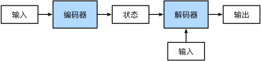

**输入和输出都是长度可变的序列**。 为了处理这种类型的输入和输出， 我们可以设计一个包含两个主要组件的架构： 第一个组件是一个*编码器*（encoder）： 它接受一个长度可变的序列作为输入， 并将其转换为具有**固定形状的编码状态**。 第二个组件是*解码器*（decoder）： 它将固定形状的编码状态映射到长度可变的序列。 这被称为*编码器-解码器*（encoder-decoder）架构

### 编码器

## encoder-decoder模型

End-to-End学习的算法

所谓**encoder-decoder模型，又叫做编码-解码模型。这是一种应用于seq2seq问题的模型**。

那么seq2seq又是什么呢？简单的说，就是根据一个输入序列x，来生成另一个输出序列y。seq2seq有很多的应用，例如翻译，文档摘取，问答系统等等。在翻译中，输入序列是待翻译的文本，输出序列是翻译后的文本；在问答系统中，输入序列是提出的问题，而输出序列是答案

参考资料：https://blog.csdn.net/u014595019/article/details/52826423

### feature disentangle

得到latent representation中不同维度的含义

应用：voice  conversion（变声器）

### discrete representation

中间输出为one-hot vector，可以作为分类

VQVAE

异常检测
