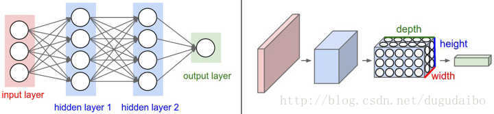
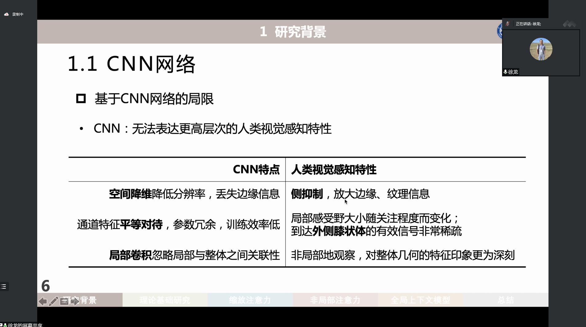

Why CNN

为什么CNN效率比经典的FNN要高？

- 卷积核计算：不需要展平，而是对一个范围内的pattern识别
- filter（权重共享）：filter把数据计算后相当于缩小了，而且filter相当于共享的权重，因为每一个filter都是一样的

如果用全连接处理图像，有三个问题/缺点：

- 图像展开会丢失空间信息
- 参数过多，训练困难
- 大量参数导致过拟合

### 维度

卷积神经网络是三维排列：宽、高和深。这里深不是指网络的深度，而是数据体的第三个维度，如图片中的channel（红绿蓝3个channel）

对于用来分类CIFAR-10中的图像的卷积网络，其最后的输出层的维度是1x1x10，因为在卷积神经网络结构的最后部分将会把全尺寸的图像压缩为包含分类评分的一个向量，**向量是在深度方向排列的**。下面是例子：

### 卷积层

#### 作用

1. 滤波器或者卷积的作用：每个滤波器在空间上比较小，**但是深度和输入数据一致**。
2. 看作神经元的输出：共享参数（使用同一个滤波器）
3. 降低参数数量

#### 感受野

感受野是指滤波器的空间尺寸；

#### 空间排列

3个超参数控制着**输出数据体**的尺寸：深度（depth），步长（stride）和零填充（zero-padding）

1. **输出数据的深度**：和使用的滤波器数量一致，每个滤波器寻找不同的东西；如下图，将沿着深度方向排列，感受野相同的神经元集合称为**深度/纤维**；
2. 步长
3. padding

### 池化

通常在连续的卷积层之间会周期性地插入一个池化层，其作用是**逐渐减低数据体的空间尺寸，缓解卷积层对空间位置的过度敏感性**。一般使用max操作。

### subsampling

用池化来下采样，但目前也有不池化的，用full solution

### 局限性

参考：[卷积神经网络（CNN）详解 - 知乎 (zhihu.com)](https://zhuanlan.zhihu.com/p/47184529)
