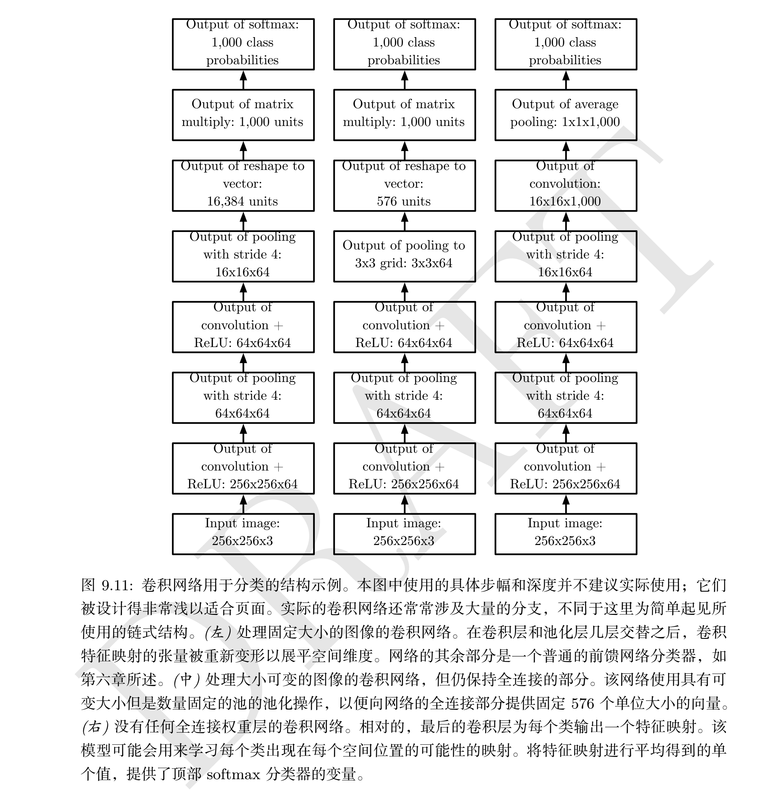

### 1. 动机

卷积运算通过三个重要的思想来帮助改进机器学习系统： `稀疏交互`（sparse interactions）、 `参数共享`（parameter sharing）、 `等变表示`（equivariant representations）。另外，卷积提供了一种处理大小可变的输入的方法。

传统神经网络（FNN）中，参数矩阵的每一个参数都描述了一个输出单元与一个输入单元的交互，即每一个输出单元与每一个输入单元产生交互。而卷积网络具有稀疏交互（也叫稀疏连接或稀疏权重）的特征。**这是通过使核的大小远小于输入的大小来达到的**（局部卷积核）。带来两个好处：存储的参数减少，提高统计效率。同时也减少了计算量。

参数共享是指一个模型中多个函数中使用相同的参数。也可以说是绑定的权重。在卷积网络中，核的每一个元素都作用在输入的每一位置上。参数共享保证了我们只需要学习一个参数集合，而不是对每一位置都需要学习一个单独的参数集合。虽然没有改变**前向传播**的运行时间，但降低了存储需求。

对于卷积，参数共享的特殊形式使得网络层具有对平移`等变`(equivariance)的性质。即如果一个函数满足输入改变，输出也以同样的方式改变这一性质。如果函数 $f(x)$ 与 $g(x)$ 满足 $f(g(x))=g(f(x))$，就说 $f(x)$对 变换 $g$ 具有等变性。卷积产生了一个 2 维映射来表明某些特征在输入中出现的位置。如果我们移动输入中的对象，它的表示也会在输出中移动同样的量。当处理多个输入位置时，一些作用在邻居像素的函数是很
有用的。例如在处理图像时，在卷积网络的第一层进行图像的边缘检测是很有用的  

### 2. 池化

池化函数使用某一位置的相邻输出的总体统计特征来代替网络在该位置的输出。例如， 最大池化（max pooling）函数 (Zhou and Chellappa, 1988) 给出相邻矩形区域内的最大值。其他常用的池化函数包括相邻矩形区域内的平均值、 L2 范数以及基于据中心像素距离的加权平均函数  

不管采用什么样的池化函数，当输入作出少量平移时， 池化能够帮助输入的表示近似 不变（invariant）。对于平移的不变性是指当我们对输入进行少量平移时，经过池化函数后的大多数输出并不会发生改变。 

局部平移不变性是一个很有用的性质，尤其是当我们关心某个特征是否出现而不关心它出现的具体位置时。  

**使用池化可以看作是增加了一个无限强的先验：这一层学得的函数必须具有对少量平移的不变性。当这个假设成立时， 池化可以极大地提高网络的统计效率。**  

### 卷积与池化作为一种无限强的先验

先验被认为是强或者弱取决于先验中概率密度的集中程度。弱先验具有较高的熵值，例如方差很大的高斯分布。这样的先验允许数据对于参数的改变具有或多或少的自由性。强先验具有较低的熵值，例如方差很小的高斯分布。这样的先验在决定参数最终取值时起着更加积极的作用。  

卷积可以认为是全连接网络中的参数引入了一个无限强的先验概率分布（接受域意外权重全为零），这个先验说明：该层学得的函数只包含局部连接关系且对平移具有等变性。类似的，使用池化也是一个无限强的先验：每个单元都具有少量平移的不变性。

卷积核池化可能导致欠拟合。与其他先验类似，之哟当其假设合理且正确时才有用。如果一项任务依赖于保存精确的空间信息，那么在所有的特征上使用池化将会增大训练误差。

一些卷积网络结构 (Szegedy et al., 2014a) 为了既获得具有较高不变性的特征又获得当平移不变性不
合理时不会导致欠拟合的特征，被设计成在一些通道上使用池化而在另一些通道上不使用。当一项任务涉及到要对输入中**相隔较远的信息进行合并**时，那么卷积所利用的先验可能就不正确了。  

比较卷积网络的统计学习表现时，之恶能以基准中其他卷积模型作为比较对象。对于图像数据集，有些基准时针对那些具有`置换不变性`且必须通过学习发现`拓扑结构`的模型，还有一些是针对模型设计者将空间关系的知识植入了它们的模型。  

### 4. 基本卷积函数的变体

### 5. 结构化输出

卷积神经网络可以用于输出高维的结构化对象，而不仅仅是预测分类任务的类标签或回归任务的实数值。通常这个对象只是一个张量，由标准卷积层产生。例如，模型可以产生张量 $\boldsymbol{S}$，其中 $S_{i,j,k}$ 是网络的输入像素 $(j,k)$ 属于类 $i$ 的概率。这允许模型标记图像中的每个像素，并绘制沿着单个对象轮廓的精确掩模。

但是由于使用了池化，输出对象的维数可能少于输入。为了产生与输入大小相似的输出映射，可以

- 避免把池化放在一起 (Jain et al., 2007)。 
- 单纯产生一章低分辨率的标签网格(Pinheiro and Collobert, 2014, 2015)
- 使用单位步幅的池化（输出大小不变）

pass

### 6. 数据类型

卷积网络的一个优点是它们还可以处理**具有可变的空间尺度的输入**。这些类型的输入不能用传统的基于矩阵乘法的神经网络来表示。

比如，考虑一组图像的集合，每个图像具有不同的高度和宽度。固定大小的权重矩阵难以对这样的输入建模。但卷积可以直接应用，核一句输入的大小被简单地使用不同次，且输出也相应地缩放。

在其他情况下，网络必须产生一些固定大小地输出。如想要为整个图像指定单个类标签。此时需要额外地设计步骤，如插入一个池化层，池化区域地大小要与输入的大小成比例，以便保持固定数量的池化输出。

### 7. 高效的卷积算法

卷积等效于使用傅立叶变换将输入与核都转换到频域、执行两个信号的逐点相乘，再使用傅立叶逆变换转换回时域。对于某些问题的规模，这种算法可能比离散卷积的朴素实现更快。  

### 8. 随机或无监督的特征

减少卷积网络训练成本的一种方式是使用那些不是由监督方式训练得到的特征。

有三种策略可以不通过监督训练而得到**卷积核**：

- 简单地随机初始化它们
- 手动设计，如设置每个核在一个特定的方向或尺度来检测边缘
- 使用无监督的标准来学习核，如 Coastes et al. (2011)将 $k$ 均值聚类算法应用于小图像块，然后使用每个学得的中心作为卷积核。

使用无监督的标准来学习特征，使得它们能够与位于网络结构顶层的分类层相互独立地确定。然后只需提取一次全部训练集的特征，构造用于最后一层的新训练集。假设最后一层类似逻辑回归或者 SVM，那么学习最后一层通常是凸优化问题。（就是固定前面层，只训练最后一层？）

`随机过滤器`通常在卷积网络中表现良好。Jarrett et al. (2009b); Saxe et al. (2011); Pinto et al. (2011); Cox and Pinto (2011)。 Saxe et al. (2011) 说明，由卷积和随后的池化组成的层，当赋予随机权重时，自然地变得具有**频率选择性和平移不变性**。他们认为这提供了一种廉价的方法来选择卷积网络的结构：首先通过仅训练最后一层来评估几个卷积网络结构的性能，然后选择最好的结构并使用更昂贵的方法来训练整个网络。

一个中间方法是学习特征，使用贪心逐层预训练。