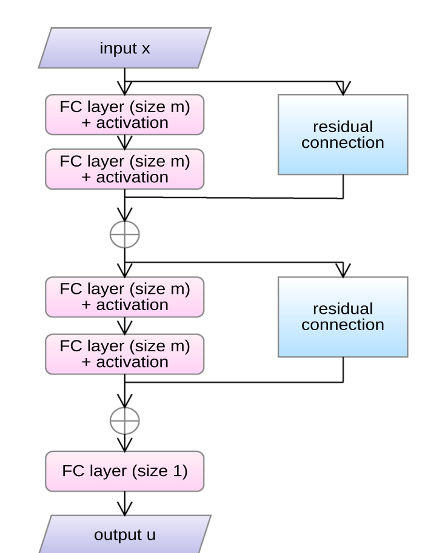
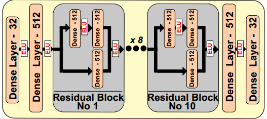
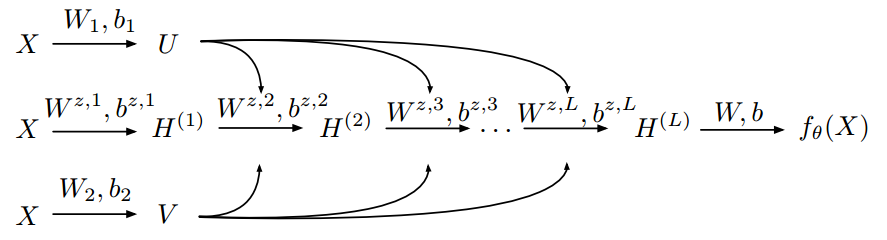

### 1. 经典ResNet

He, K.M., Zhang, X.Y., Ren, S.Q., Sun, J.: Deep residual learning for image recognition. In: 2016
IEEE Conference on Computer Vision and Pattern Recognition (CVPR), pp. 770–778 (2016). https://
doi.org/10.1109/CVPR.2016.90  

### 2. 修改款

feed-forward network consisting of a series of residual blocks with fully-connected layers  

F. Huang, J.T. Ash, J. Langford, and R.E. Schapire, 2017, Learning deep resnet blocks sequentially
using boosting theory. CoRR abs/1706.04964.  

### 3. 修改款2

Wang et al., Understanding and mitigating gradient pathologies in physics-informed neural networks, 2020