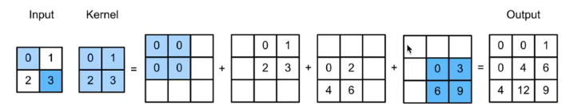
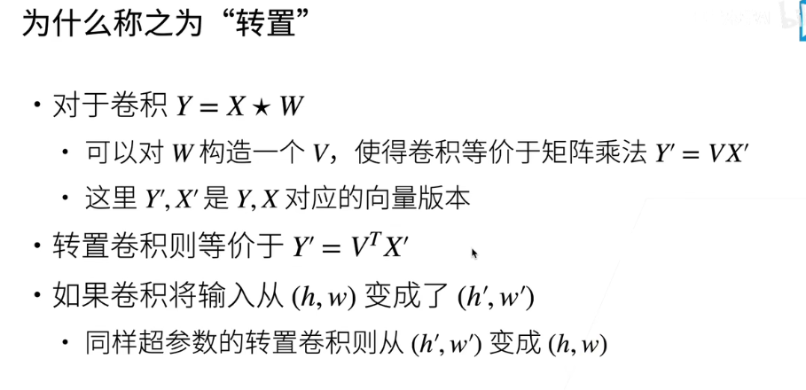

### 功能

- 卷积无法增大输入的高和宽
- 转置卷积可以实现

输入的每个元素和核乘积，填入输入元素的位置；最后加起来

### 为什么称之为转置

#### 参考

[47 转置卷积【动手学深度学习v2】_哔哩哔哩_bilibili](https://www.bilibili.com/video/BV17o4y1X7Jn/?spm_id_from=333.999.0.0&vd_source=51835ba198b79c5277a5fcadc11bd9ff)