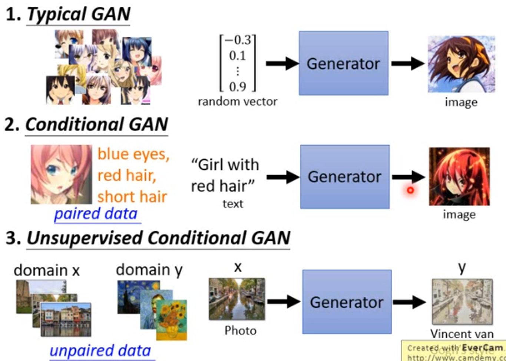
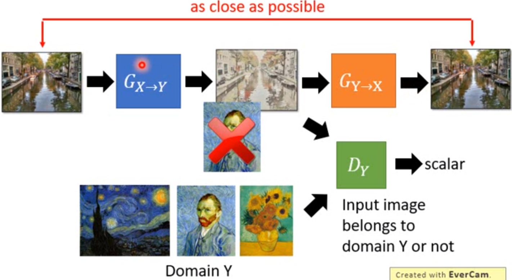
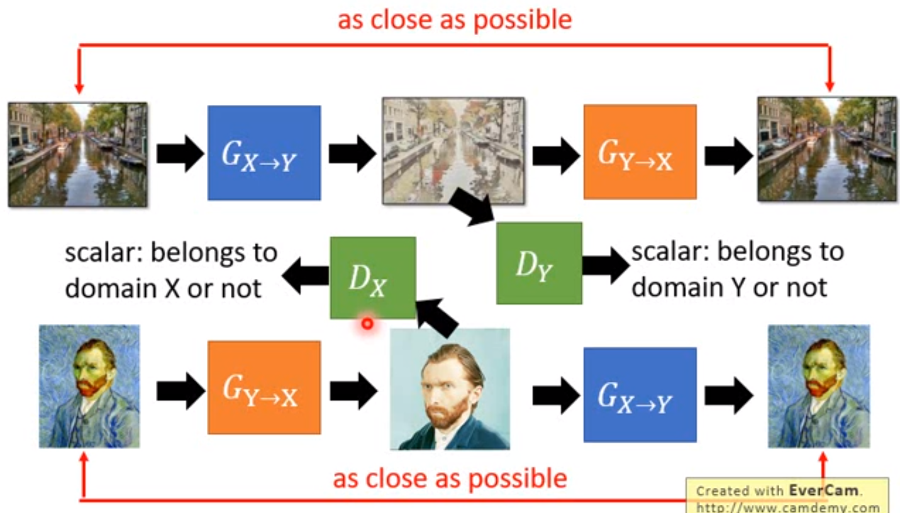

## 综述

### 三种形态

<figure align="center">  三类GAN
     </figure>

### 基本款

随机产生；难以训练

变为WGAN：

### Conditional GAN

有目的输出；e.g.，给一段文字，产生对应的图片；

#### text-to-image

传统监督学习可以实现：效果不太好；因为一类图片有很多，最终会得到诸多图片的平均

输入有两个：图片+文字

评价：文字与图片匹配度 + 图片评价

**注意：需要负样本**（好图片配不对应的文字）

#### sound-to-image

训练数据：直接从video中抽取声音和对应图片

#### image-to-text

### unsupervised conditional GAN

影像风格转换；

#### cycle GAN

增加一个generator $G_{Y\rightarrow X}$，可以还原输入；

也可以反过来处理

#### 文字改写

负面变为正面

#### speech recognition

传统监督学习需要大量语音与文字的训练资料

希望可以用非监督学习。

[更多 GAN 详细介绍](../GAN/GAN基本原理.md)

