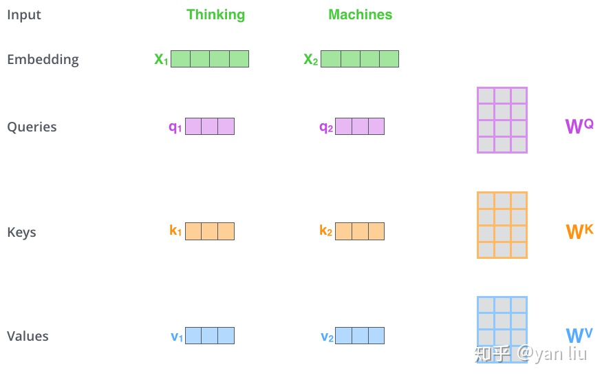
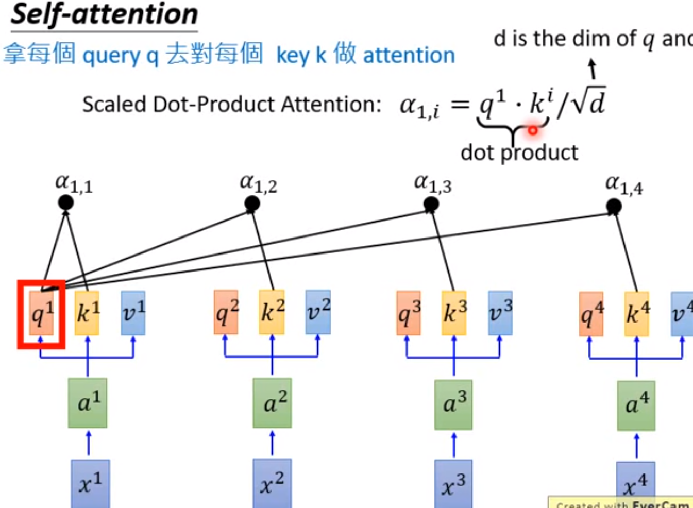
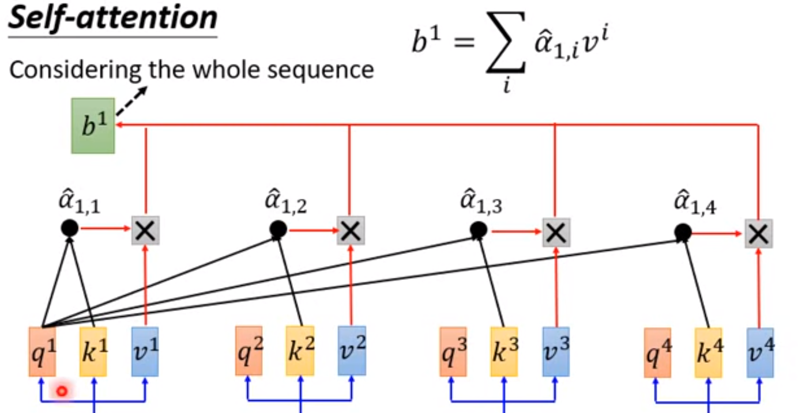
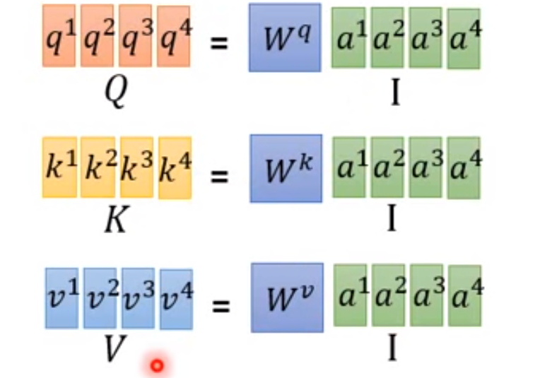
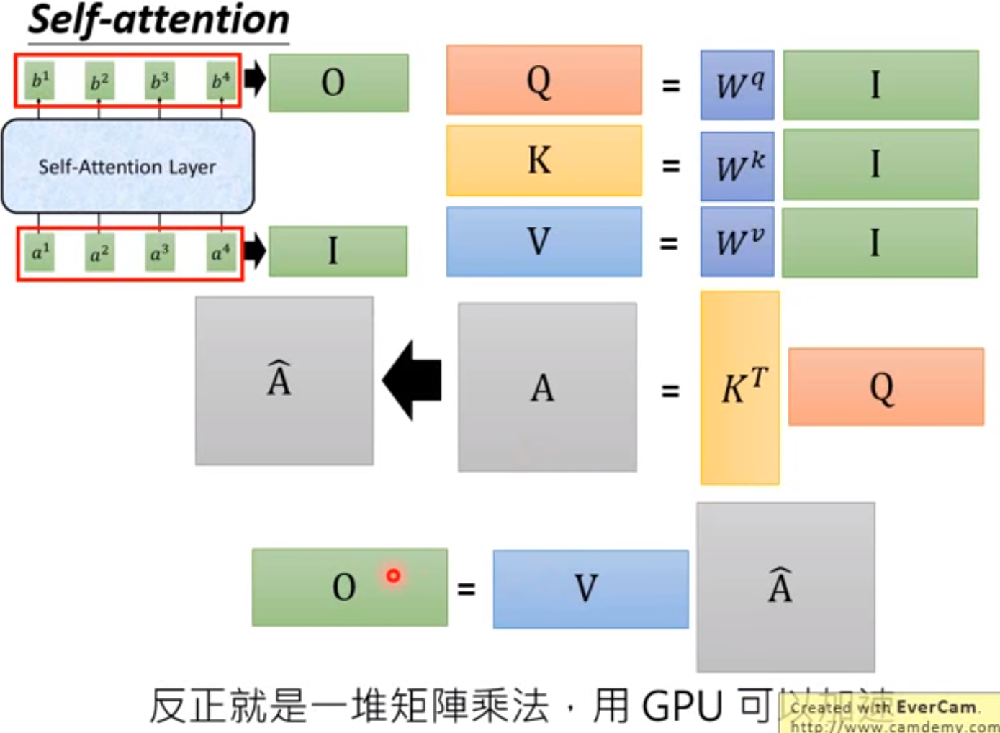
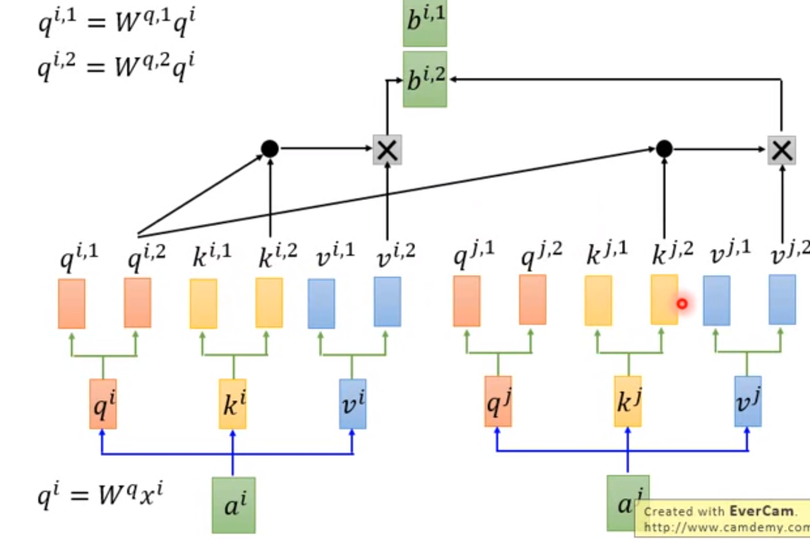

## 注意力机制

作者采用Attention机制的原因是考虑到RNN（或者LSTM，GRU等）的计算限制为是顺序的，也就是说RNN相关算法只能从左向右依次计算或者从右向左依次计算，这种机制带来了两个问题：

1. 时间片 ![[公式]](https://www.zhihu.com/equation?tex=t) 的计算依赖 ![[公式]](https://www.zhihu.com/equation?tex=t-1) 时刻的计算结果，这样限制了模型的并行能力；
2. 顺序计算的过程中信息会丢失，尽管LSTM等门机制的结构一定程度上缓解了长期依赖的问题，但是对于特别长期的依赖现象,LSTM依旧无能为力

Transformer的提出解决了上面两个问题，首先它使用了Attention机制，将序列中的任意两个位置之间的距离是缩小为一个常量；其次它不是类似RNN的顺序结构，因此具有更好的并行性，符合现有的GPU框架

在每个encoder中，数据线经过`self-attention`模块，Q、K、V运算得到Z，

接着被送到FNN层

Decoder的结构如图5所示，它和encoder的不同之处在于Decoder多了一个Encoder-Decoder Attention，两个Attention分别用于计算输入和输出的权值：

1. Self-Attention：**当前翻译**和已经**翻译的前文**之间的关系；
2. Encoder-Decnoder Attention：**当前翻译**和编码的特征向量之间的关系。

在解码器中，Transformer block比编码器中多了个encoder-cecoder attention。在encoder-decoder attention中，Q来自于解码器的上一个输出，K和 V 则来自于与编码器的输出。

由于在机器翻译中，**解码过程是一个顺序操作的过程**，也就是当解码第 ![[公式]](https://www.zhihu.com/equation?tex=k) 个特征向量时，我们只能看到第 ![[公式]](https://www.zhihu.com/equation?tex=k-1) 及其之前的解码结果，论文中把这种情况下的multi-head attention叫做**masked multi-head attention。**

### 2. 输入编码

首先通过Word2Vec等词嵌入方法将输入语料转化成特征向量，论文中使用的词嵌入的维度为 $d_{model}=512$。

### 3. 注意力细节

q、k、v 通过嵌入向量x乘以三个不同权值矩阵$W^Q, W^K, W^V$，这三个矩阵尺寸相同。

Attention的计算方法，整个过程可以分成7步：

1. 如上文，将输入单词转化成嵌入向量；
2. 根据嵌入向量得到 q, k, v三个向量；
3. 为每个向量计算一个score： $score=q\cdot k$​；
4. 为了梯度的稳定，Transformer使用了score归一化，
5. 对score施以softmax激活函数；
6. softmax点乘Value值 v ，得到加权的每个输入向量的评分 v
7. 相加之后得到最终的输出结果 ![[公式]](https://www.zhihu.com/equation?tex=z) ) 。

<figure align="center">  x为输入，a被embedding，a与权重系数w相乘得到q、k、v  </figure>

<figure align="center">  所以每一个输出（b1)与所有的输入都有关系  </figure>

 

#### 总结

### 4. 多头

## 位置编码

截止目前为止，我们介绍的Transformer模型并没有捕捉顺序序列的能力，也就是说无论句子的结构怎么打乱，Transformer都会得到类似的结果。换句话说，Transformer只是一个功能更强大的词袋模型而已。

为了解决这个问题，论文中在编码词向量时引入了位置编码（Position Embedding）的特征。具体地说，位置编码会在词向量中加入了单词的位置信息，这样Transformer就能区分不同位置的单词了。

作者这么设计的原因是考虑到在NLP任务中，除了单词的绝对位置，单词的相对位置也非常重要

[详解Transformer （Attention Is All You Need） - 知乎 (zhihu.com)](https://zhuanlan.zhihu.com/p/48508221)

[The Illustrated Transformer – Jay Alammar – Visualizing machine learning one concept at a time. (jalammar.github.io)

[[Transformer - YouTube](https://www.youtube.com/watch?v=ugWDIIOHtPA&list=PLJV_el3uVTsOK_ZK5L0Iv_EQoL1JefRL4&index=60)](http://jalammar.github.io/illustrated-transformer/)

## 为什么需要多头

可以类比CNN中同时使用**多个滤波器**的作用，直观上讲，多头的注意力**有助于网络捕捉到更丰富的特征/信息。**

论文中是这么说的：

> Multi-head attention allows the model to jointly attend to information from **different \*representation subspaces\*** at different positions.

[为什么Transformer 需要进行 Multi-head Attention？ - TniL的回答 - 知乎](https://www.zhihu.com/question/341222779/answer/793334421)

