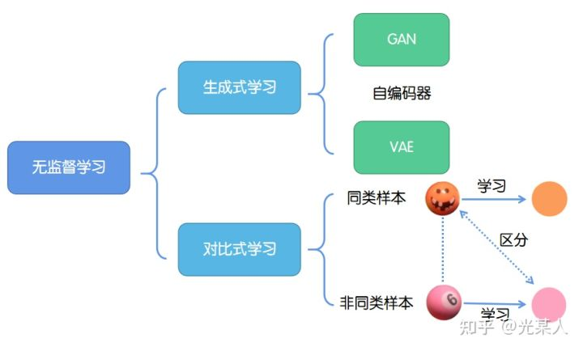

## 1. 介绍

对比式学习着重于学习同类实例之间的共同特征，区分非同类实例之间的不同之处。

与生成式学习比较，对比式学习不需要关注实例上繁琐的细节，只需要在抽象语义级别的特征空间上学会对数据的区分即可，因此模型以及其优化变得更加简单，且泛化能力更强。

### 字典学习

降维方法的一种，把样本Y用字典(key)X和查询方法（query）组成

$$Y=DX$$

## 2. Moco

2020 最佳CVPR论文提名 （一作 何凯明）

建立中间模型； 容易迁移到下游任务。 

可以随着数据集增大，性能没有上限 

#### 以个体识别任务为例

query和key是不同视角的同一个东西， 