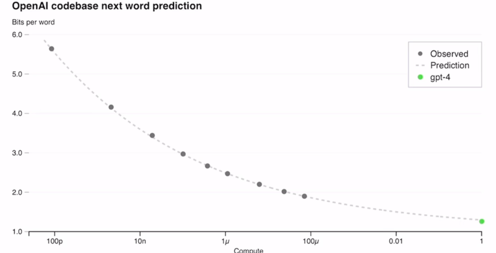

### 模型可以使用工具

Toolformer：

### 最新新模型

LLaMA

Visual ChatGPT：可处理图件

GPT-4：多模态（宣称可以处理视频）

GigaGAN：1 billion parameters；

Alpaca：7 Billion v.s. chatGPT （175 Billion）

Claude：主打安全性

midjourney：文生图

CPT-copilot：办公工具

## GPT-4技术文档总结

### 简介

输入：文字或图片；输出：文字。（注意不能生成图片）

去年8月训练完成，后续进行测试；

代码超级强；

### 测试结果

可通过律师考试；

稳定：准确预测模型的结果；可预测的扩大预测，即小模型的结果可以和大模型的一致（在语言模型中比较难做到）

### 视觉输入

可以读图、OCR

### 可控性（steerability）

systerm message功能，可以使用不同的”人格“，比如用不同口气chat；

### Limitations

不完全可靠；

参考：

[GPT-4论文精读【论文精读·53】_哔哩哔哩_bilibili](https://www.bilibili.com/video/BV1vM4y1U7b5/?spm_id_from=333.1007.top_right_bar_window_dynamic.content.click&vd_source=51835ba198b79c5277a5fcadc11bd9ff)