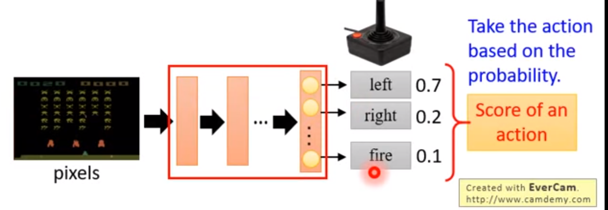
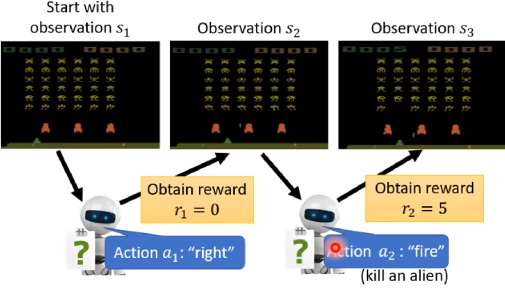
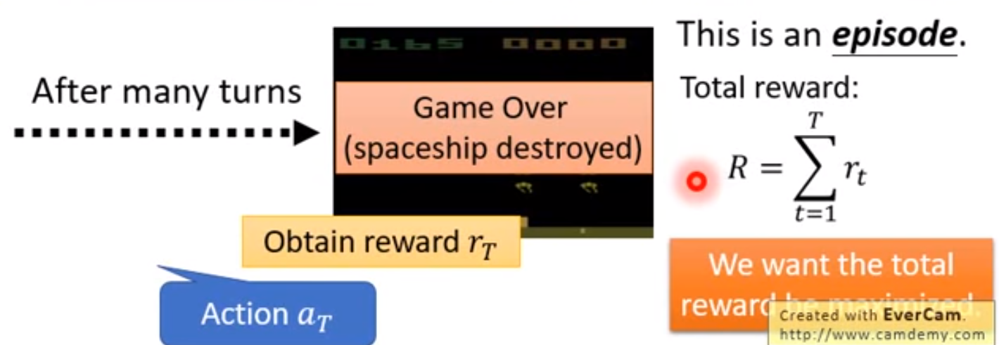
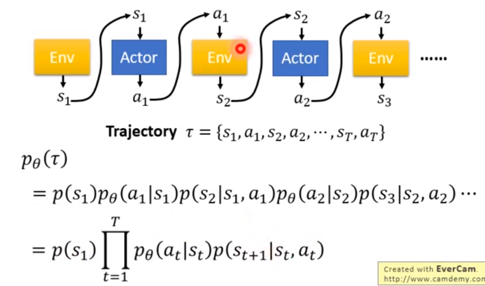
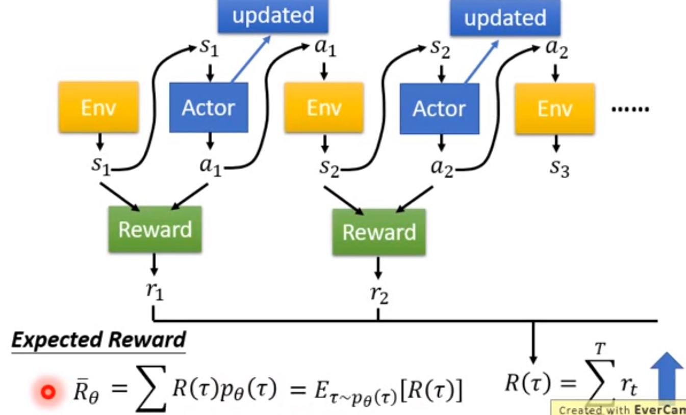
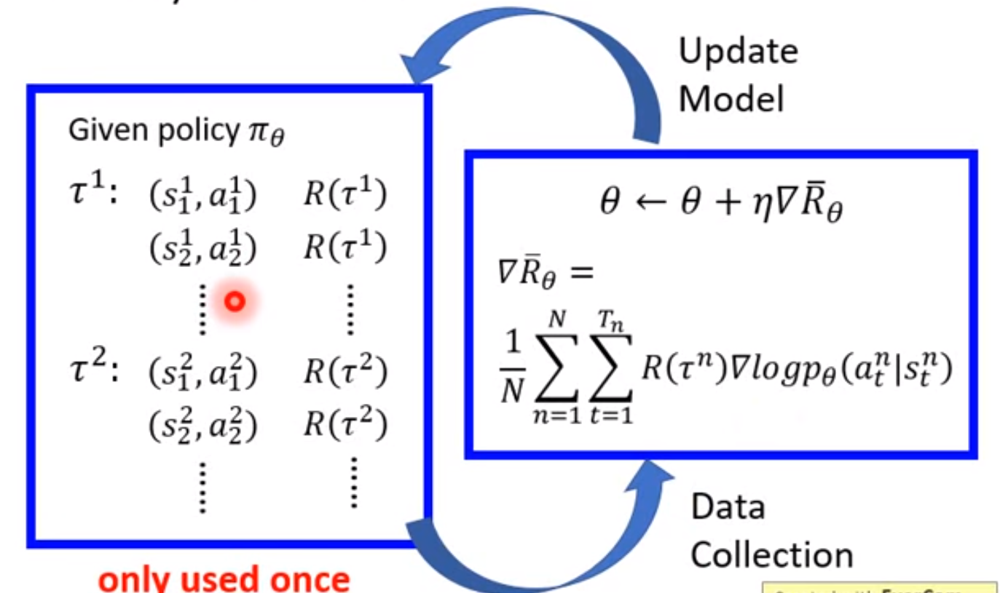

Proximal policy optimization

### 基础部件

- actor：行动
- environment：环境，对手行动 （无法控制）
- reward function：奖励（ 无法控制）

### policy of actor

policy $\pi$ is a network with parameter $\boldsymbol{\theta}$

- 输入：机器观察到的，用矢量或矩阵表示
- 输出：机器采取的对应的行为

### 范例

计算reward

## policy gradient

$$
\bar{R}_\theta =\sum_\tau R(\tau)p_\theta(\tau)
$$

$\bar{R}$为$R$的期望，$p$为概率。其梯度为：
$$
\nabla \bar{R}_\theta =\sum_\tau R(\tau)\nabla p_\theta(\tau) = \sum_\tau R(\tau)p_\theta(\tau)\frac{\nabla p_\theta(\tau)}{p_\theta(\tau)}
$$
其中，$R(\tau)$是不可微的。

已知,$$\nabla f(x)=f(x)\nabla \log f(X)$$，所以
$$
\nabla \bar{R}_\theta = \sum_\tau R(\tau)p_\theta(\tau)\nabla \log p_\theta(\tau)\\
= E_{\tau\sim p_\theta(\tau)} [R(\tau)\nabla \log p_\theta(\tau)] \approx \frac{1}{N}\sum_{n=1}^N R(\tau)\nabla \log p_\theta(\tau)\\
=\frac{1}{N}\sum_{n=1}^N \sum_{t=1}^{T_n} R(\tau^n)\nabla \log p_\theta(a^n_t|s^n_t)
$$
上式中，期望值用多次采样计算平均值的方法来计算

和一般分类问题比，相当于乘了一个权重系数$R(\tau^n)$，且这个系数一般为正。

参考：

[DRL Lecture 1: Policy Gradient (Review) - YouTube](https://www.youtube.com/watch?v=z95ZYgPgXOY&list=PLJV_el3uVTsODxQFgzMzPLa16h6B8kWM_)