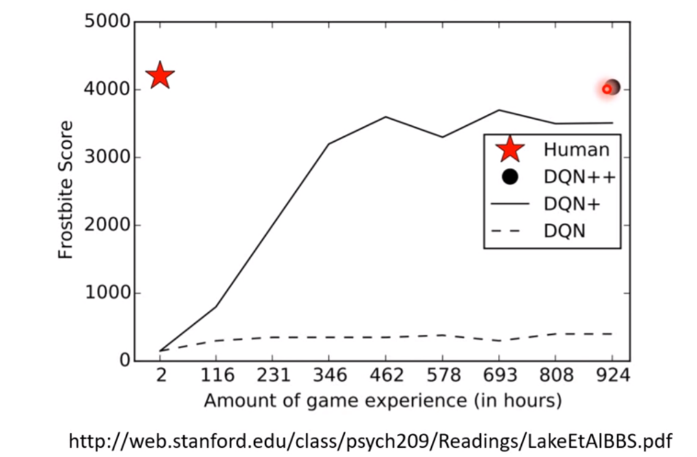
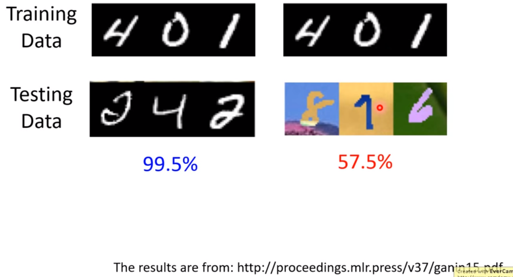

### 1. 机器知道自己不了解

### 2. 为什么“我知道”

### 3. 机器错觉

adversarial attack，需要对抗训练

### 4. 终身学习（life-long learning）

一个模型学习一个任务

### 5. 学习如何学习

meta-learning

### 6. 训练资料数量

few-shot learning

### 7. 强化学习（reinforcement learning）

对于简单游戏

### 7. 模型压缩

- 网络缩小
- 参数二值化：减少存储

### 8. 数据假设

训练和测试资料假定都是独立同分布；

参考：

[The Next Step for Machine Learning - YouTube](https://www.youtube.com/watch?v=XnyM3-xtxHs&list=PLJV_el3uVTsOK_ZK5L0Iv_EQoL1JefRL4)