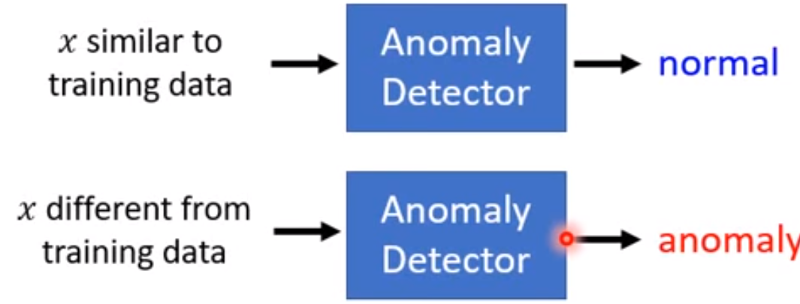
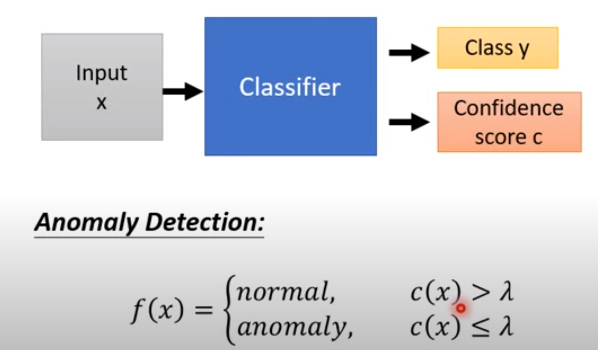

### 问题描述

给定一个训练集 {$x^1,x^2,\dots,x^N$}，判断输入的 $x$ **是否与训练数据类似**。

### 应用

- 分辨正常刷卡和盗刷
- 癌细胞

### 二分器？

正常数据算一类，异常算一类；

问题在于：异常类难以定义？异常数据难以搜集？

### 类别

- 既有训练数据 $x$，也有对应的标签 $y$， 但是没有“unkonwn”标签；open-set recognition

- 没有label
  - 所有资料都是正常的（clean）
  - 少部分资料有问题（polluted）

confidence如何给分？输出是一个分布，可以计算熵；

### confidence estimation

之前：得到一个分类器，再计算信心分

现在：直接输出信心分

训练集：只有正集

development set：既有正集 也有其他，用于决定 $\lambda$

测试集：

结果：异常的分数也可能很高，但还是比不上正常的图片。

#### 评估

cost Table:

|   cost   | Anomaly     | Normal     |
| ----      | ----       | ---- |
|   Detected   |   0     |   100   |
|  Not detected |  1     |   0   |

<table>评价系统，如果异常未被检测到扣1分，如果正常的错判扣100分</table>

不同的任务可以给定不同的cost table

### 可能的问题

学到某种特有特征（泛化性能问题？），但是异常数据可能难以搜集。

方案：generative model。
