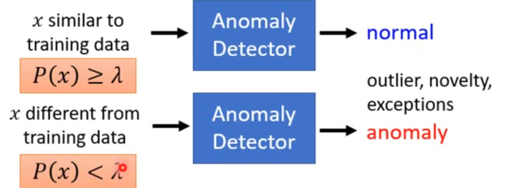
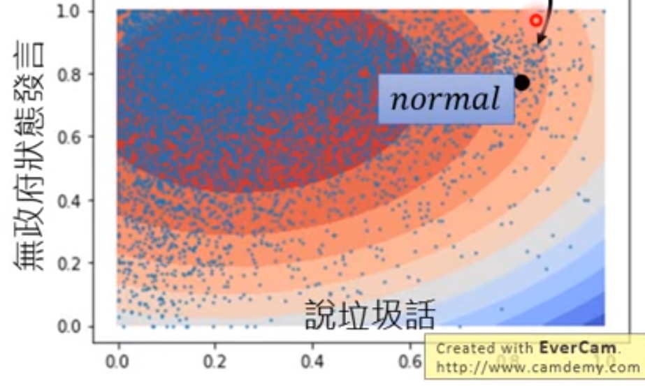

### Generative  model

没有标签数据，寻找多数派（正常操作）和少数派（异常操作）

给定一组训练集： {$x^1,x^2,\dots,x^N$}，找到输入的 $x$ 与训练数据是否类似

、

根据数据得到一个分布 $P(x)$

  

寻找最大似然函数 $f_\theta(x)$，即所想要的密度概率函数。
$$
L(\theta) = f_\theta(x^1)f_\theta(x^2)\cdots f_\theta(x^N)\\
\theta^* = \arg \max_\theta L(\theta)
$$
最常用的是多元高斯分布：
$$
{\displaystyle f_{\mathbf {x} }(x_{1},\ldots ,x_{k})={\frac {1}{\sqrt {(2\pi )^{k}|{\boldsymbol {\Sigma }}|}}}\mathrm {e} ^{-{\frac {1}{2}}({\mathbf {x} }-{\boldsymbol {\mu }})^{\mathrm {T} }{\boldsymbol {\Sigma }}^{-1}({\mathbf {x} }-{\boldsymbol {\mu }})},}
$$
均值 $\mu$ 和协方差 $\Sigma$。
$$
L(\mu,\Sigma) = f_{\mu,\Sigma}(x^1)f_{\mu,\Sigma}(x^2)\cdots f_{\mu,\Sigma}(x^N)\\
\mu^*,\Sigma^* = \arg \max_{{\mu,\Sigma}} L(\mu,\Sigma)
$$
上述两个参数可以直接代入公式计算。

为什么习惯使用高斯分布？

很常用，可以把数据变化为类似这种分布。

最终得到的 $f(x)>\lambda$ 的值的范围

### Auto-encoder

