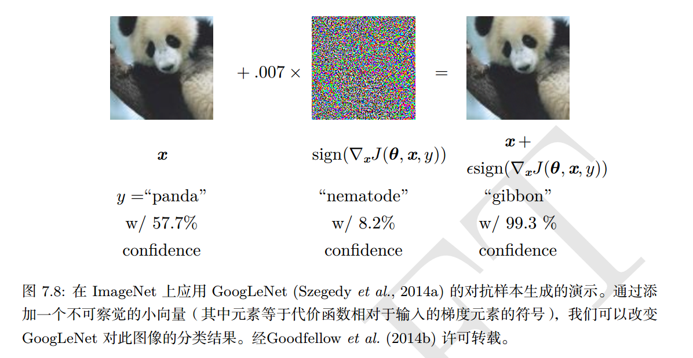

Szegedy et al. (2014b) 发现，在精度达到人类水平的神经网络上通过优化过程故意构造数据点，其上的误差率接近100%，模型在这个输入点 x′ 的输出与附近的数据点 x 非常不同。在许多情况下， x′ 与 x 非常近似，人类观察者不会察觉原始样本和 对抗样本（adversarial example）之间的差异，但是网络会作出非常不同的预测。  

在正则化背景下，通过`对抗训练`减少原有独立同部分的测试集的错误率——在对抗扰动的训练集样本上训练网络。

原因在于神经网络主要是基于线性块构建的。如果用 $\epsilon$ 改变每个输入，那么权重为 $\boldsymbol{w}$ 的线性函数就会改变 $\epsilon ||\boldsymbol{w}||_1$之多，如果 $\boldsymbol{w}$ 是高维那么这个改变量会很大。

对抗训练通过鼓励网络在训练数据附近的局部区域恒定来限制这一高度敏感的局部线性行为。这可以被看作是一种明确地向监督神经网络引入局部恒定先验的方法。  

对抗样本也提供了一种实现半监督学习的方法

pass

