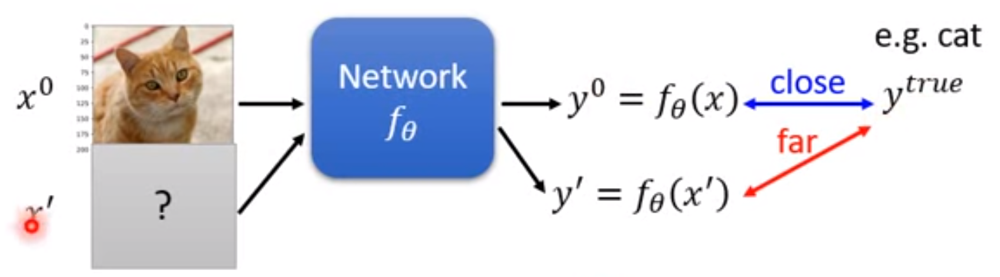
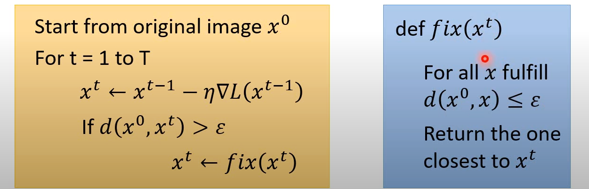
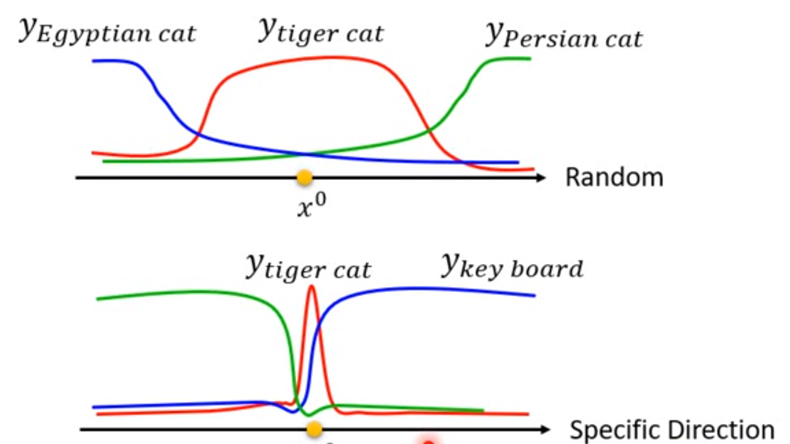
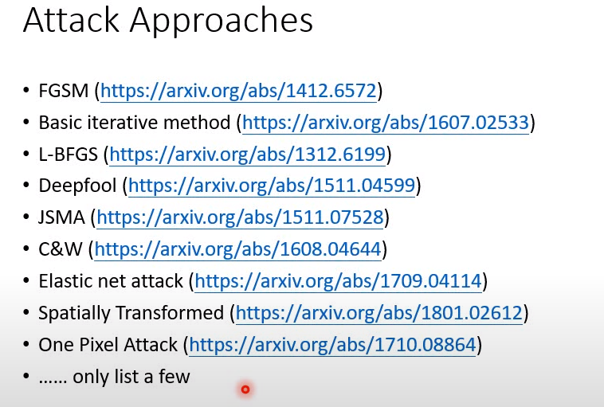

传统的训练： $L_{train}(\theta)=C(y^0,y^{true)})$，此时 $x$ 是固定的

### 无目标攻击

$L(x')=-C(y',y^{true})$，此时 $\theta$ 是固定不变的，需要找到一个好的 $x'$ 使他的输出离真值很远。

### 目标攻击

$L(x')=-C(y',y^{true})+C(y',y^{false}) \quad s.t.\quad d(x^0,x')\le\epsilon$

### 定义constraint

二范数：

无穷范数：

### 如何对抗

$$
x^* = \arg \min_{d(x^0,x')\le\epsilon} L(x')
$$

#### Gradient Descent

### 加入噪声

不同噪声产生的结果不同。

- 随机噪声可以较好地分辨
- 特殊噪声较难

