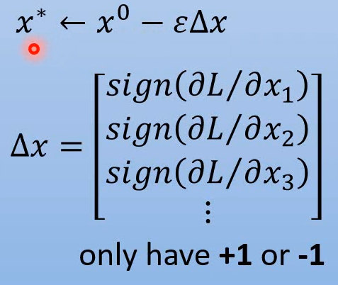
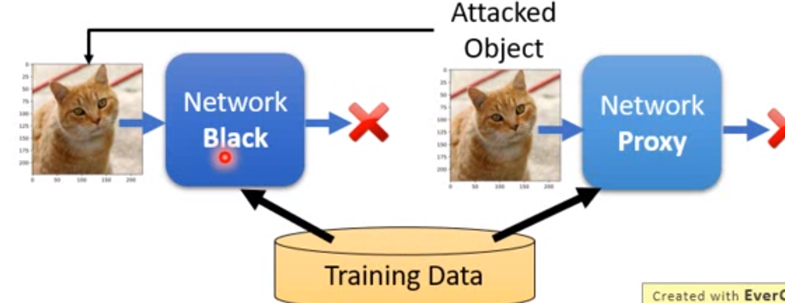
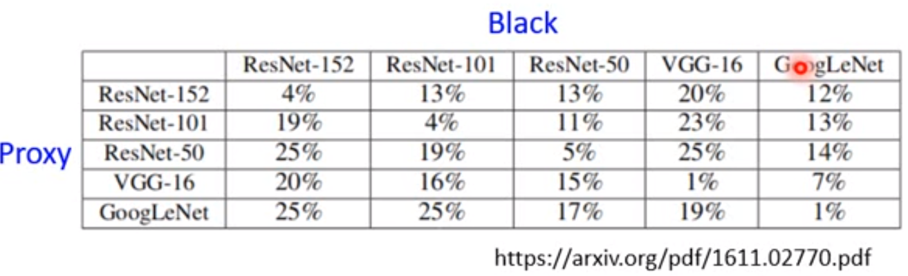

### fast gradient sign method

非常简单，虽然不一定非常强大

学习率大，只需要一次更即可找到想要的 $x^0$

### white box v.s. black box

- 白箱：已知 $\theta$ 寻找 $x'$
- 黑箱：知道training data，自己训练一个network proxy，该模型无法判定的图片，在black box里大概里也无法判定。

存在通用噪声，使很多图片无法被判定。