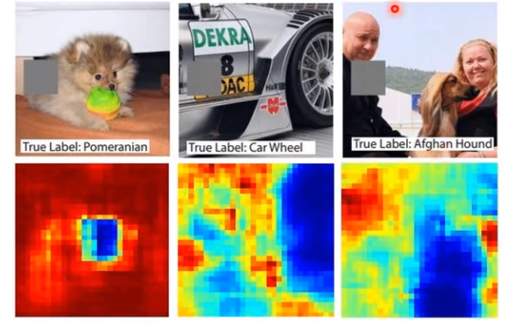
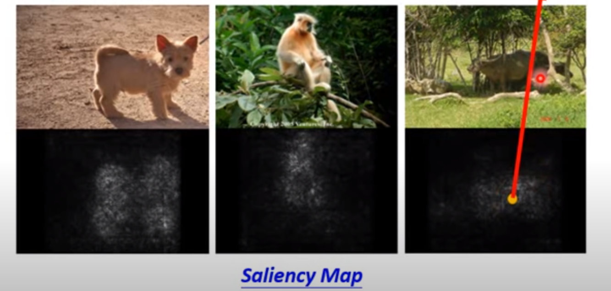
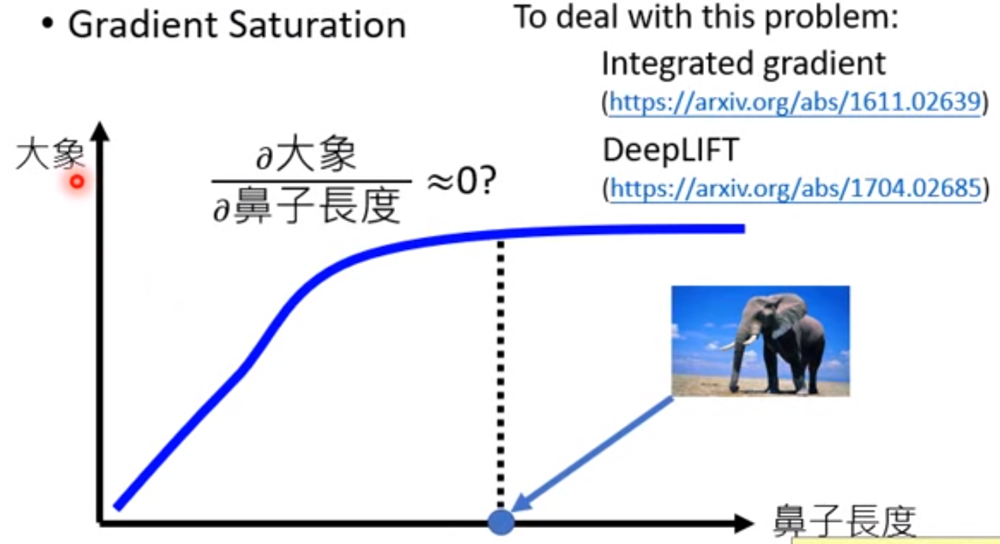
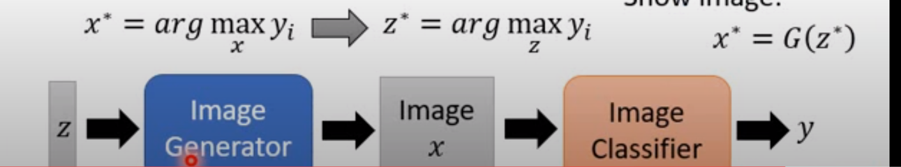
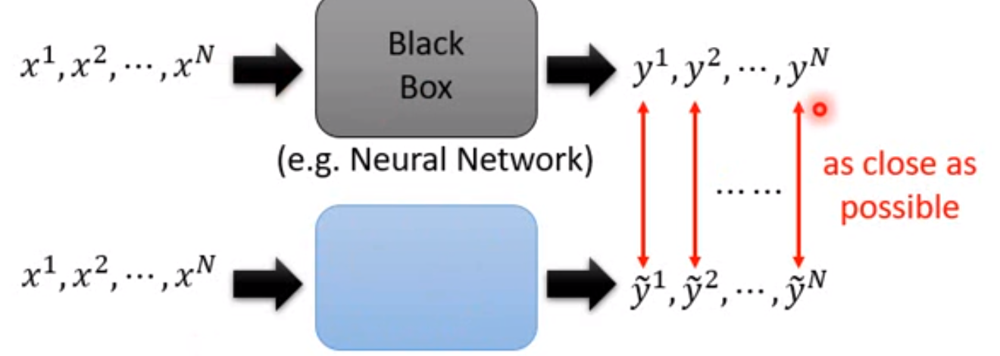
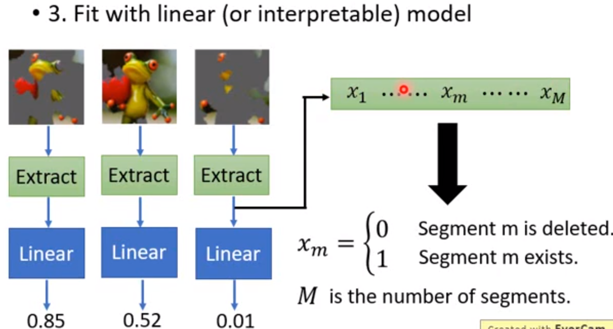
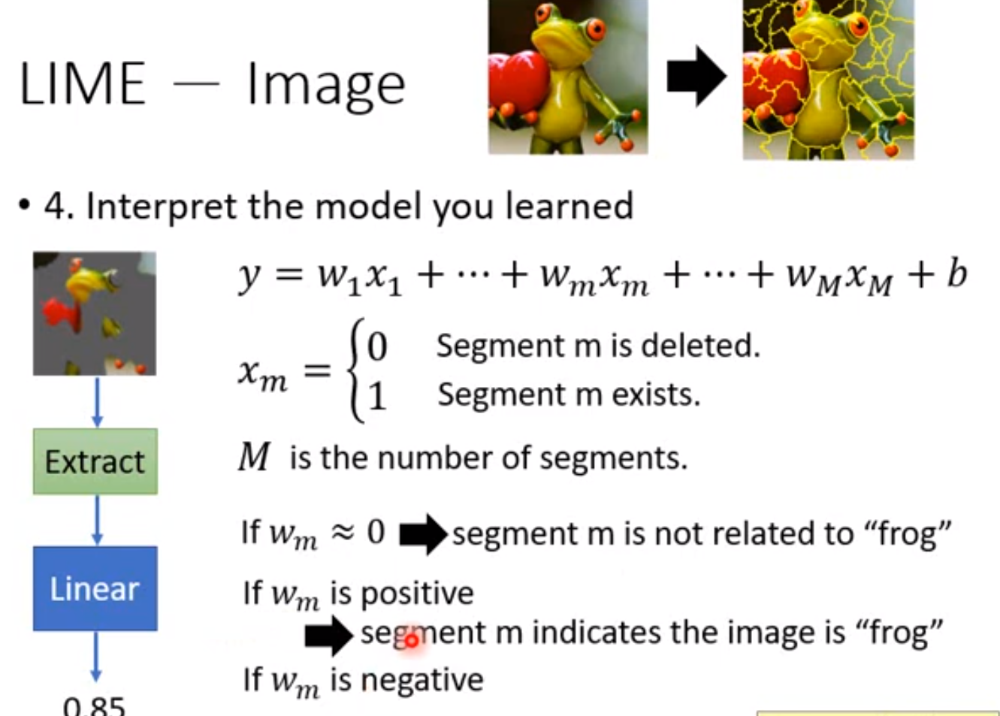

目标是 完成任务？

### 可解释 v.s. 强大

### 局部可解释性

#### 方法一

判断是picel，segment还是其他起作用？

方法：去掉或遮盖某一部分，观察是否影响判断结果。

<figure align="center"> 盖住该处后概率（蓝色为低，红色为高）</figure>

#### 方法二 

计算x的小扰动对y的影响，即 $\frac{\partial y}{\partial x}$。

该方法的局限性

#### 对抗解释性

加入噪声 导致 梯度分布 混乱

### 全局解释性

加入regularization

<figure align="center"> 固定判别器，训练图片生成器（与GAN不同） </figure>

### 用一个模型解释另一个

用可解释部分模拟另外不可解释部分

<figure align="center"> 图：蓝色为可解释模型，灰色为不可解释，令两个模型输出尽可能相同，</figure>

困难之处在于蓝色的可解释模型可能比较简单（线性模型），不像black box那样强大。

#### 只专注于一小部分可解释部分

#### LIME

<figure align="center"> 图：多个线性模型组合</figure>

### 决策树

用decision tree代替蓝色的可解释模型（只要够深是可以实现）。

但是希望decision tree 深度有限；

既能实现NN的能力，decision tree的复杂度也越小越好
$$
\theta^* = \arg \min_\theta L(\theta) + \lambda O(T_\theta)
$$
$O$表示复杂度。理解为tree regularization。

参考：

[Explainable ML (1/8) - YouTube](https://www.youtube.com/watch?v=lnjrn3bF9lA&list=PLJV_el3uVTsOK_ZK5L0Iv_EQoL1JefRL4&index=17)