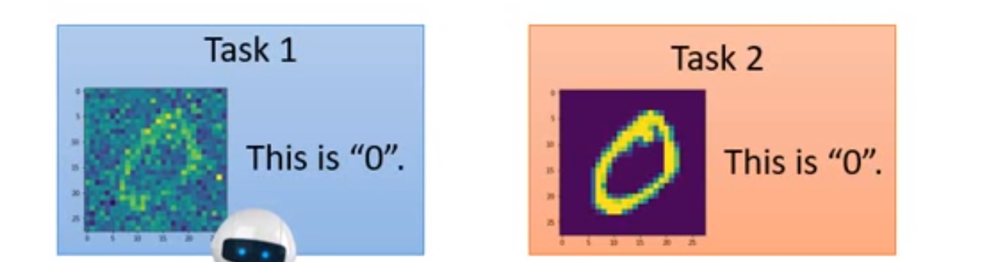
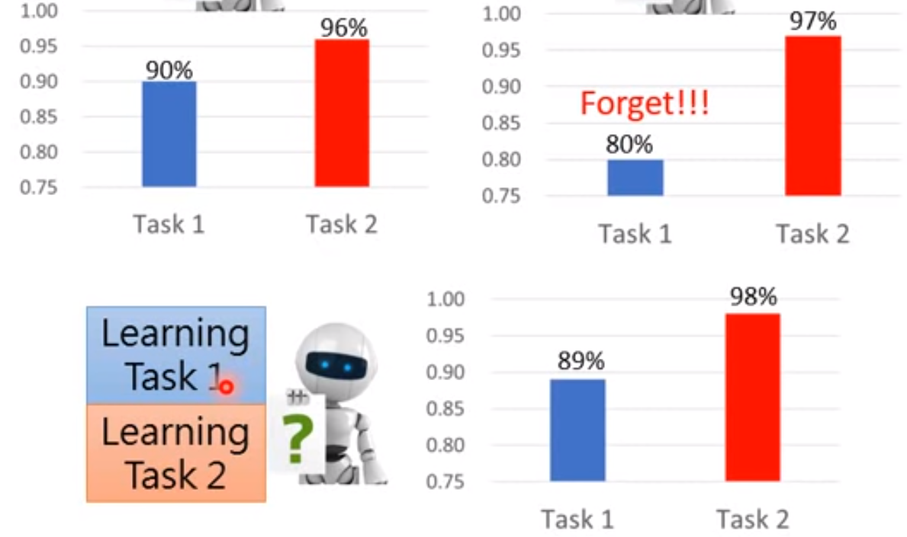
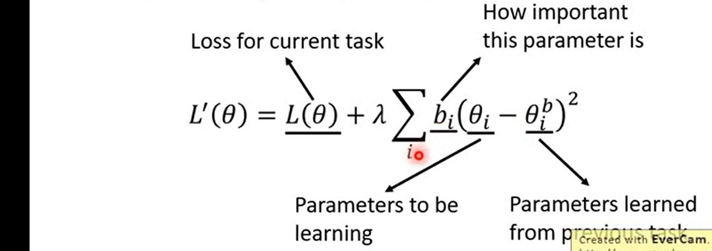

### knowledge retention

不要遗忘学过的，也能学会新的东西。

### 举例

两个不同任务，任务一更难一些。

三种方案：

1. 分别训练
2. 训练完任务一的网络作为任务二的网络继续训练
3. 同时训练（数据放在一起）

结果：

### Elastic weight consolidation（EWC）

网络中分为重要和非重要参数，$\theta^b$为从之前任务中学到的，$b_i$为“guard”（重要程度？）

#### 如果选择b？

如果某个 $\theta$ 变化速度慢，可以多动一点，如果变化快（梯度大），尽量少动

### synaptic intelligence

### memory aware synapses

不需要 labelled data

### generating data

用模型代替数据来存储；

难点：机器生成（复杂）数据比较难

### adding new classes

#### learning without forgetting（LwF）

