## 核方法（kernel Method）

对于一些回归问题中无法使用线性公式拟合，或者分类问题中线性不可分的输入数据，可以使用一个非线性变换的基函数$\phi(\cdot)$，将原始数据映射到高维，比如多项式拟合，就是将原始输入 $x$映射到一个高维空间 $[x^2,x^3,\dots,x^n]$ ，这样几乎可以拟合任意的曲线，或者使任何数据都可分。映射到高维空间，可以看做是一种特征提取，这时我们的问题就转化成如何选取合适的基函数。理论上，**任何形式的有限维度的数据都可以通过非线性变换映射到高维空间从而线性可分**，但是**选取这样的非线性变换需要的代价很大，这时核方法就可以巧妙地解决这个问题**。

引入核函数
$$
k(x,x')=\phi(x)^T\phi(x')
$$
可以看做是对两个输入向量$x$,$x'$ 分别做基函数$\phi(\cdot)$的非线性映射，然后对映射后的高维向量做内积转换到一维空间。由于核函数的输出是个标量值，很容易进行计算操作。

## 核函数

基函数决定了核函数。最简单的选取基函数$\phi(x)=x$时，得到的为线性核$k(x,x')=x^Tx'$。

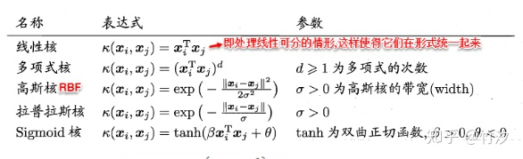

## 高斯过程（Gaussian process）

#### 0. 简介

高斯过程（GP）是一种强大的模型，它可以被用来表示函数的分布情况。当前，机器学习的常见做法是把函数参数化，然后用产生的**参数建模来规避分布表示**（如线性回归的权重）

GP不同，它直接对函数建模生成**非参数模型**。由此产生的一个突出优势就是它不仅能模拟任何黑盒函数，还能**模拟不确定性**。这种对不确定性的量化是十分重要的，如当我们被允许请求更多数据时，依靠高斯过程，我们能探索最不可能实现高效训练的数据区域。这也是贝叶斯优化背后的主要思想。

## 1. 具体原理

假定一个没有噪声的高斯回归（其实GP可以扩展到多维和噪声数据）：

- 假设有一个隐藏函数：f：ℝ→ℝ，我们要对它建模；
- x=[x1,…,xN]^T，y=[y1,…,yN]^T，其中yi=f(xi)；
- 我们要计算函数f在某些未知输入**x**∗上的值。

GP背后的关键思想是可以使用无限维多变量高斯分布来对函数进行建模。换句话说，**输入空间中的每个点都与一个随机变量相关联**，而它们的联合分布可以被作为多元高斯分布建模。

#### 1.1 高斯建模

正态分布，又名**高斯分布**（Gaussian distribution）：$N(\mu, \sigma^2)$

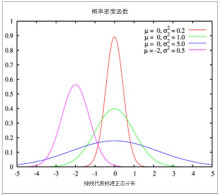

多维高斯分布：

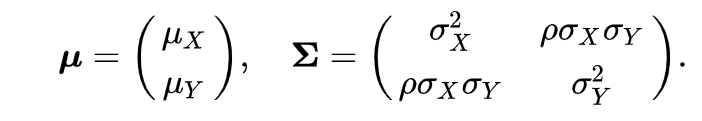

二维高斯分布：

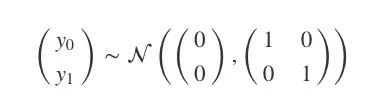

上式可以被可视化为一个3D的钟形曲线，其中概率密度为其高度。如果我们不把它作为一个整体来看，而是从它的分布中抽样，那会怎么样？比如说，我们一次从图中抽取两点，反复进行10次，并把第一个值记录在x=0，第二个值在x=1，然后在两点间绘制线段。

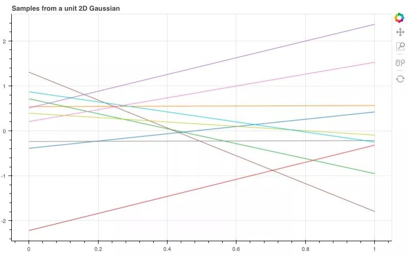

如图所示，这10根线条就是我们刚才抽样的10个线性函数。那如果我们扩展到20维，它们会呈怎样的分布呢？

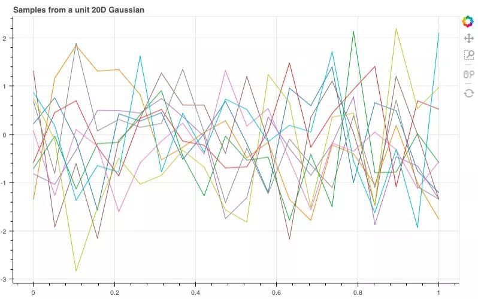

问题：经过调整，我们得到了这样的函数曲线，虽然整体非常杂乱，但它们包含了许多有用的信息，能让我们推敲想从这些样本中获得什么，以及**如何改变分布来获得更好的样本**。

#### 均值

多元高斯分布有两个重要参数，一个是均值函数，另一个是协方差函数。如果只改变均值，那我们改变的只有曲线的整体趋势（如果均值函数是上升的，例：np.arange(D)，曲线就会有一个整体的线性上升趋势），而锯齿状的噪声形状依然存在。鉴于这个特征，我们一般倾向于设GP的均值函数为0（即使不改变均值，GP也能对许多函数建模）

## 2. 协方差矩阵

#### 平滑度

如果两个样本非常接近，那我们自然会希望它们的函数值，即y值也非常相近。而把这个放进我们的模型中，就是样本附近的随机变量对应到它们联合分布（高维协方差）上的值应当和样本对应的值十分接近。

**协方差**：协方差被定义在高斯协方差矩阵中，考虑到我们有的是一个N维的高斯模型：y0,…,yN，那么这就是一个N×N的协方差矩阵Σ，那么矩阵中的(i,j)就是Σij=cov(yi,yj)。换句话说，协方差矩阵Σ是对称的，它包含了模型上所有随机变量的协方差（一对）

对于一系列输入点$x_1,\dots,x_n$，可以用函数值$f(x_1),\dots,f(x_n)$表示，获得一个联合多元高斯分布，均值 $\mu$ 用一个均值函数表示，通常设置为0，协方差则用核函数来表示
$$
\begin{split}\begin{bmatrix}f(x) \\f(x_1) \\ \vdots \\ f(x_n) \end{bmatrix}\sim \mathcal{N}\left(\mu, \begin{bmatrix}k(x,x) & k(x, x_1) & \dots & k(x,x_n) \\ k(x_1,x) & k(x_1,x_1) & \dots & k(x_1,x_n) \\ \vdots & \vdots & \ddots & \vdots \\ k(x_n, x) & k(x_n, x_1) & \dots & k(x_n,x_n) \end{bmatrix}\right)\end{split}
$$
我们可以计算对任意点 $x$ 计算条件 $f(x)$，这种条件分布被称为posterior（后验），可用于作预测。
$$
f(x) | f(x_1), \dots, f(x_n) \sim \mathcal{N}(m,s^2)
$$


#### 核函数实现平滑

那么我们该如何**定义我们的协方差函数**呢？这时高斯过程的一个重要概念**核函数（kernel）**就要登场了。为了实现我们的目的，我们可以设一个平方形式的核函数（最简形式）：

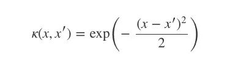

当x=x′时，核函数k(x,x′)等于1；x和x′相差越大，k越趋向于0。

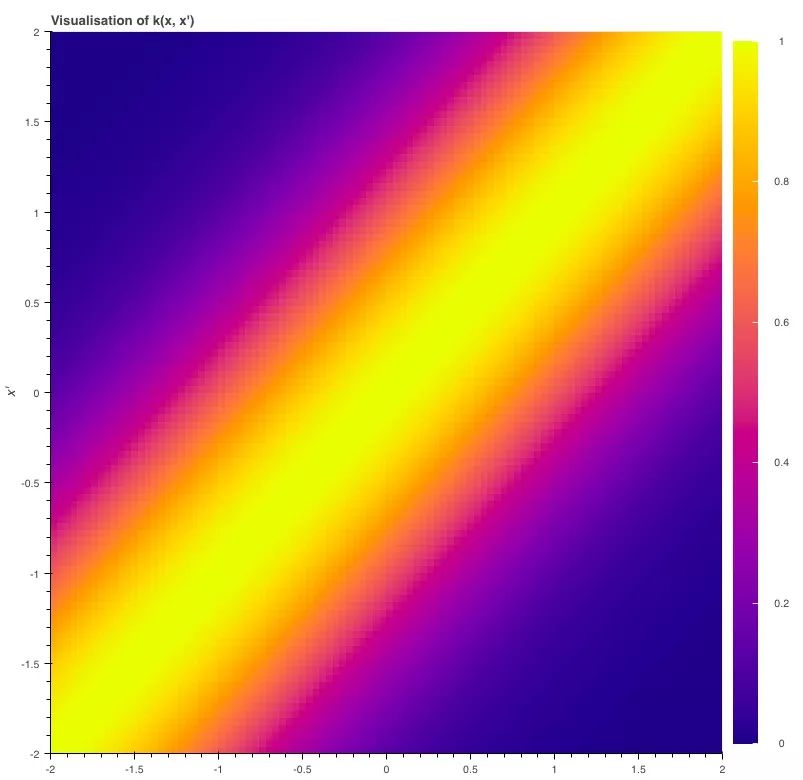

那么，如果进一步提高维数，比如到20维（注意与上面20维的图像对比）100维呢？

这图更为平滑

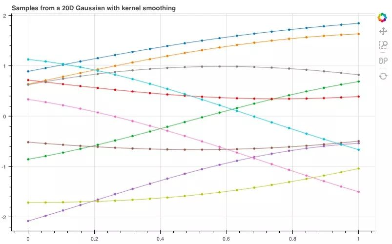

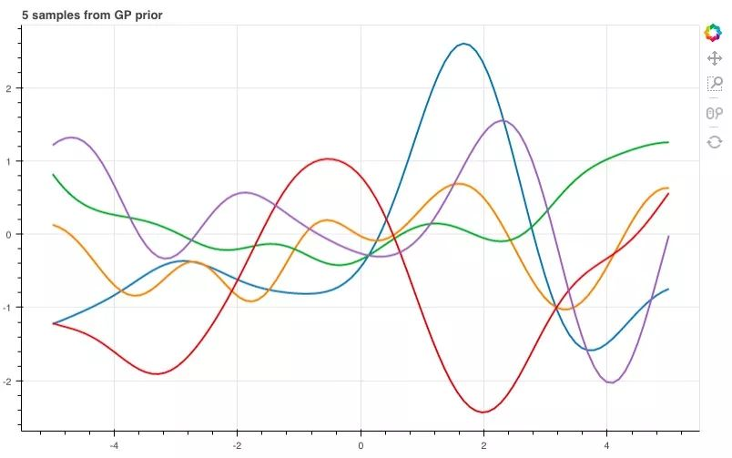


## 3.预测

现在我们已经有了一个函数分布，之后就要用训练数据来模拟那个隐藏函数，从而预测y值

#### 隐藏函数f

对于上图，我们先假定是一个5次方程（之所以这么选，是因为它的图适合讲解，事实上我们可以随便设）

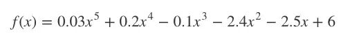

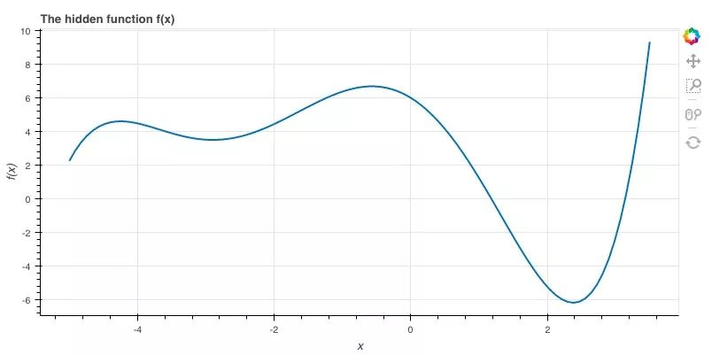

#### 数学计算（概率论）

我们用多元高斯分布对p(y|x)建模：

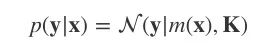

K=κ(x,x)，均值函数m(x)=0。这是一个先验分布，表示在观察任何数据前，我们期望在输入x后获得的输出y。

之后，我们导入一些输入为x的训练数据，并输出y=f(x)。接着，我们设有一些新输入x∗，需要计算y∗=f(x∗)。

```text
x_obs = np.array([-4, -1.5, 0, 1.5, 2.5, 2.7])
y_obs = f(x_obs)

x_s = np.linspace(-8, 7, 80)
```

我们将所有y和y∗的联合分布建模为：

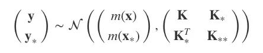

其中，K=κ(x,x)， K∗=κ(x,x∗)， K∗∗=κ(x∗,x∗)，均值函数为0。

现在，模型成了p(y,y∗|x,x∗)，而我们需要的是y∗。

#### 调节高斯分布

由于我们已有y和y∗的联合分布，在这个基础上我们想对y的数据做条件处理，那就会得到：

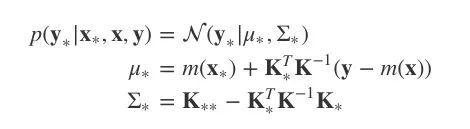

这就是基于先验分布和观察值计算出的关于y∗的后验分布。

*注：由于K条件不当，以下代码可能是不准确的，我会在第二篇文章中介绍一种更好的方法。*

```python
K = k(x_obs, x_obs)
K_s = k(x_obs, x_s)
K_ss = k(x_s, x_s)

K_sTKinv = np.matmul(K_s.T, np.linalg.pinv(K))

mu_s = m(x_s) + np.matmul(K_sTKinv, y_obs - m(x_obs))
Sigma_s = K_ss - np.matmul(K_sTKinv, K_s)
```

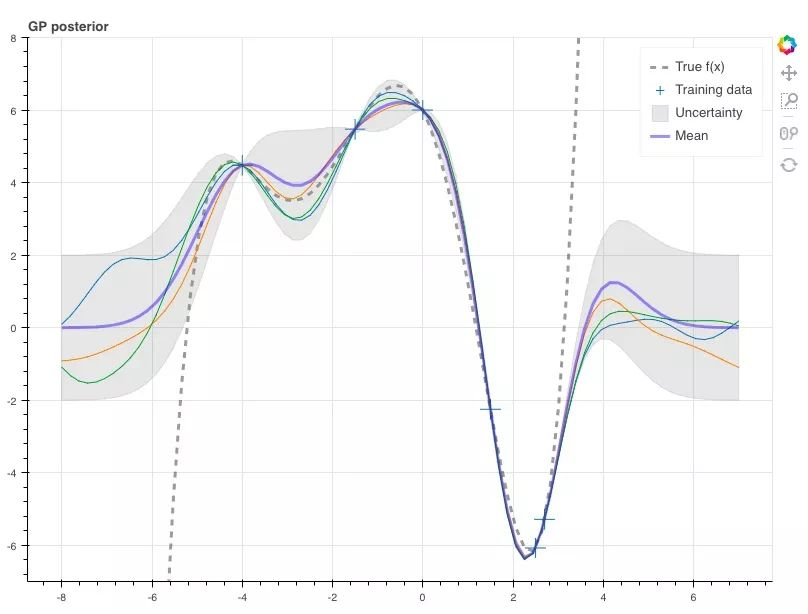


参考：https://zhuanlan.zhihu.com/p/32152162

[核方法 Kernel Method，高斯过程 Gaussian Process - PRML - 知乎 (zhihu.com)](https://zhuanlan.zhihu.com/p/375552723)

#### 参考

[18.1. Introduction to Gaussian Processes — Dive into Deep Learning 1.0.0-beta0 documentation (d2l.ai)](https://d2l.ai/chapter_gaussian-processes/gp-intro.html)