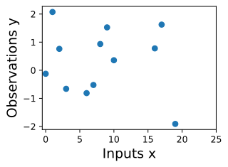
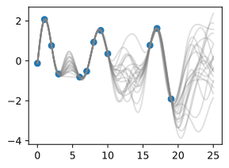
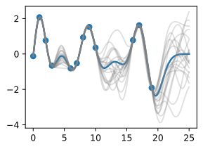
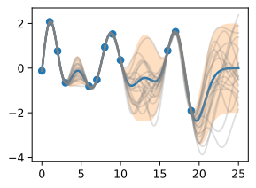
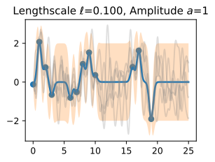
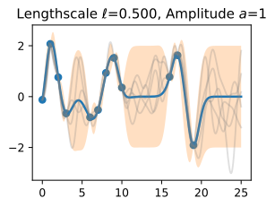
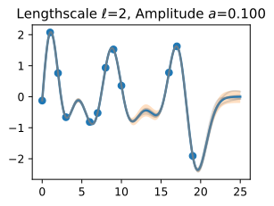
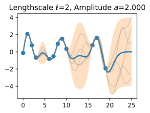

### 0. 介绍

很多机器学习都是从数据中估计参数（这些参数大多不可解释）；相反，高斯过程提供一种直接reasoning about the high-level properties of functions的机制来**拟合数据**。我们可以把一些函数的特征（周期性、协方差、条件独立）通过高斯分布加入进来，

假定我们观测到一系列数据，如何观察数据的特征：变化周期、数据点的间隔是否规律，是否缺少输入？如何预测后续点的值？

在高斯过程中，首先选定一个reasonable的先验高斯分布。Once we condition on data, we can use this prior to infer a `posterior distribution` over functions that could fit the data

上述每一条曲线（灰色）都拟合了数据，为了用这些posterior samples来做预测，我们可以去每一个可能sample function的均值，如下图蓝色曲线。

注意： we do not actually have to take an infinite number of samples to compute this expectation; as we will see later, **we can compute the expectation in closed form**

我们还想表达不确定性，This type of uncertainty is called *epistemic uncertainty*, which is the *reducible uncertainty* associated with lack of information。当数据越多，这种不确定性越小。和举止一样，我们计算posterior variance in closed form。

高斯过程主要受*covariance function*控制，也被称为kernel。这里使用 *RBF (Radial Basis Function) kernel*, 
$$
k_{\text{RBF}}(x,x') = \mathrm{Cov}(f(x),f(x')) = a^2 \exp\left(-\frac{1}{2\ell^2}||x-x'||^2\right)
$$
这里的参数都是可解释的。$a$是振幅，控制vertical scale，$\ell$ 为length scale控制 rate of variation（hte wiggliness）；$a$越大表明函数值越大，$\ell$ 越大表明变化越缓慢，

固定a

