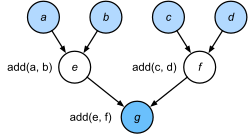
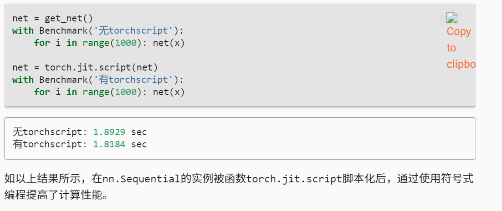

### 命令式编程

命令式编程使用诸如`print`、“`+`”和`if`之类的语句来更改程序的状态。



Python会单独执行这三个函数的调用，而没有考虑`add`函数在`fancy_func`中被重复调用。如果在一个GPU（甚至多个GPU）上执行这些命令，那么Python解释器产生的开销可能会非常大。此外，它需要保存`e`和`f`的变量值，直到`fancy_func`中的所有语句都执行完毕。这是因为程序不知道在执行语句`e = add(a, b)`和`f = add(c, d)`之后，其他部分是否会使用变量`e`和`f`。

### 符号式编程

即代码通常只在完全定义了过程之后才执行计算。这个策略被多个深度学习框架使用，包括Theano和TensorFlow（后者已经获得了命令式编程的扩展）。一般包括以下步骤：

1. 定义计算流程；
2. 将流程编译成可执行的程序；
3. 给定输入，调用编译好的程序执行。

这将允许进行大量的优化。首先，在大多数情况下，我们可以跳过Python解释器。从而消除因为多个更快的GPU与单个CPU上的单个Python线程搭配使用时产生的性能瓶颈。其次，编译器可以将上述代码优化和重写为`print((1 + 2) + (3 + 4))`甚至`print(10)`。因为编译器在将其转换为机器指令之前可以看到完整的代码，所以这种优化是可以实现的。例如，只要某个变量不再需要，编译器就可以释放内存（或者从不分配内存），或者将代码转换为一个完全等价的片段。


命令式（解释型）编程和符号式编程的区别如下：

- 命令式编程更容易使用。在Python中，命令式编程的大部分代码都是简单易懂的。命令式编程也更容易调试，这是因为无论是获取和打印所有的中间变量值，或者使用Python的内置调试工具都更加简单。
- 符号式编程运行效率更高，更易于移植。符号式编程更容易在编译期间优化代码，同时还能够将程序移植到与Python无关的格式中，从而允许程序在非Python环境中运行，避免了任何潜在的与Python解释器相关的性能问题。

### 混合式

如上所述，PyTorch是基于命令式编程并且使用动态计算图。为了能够利用符号式编程的可移植性和效率，**开发人员思考能否将这两种编程模型的优点结合起来，于是就产生了torchscript**。torchscript允许用户使用纯命令式编程进行开发和调试，同时能够将大多数程序转换为符号式程序，以便在需要产品级计算性能和部署时使用。

#### Sequential的混合式编程

瓶颈是单线程的Python解释器。让我们看看如何通过将`Sequential`替换为`HybridSequential`来解决代码中这个瓶颈。首先，我们定义一个简单的多层感知机。

```python
import torch
from torch import nn
from d2l import torch as d2l


# 生产网络的工厂模式
def get_net():
    net = nn.Sequential(nn.Linear(512, 256),
            nn.ReLU(),
            nn.Linear(256, 128),
            nn.ReLU(),
            nn.Linear(128, 2))
    return net

x = torch.randn(size=(1, 512))
net = get_net()
net(x)

```

```python
net = torch.jit.script(net)
net(x)
```

我们编写与之前相同的代码，再使用`torch.jit.script`简单地转换模型，当完成这些任务后，网络就将得到优化（我们将在下面对性能进行基准测试）。



文中显示的用法 *obj = torch.jit.script(obj)* 适用于**nn.Module或者继承自nn.Module的class**

对于**function**，一般是@注释，即 *@torch.jit.script*

#### 序列化

编译模型的好处之一是我们可以将模型及其参数序列化（保存）到磁盘。这允许这些训练好的模型部署到其他设备上，并且还能方便地使用其他前端编程语言。同时，通常编译模型的代码执行速度也比命令式编程更快