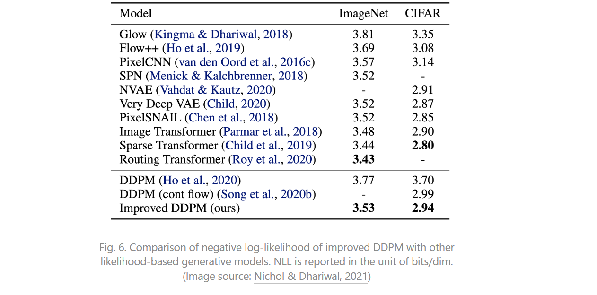
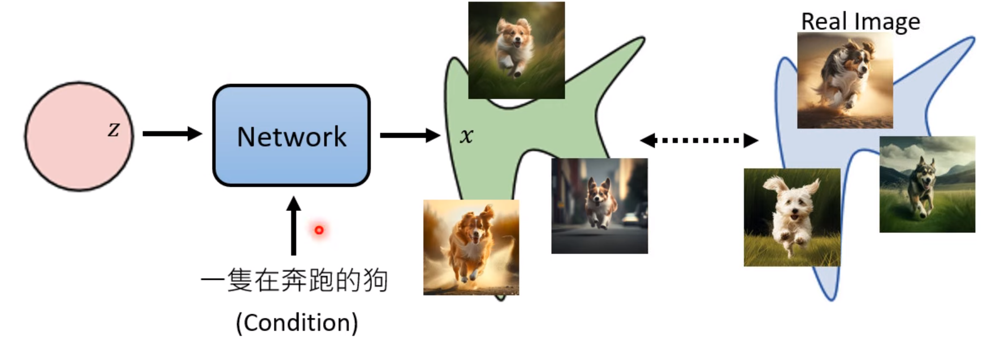

### 0. 前言

各种类型的生成（generative model）各有缺点

- GAN训练不稳定，多样性不足（由于对抗性训练的本质）
- VAE依赖于surrogate loss
- Flow model需要特殊架构且转换要可逆

Diffusion Model（DM）的灵感来自non-equilibrium thermodynamics(非平衡热力学)；定义Markov chain of diffusion steps to slowly add random noise to data and then learn to reverse the diffusion process to construct desired data samples from the noise. 

**正向和逆向过程数学原理简介参考前一篇**

本文拥有更多推导，此处略过（PASS）

## 第二种视角

#### forward process

给定数据 $\mathbf{x}_0 \sim q(\mathbf{x}_0)$ ，通过前向马尔可夫过程（transition kernel $q(\mathbf{x}_t\mid\mathbf{x}_{t-1})$）生成一系列随机变量 $\mathbf{x}_1, \mathbf{x}_2 \dots \mathbf{x}_T$，最后得到joint distribution of $\mathbf{x}_1, \mathbf{x}_2 \dots \mathbf{x}_T$ conditioned on $\mathbf{x}_0$，
$$
\begin{align}
    q(\mathbf{x}_1, \ldots, \mathbf{x}_T\mid\mathbf{x}_0) &= \prod_{t=1}^{T} q(\mathbf{x}_t\mid\mathbf{x}_{t-1}).\label{eq:forward_joint}
\end{align}
$$
通过这种方式，**把data distribution** $q(\mathbf{x}_0)$ **转化为tractable prior distribution**。设计这种transition kernel的一种方案是Gaussian perturbation，
$$
\begin{align}
    q(\mathbf{x}_t\mid\mathbf{x}_{t-1}) &= \mathcal{N}(\mathbf{x}_t; \sqrt{1-\beta_t} \mathbf{x}_{t-1}, \beta_t \mathbf{I}), \label{eq:2}
\end{align}
$$
通过这种Gaussian transition kernel 得到一个 analytical form of $q(\mathbf{x}_t\mid\mathbf{x}_{0})$
$$
\begin{align}
    q(\mathbf{x}_t\mid\mathbf{x}_{t-1}) &= \mathcal{N}(\mathbf{x}_t; \sqrt{1-\beta_t} \mathbf{x}_{t-1}, \beta_t \mathbf{I}),
\end{align}
$$
这样，给一个 $\mathbf{x}_0$，就可很容易获得 a sample of $\mathbf{x}_t$ by sampling a Gaussian vector  $\epsilon \sim \mathcal{N}(\mathbf{0}, \mathbf{I})$ 
$$
\begin{align}
    \mathbf{x}_t &=\sqrt{\bar{\alpha}_t} \mathbf{x}_0 + \sqrt{1-\bar{\alpha}_t} \epsilon. 
\end{align}
$$
当$\bar{\alpha}_T \approx 0$, $\mathbf{x}_{T}$近似于高斯分布了。因为有$q(\mathbf x_T) \coloneqq \int q(\mathbf x_T \mid \mathbf x_0) q(\mathbf x_0) \textrm{d} \mathbf x_0 \approx \mathcal{N}(\mathbf x_T; \mathbf{0}, \mathbf{I})$

**这个过程可以看作，向原始数据缓慢注入噪声直到失去原有结构。**

#### reverse process

先从prior distribution 中生成一个 unstructured noise vector ， 

然后通过一个learnable Markov chain 去除噪声。

the reverse Markov chain is parameterized by a prior distribution $p(\mathbf x_T) = \mathcal{N}(\mathbf x_T; \mathbf{0}, \mathbf{I})$ and a learnable transition kernel $p_\theta(\mathbf{x}_{t-1}\mid\mathbf{x}_t)$.  

learnable transition kerne 数学形式为：
$$
\begin{align}
  p_\theta(\mathbf x_{t-1}\mid\mathbf x_t) &= \mathcal{N}(\mathbf x_{t-1}; \mu_{\theta}(\mathbf x_t, t), \Sigma_{\theta}(\mathbf x_t, t))
  \label{4}
\end{align}
$$
the mean $\mu_{\theta}(\mathbf x_t, t)$ and variance $\Sigma_{\theta}(\mathbf x_t, t)$ are parameterized by deep neural networks.

因此我们可以先sampling a noise vector $\mathbf x_T \sim p(\mathbf x_T)$, then iteratively sampling from the learnable transition kernel $\mathbf x_{t-1} \sim p_\theta(\mathbf x_{t-1} \mid \mathbf x_t)$ until $t = 1$.

**关键在于训练这个reverse Markov chain能够逆转forward Markov chain；即the joint distribution of the reverse Markov chain $p_\theta(\mathbf x_0, \mathbf x_1, \cdots, \mathbf x_T)\coloneqq p(\mathbf x_T)\prod_{t=1}^T p_\theta(\mathbf x_{t-1}\mid\mathbf x_t)$ closely approximates that of the forward process $q(\mathbf x_0, \mathbf x_1, \cdots, \mathbf x_T) \coloneqq q(\mathbf x_0) \prod_{t=1}^T q(\mathbf x_t \mid \mathbf x_{t-1})$；需要通过最小化KL散度来实现。
$$
\begin{align}
    &\operatorname{KL}(q(\mathbf x_0, \mathbf x_1, \cdots, \mathbf x_T) \mid\mid p_\theta(\mathbf x_0, \mathbf x_1, \cdots, \mathbf x_T))\\
    \stackrel{(i)}{=} &-\mathbb{E}_{q(\mathbf x_0, \mathbf x_1, \cdots, \mathbf x_T)}[\log p_\theta(\mathbf x_0, \mathbf x_1, \cdots, \mathbf x_T)] + \text{const}\\
    \stackrel{(ii)}{=} & \underbrace{\mathbb{E}_{q(\mathbf x_0, \mathbf x_1, \cdots, \mathbf x_T)}\bigg[ -\log p(\mathbf x_T) - \sum_{t=1}^T \log \frac{p_\theta(\mathbf x_{t-1}\mid\mathbf x_t)}{q(\mathbf x_t\mid\mathbf x_{t-1})} \bigg]}_{\coloneqq -L_{\textrm{VLB}}(\mathbf x_0)} + \text{const} \label{eq:7} \\
    \stackrel{(iii)}{\geq} & \mathbb{E}[{-\log p_\theta(\mathbf x_0)}] + \text{const},
\end{align}
$$

### 参考

[What are Diffusion Models? | Lil'Log (lilianweng.github.io)](https://lilianweng.github.io/posts/2021-07-11-diffusion-models/)

Croitoru, Florinel-Alin, Vlad Hondru, Radu Tudor Ionescu, and Mubarak Shah. “Diffusion Models in Vision: A Survey.” *IEEE Transactions on Pattern Analysis and Machine Intelligence*, 2023, 1–20. https://doi.org/10.1109/TPAMI.2023.3261988.