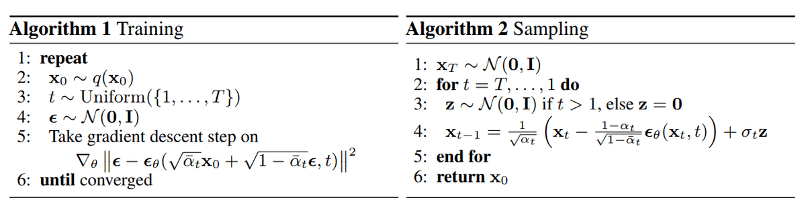

### Training

2：采样一个干净（真实的）图像

3：采样一个整数 $T$，表示前向步数

4：从 $\mathcal{N}(0,\mathbf{I})$ 采样一个噪声

5：梯度
$$
\nabla_\theta\left\|\boldsymbol{\epsilon}-\boldsymbol{\epsilon}_\theta\left(\sqrt{\bar{a}_t} \mathbf{x}_0+\sqrt{1-\bar{a}_t} \boldsymbol{\epsilon}, t\right)\right\|^2
$$
$\bar{\alpha}_t$ 随着 t 变大 会变小，所以 $\sqrt{\bar{a}_t} \mathbf{x}_0+\sqrt{1-\bar{a}_t} \boldsymbol{\epsilon}$ （即 $\mathbf{x}_t$）会随着 $t$ 变大，越来越接近噪声；

而 $\boldsymbol{\epsilon}_\theta\left(\sqrt{\bar{a}_t} \mathbf{x}_0+\sqrt{1-\bar{a}_t} \boldsymbol{\epsilon}, t\right)$ 是 noise predictor，输入 $\mathbf{x}_t$ 和 $t$，预测一个噪声，并于真实噪声 $\boldsymbol{\epsilon}$ 对比求梯度

因此实际上不是一次又一次加入噪声，而是直接一次性加入噪声

### Sampling（预测？）

1：从 $\mathcal{N}(0,\mathbf{I})$ 采样一个噪声

2~3： 再次从 $\mathcal{N}(0,\mathbf{I})$ 采样一个噪声 $\mathbf{z}$

4：准备两组参数：$\alpha$ 和 $\hat{\alpha}$；由 $\mathbf{x}_t，t$ 和 $\mathbf{z}$ 得到 $\mathbf{x}_{t-1}$

## maximum likelihood estimation

如何衡量生成的分布与真实分布的接近程度？

为什么最大似然估计意味着两个分布 $P_\theta$ 和 $P_{data}$ 很接近？

结果：最大似然估计 = 最小化 KL散度

#### 为什么需要sample

计算的是均值，但还需要从分布中sample，而不是直接取均值（即几率最大的）。

取机率最大的容易重复写；

### VAE

直接计算 $P_\theta(x|z)$会有困难（比如 $G(z)$ 生成的图像与 $x$ 有细微差异也可能被判为0；

所以使用 $exp(-||G(z)-x||_2)$ 的相近度作为概率

