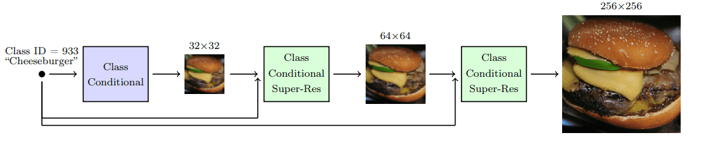

本文专注于`Denoising Diffusion Probabilistic models (DDPM)` as initialized by [Sohl-Dickstein et al](https://arxiv.org/abs/1503.03585) and then proposed by [Ho. et al 2020](https://arxiv.org/abs/2006.11239).

> diffusion model 与之前的生成模型（e.g. GAN）有很大区别，关键在于它们是用“去噪”的步骤来分解图像生成的过程。

它的思路（refining the representation）再alphafold中就已经使用了。但是这种思路是有代价的：slow at sampling，至少相对于[GANs](https://theaisummer.com/gan-computer-vision/)来说是这样。

### Diffusion process

前向过程：给输入图像 $\boldsymbol{x}_0$ 加入 $T$ 步的高斯噪声，这一步可以和NN无关（用于生成后面需要的数据）

反向过程：然后训练NN通过逆转噪声生成来回复数据；也可被称为 sampling process of generative model。

### Forward Diffusion

diffusion model可以被看作 `latent variable models`。Latent指的是 hidden continuous feature space，有点类似VAE。在实践中，由 $T$步的马尔科夫链组成，马尔科夫链代表每一步只依赖于前一步。

给定一个从数据分布 $q(x)$ 采样得到的  $\boldsymbol{x}_0$ ，（ $\boldsymbol{x}_0 \sim q(x)$ )。每一步马尔可夫链中，向  $\boldsymbol{x}_{t-1}$ 加入与变量 $\beta_t$相关的高斯噪声，得到新的 latent variable  $\boldsymbol{x}_t$ 
$$
q( \boldsymbol{x}_t|\boldsymbol{x}_{t-1} ) = \mathcal N (\boldsymbol{x}_t;\boldsymbol{\mu}_t=\sqrt{1-\beta_t}\boldsymbol{x}_{t-1},\boldsymbol{\Sigma}_t=\beta_t\mathbf{I})
$$

因此，从输入数据 $\boldsymbol{x}_0$ 到 $\boldsymbol{x}_t$ 是一个可追踪过程，这是一个后验概率
$$
q( \boldsymbol{x}_{1:T}|\boldsymbol{x}_{0} ) = \prod^T_{t=1}q( \boldsymbol{x}_t|\boldsymbol{x}_{t-1} ) 
$$
但是真的需要做$T$次概率乘法吗？The [reparametrization trick](https://theaisummer.com/latent-variable-models/#reparameterization-trick) provides a magic remedy to this.

#### reparameterization trick

定义：$\alpha_t=1-\beta_t,\bar{\alpha}_t=\prod^t_{s=0}\alpha_s$，where $\epsilon_0,\dots,\epsilon_{t-1}\sim\mathcal{N}(0,\mathbf{I})$，可以用递归方式证明：
$$
\begin{aligned}
\mathbf{x}_t & =\sqrt{1-\beta_t} \mathbf{x}_{t-1}+\sqrt{\beta_t} \epsilon_{t-1} \\
& =\sqrt{\alpha_t} \mathbf{x}_{t-2}+\sqrt{1-\alpha_t} \boldsymbol{\epsilon}_{t-2} \\
& =\cdots \\
& =\sqrt{\bar{\alpha}_t} \mathbf{x}_0+\sqrt{1-\bar{\alpha}_t} \epsilon_0
\end{aligned}
$$
因为我们可以用下面的分布来生成样本 $\boldsymbol{x}_t$
$$
\mathbf{x}_t \sim q\left(\mathbf{x}_t \mid \mathbf{x}_0\right)=\mathcal{N}\left(\mathbf{x}_t ; \sqrt{\bar{\alpha}_t} \mathbf{x}_0,\left(1-\bar{\alpha}_t\right) \mathbf{I}\right)
$$
$\beta_t$ 是个超参数，因此可以在每一步中预先计算 $\alpha_t$ 和 $\bar{\alpha}_t$

#### Variance schedule

$\beta_t$可以定义在一个常数，或者是在 $T$ 上规律变化，比如线性、二次或cos函数，原始的使用线性变化：$\beta_1=10^{-4},\beta_T=0.02$。[Nichol et al. 2021](https://arxiv.org/abs/2102.09672) showed that employing a cosine schedule works even better.

<figure align="center"> top：linear；bottom：cosin </figure>

### Reverse diffusion

在 $T\rightarrow \infty$ 时， $\boldsymbol{x}_T$ 接近 [isotropic](https://math.stackexchange.com/questions/1991961/gaussian-distribution-is-isotropic#:~:text=TLDR%3A An isotropic gaussian is,Σ is the covariance matrix.) Gaussian distribution。如果我们成功学到了逆向分布 $q(\boldsymbol{x}_{t-1}|\boldsymbol{x}_t)$，就可以从 $\mathcal{N}(0,\mathbf{I})$中采样  $\boldsymbol{x}_T$ 并运行 reverse process 从而得到 $q( \boldsymbol{x}_0)$中的采样。关键在于如何获得逆向过程

#### 用NN

用一个参数模型 $p_\theta$ 来近似逆向分布 $q(\boldsymbol{x}_{t-1}|\boldsymbol{x}_t)$，令 $p_\theta$ 为高斯分布
$$
p_\theta\left(\mathbf{x}_{t-1} \mid \mathbf{x}_t\right)=\mathcal{N}\left(\mathbf{x}_{t-1} ; \boldsymbol{\mu}_\theta\left(\mathbf{x}_t, t\right), \boldsymbol{\Sigma}_\theta\left(\mathbf{x}_t, t\right)\right)
$$
对于每一步使用这样的逆过程
$$
p_\theta\left(\mathbf{x}_{0: T}\right)=p_\theta\left(\mathbf{x}_T\right) \prod_{t=1}^T p_\theta\left(\mathbf{x}_{t-1} \mid \mathbf{x}_t\right)
$$
如何训练这样的模型

### training

$p$ 和 $q$ 与VAE比较类似，因此可以用一个 negative log-likelihood 作为优化函数，we can write the evidence lower bound (ELBO) as follows:
$$
\begin{aligned}
\operatorname{log}p(\mathbf{x}) \geq & \mathbb{E}_{q\left(x_1 \mid x_0\right)}\left[\log p_\theta\left(\mathbf{x}_0 \mid \mathbf{x}_1\right)\right]- \\
& D_{K L}\left(q\left(\mathbf{x}_T \mid \mathbf{x}_0\right)|| p\left(\mathbf{x}_T\right)\right)- \\
& \sum_{t=2}^T \mathbb{E}_{q\left(\mathbf{x}_t \mid \mathbf{x}_0\right)}\left[D_{K L}\left(q\left(\mathbf{x}_{t-1} \mid \mathbf{x}_t, \mathbf{x}_0\right) \| p_\theta\left(\mathbf{x}_{t-1} \mid \mathbf{x}_t\right)\right)\right] \\
& =L_0-L_T-\sum_{t=2}^T L_{t-1}
\end{aligned}
$$

1. $\mathbb{E}_{q(x_1 \mid x_0)}[\log p_\theta(\mathbf{x}_0\mathbf{x}_1)]$是一个reconstruction term，与variational autoencoder类似，可以用一个separate decoder 学习（[Ho et al 2020](https://arxiv.org/abs/2006.11239) ）
2. 第二项$D_{K L}\left(q\left(\mathbf{x}_T \mid \mathbf{x}_0\right)|| p\left(\mathbf{x}_T\right)\right)$衡量 $\boldsymbol{x}_T$ 与标准高斯的举例，这里没有需要学习的参数（无需训练）
3. $\sum_{t=2}^T L_{t-1}$ 衡量希望的去噪步骤 $p_\theta\left(\mathbf{x}_{t-1} \mid \mathbf{x}_t\right)$ 和 近似项 $q(\mathbf{x}_{t-1} \mid \mathbf{x}_t,\mathbf{x}_0)$ 之间的差距。

In other words, we can sample $\mathbf{x}_t$ at noise level $t$ conditioned on $\mathbf{x}_0$
$$
\begin{aligned}
q\left(\mathbf{x}_{t-1} \mid \mathbf{x}_t, \mathbf{x}_0\right) & =\mathcal{N}\left(\mathbf{x}_{t-1} ; \tilde{\boldsymbol{\mu}}\left(\mathbf{x}_t, \mathbf{x}_0\right), \tilde{\beta}_t \mathbf{I}\right) \\
\tilde{\beta}_t & =\frac{1-\bar{\alpha}_{t-1}}{1-\bar{\alpha}_t} \cdot \beta_t \\
\tilde{\boldsymbol{\mu}}_t\left(\mathbf{x}_t, \mathbf{x}_0\right) & =\frac{\sqrt{\bar{\alpha}_{t-1}} \beta_t}{1-\bar{\alpha}_t} \mathbf{x}_{\mathbf{0}}+\frac{\sqrt{\alpha_t}\left(1-\bar{\alpha}_{t-1}\right)}{1-\bar{\alpha}_t} \mathbf{x}_t
\end{aligned}
$$

最终得到损失函数(the denoising term in the ELBO)： 
$$
\begin{aligned}
L_t & =\mathbb{E}_{\mathbf{x}_0, t, \boldsymbol{\epsilon}}\left[\frac{1}{2\left\|\boldsymbol{\Sigma}_\theta\left(x_t, t\right)\right\|_2^2}\left\|\tilde{\boldsymbol{\mu}}_t-\boldsymbol{\mu}_\theta\left(\mathbf{x}_t, t\right)\right\|_2^2\right] \\
& =\mathbb{E}_{\mathbf{x}_0, t, \boldsymbol{\epsilon}}\left[\frac{\beta_t^2}{2 \alpha_t\left(1-\bar{\alpha}_t\right)\left\|\boldsymbol{\Sigma}_\theta\right\|_2^2}\left\|\boldsymbol{\epsilon}_t-\boldsymbol{\epsilon}_\theta\left(\sqrt{\bar{a}_t} \mathbf{x}_0+\sqrt{1-\bar{a}_t} \boldsymbol{\epsilon}, t\right)\right\|^2\right]
\end{aligned}
$$
预期预测分布的均值 $\mu$，不如直接预测噪声 $\epsilon$

#### 算法

[Ho et.al 2020](https://arxiv.org/abs/2006.11239) 做了一个简化版本
$$
L_t^{\text {simple }}=\mathbb{E}_{\mathbf{x}_0, t, \epsilon}\left[\left\|\boldsymbol{\epsilon}-\boldsymbol{\epsilon}_\theta\left(\sqrt{\bar{a}_t} \mathbf{x}_0+\sqrt{1-\bar{a}_t} \boldsymbol{\epsilon}, t\right)\right\|^2\right]
$$
还可以修改为学协方差矩阵（$\Sigma$)，效果更好([Nichol et al. 2021](https://arxiv.org/abs/2102.09672))。

### 架构

由于输入输出同维度，考虑U-net，每一个块可以使用ResNet或者自注意力

### conditional image generation： Guided diffusion

（文字输入产生作用）

目标：conditioning the sampling process to **manipulate the generated samples**。

给定条件信息：text prompt $y$，因此希望得到模型：
$$
p_\theta(\boldsymbol{x}_{0:T}|y)=p_\theta(\boldsymbol{x}_T)\prod^T_{t=1}p_\theta(\boldsymbol{x}_{t-1}|\boldsymbol{x}_t,y)
$$

每一步都需要conditioning有助于获得高质量samples from a text promt；

目标是学到 $\nabla\log p_\theta(\boldsymbol{x}_t|Y)$ （为啥这是目标？using gradients of the data distribution estimated with score matching），通过贝叶斯规则：
$$
\begin{aligned}
\nabla_{\mathbf{x}_t} \log p_\theta\left(\mathbf{x}_t \mid y\right) & =\nabla_{\mathbf{x}_t} \log \left(\frac{p_\theta\left(y \mid \mathbf{x}_t\right) p_\theta\left(\mathbf{x}_t\right)}{p_\theta(y)}\right) \\
& =\nabla_{\mathbf{x}_t} \log p_\theta\left(\mathbf{x}_t\right)+\nabla_{\mathbf{x}_t} \log \left(p_\theta\left(y \mid \mathbf{x}_t\right)\right)
\end{aligned}
$$
与 $\boldsymbol{x}_T$ 无关的项被丢弃，记得 $\log(ab)=\log(a)+\log(b)$ 

加入一个guidance scalar term $\boldsymbol{s}$，
$$
\nabla_{\mathbf{x}_t} \log p_\theta\left(\mathbf{x}_t \mid y\right) = \nabla_{\mathbf{x}_t} \log p_\theta\left(\mathbf{x}_t\right) +  \boldsymbol{s} \cdot\nabla_{\mathbf{x}_t} \log \left(p_\theta\left(y \mid \mathbf{x}_t\right)\right)
$$
由此可以得到两个方法：`classifier` and `classifier-free guidance`。

#### classifier guidance

用第二个模型：即一个分类器 $f_\phi(y|\boldsymbol{x}_t,t)$ 来指导 $y$。因此需要在noise image $\boldsymbol{x}$ 上训练一个分类器 $f_\phi(y|\boldsymbol{x}_t,t)$ 来预测类别 $y$。然后可以使用梯度$\nabla \log f_\phi(y|\boldsymbol{x}_t)$ 来指导diffusion。

**做法**：用均值 $\mu_\theta(\boldsymbol{x}_t|y)$ 和 方差 $\Sigma_\theta(\boldsymbol{x}_t|y)$ 建立一个 class-conditional diffusion model

因为 $p_\theta \sim \mathcal{N}(\mu_\theta,\Sigma_\theta)$ ,由前面可知，the mean is perturbed by the gradients of $log f_\phi(y|\boldsymbol{x}_t)$ of class $y$, resulting in:
$$
\hat{\mu}(\boldsymbol{x}_t|y) = \mu_\theta(\boldsymbol{x}_t|y) + \boldsymbol{s}\cdot \Sigma_\theta(\boldsymbol{x}_t|y) \nabla_{\boldsymbol{x}_t} \log f_\phi(y|\boldsymbol{x}_t,t)
$$
In the famous [GLIDE paper by Nichol et al](https://arxiv.org/abs/2112.10741), the authors expanded on this idea and use [CLIP embeddings](https://theaisummer.com/vision-language-models/#clip) to guide the diffusion,CLIP用于衡量image encoder $g(\boldsymbol{x}_t)$ 和 text encoder $h(c)$，上式变为
$$
\hat{\mu}(\boldsymbol{x}_t|c) = \mu_\theta(\boldsymbol{x}_t|c) + \boldsymbol{s}\cdot \Sigma_\theta(\boldsymbol{x}_t|c) \nabla_{\boldsymbol{x}_t} g(\boldsymbol{x}_t) \cdot h(c)
$$

#### classifier-free guidance

定义一个classifier-free guided diffusion model
$$
\nabla \log \left(\mathbf{x}_t \mid y\right) = \boldsymbol{s} \cdot\nabla \log \left(p\left(y \mid \mathbf{x}_t\right)\right) +
(1-\boldsymbol{s} ) \nabla\log p\left(\mathbf{x}_t\right)
$$
不需要额外的分类器，而是和一个unconditional model $\mathbb{\epsilon}_\theta(\mathbf{x}_t|0)$ 一起训练 conditional diffusion model  $\mathbb{\epsilon}_\theta(\mathbf{x}_t|y)$ 

事实上，两者使用同一个的NN，训练中，随机地令class $y$ 为0，这样两个模型一起 exposed to both the conditional and unconditional setup:
$$
\begin{aligned}
\hat{\boldsymbol{\epsilon}}_\theta\left(\mathbf{x}_t \mid y\right) & =s \cdot \boldsymbol{\epsilon}_\theta\left(\mathbf{x}_t \mid y\right)+(1-s) \cdot \boldsymbol{\epsilon}_\theta\left(\mathbf{x}_t \mid 0\right) \\
& =\boldsymbol{\epsilon}_\theta\left(\mathbf{x}_t \mid 0\right)+s \cdot\left(\boldsymbol{\epsilon}_\theta\left(\mathbf{x}_t \mid y\right)-\boldsymbol{\epsilon}_\theta\left(\mathbf{x}_t \mid 0\right)\right)
\end{aligned}
$$
这个奇怪的过程有两个优点：

- 只有一个model
- 当条件信息难以被分类器预测时时简化了guidance

imagen（谷歌家的）就是这类代表。

### scaling up

用u-net生成高分辨率图像计算复杂度太高，因此用两种方法来scaling up diffusion models 到高分辨率

#### Cascade diffusion models

a pipeline of many sequential diffusion models that generate images of increasing resolution。每一步中，图片都会上采样并增加细节以提高分辨率，所以每一个步都需要从diffusion model中sample；

**strong data augmentations** on the input of each super-resolution model are crucial. Why? Because it alleviates compounding error from the previous cascaded models, as well as due to a train-test mismatch.

研究发现，高斯模糊是实现高保真度的一个关键转变。他们把这种技术称为条件增强。

#### latent diffusion models（LDM）

**经典款：stable diffusion**：把输入**投影到更小的latent space 并应用diffusion**

方法就是在输入输出前分别添加一个encoder $\varepsilon$ 和 decoer $D$

如果经典 diffusion model（DM）的损失函数是
$$
L_{DM}=\mathbb{E}_{x,t,\epsilon}[||\epsilon-\epsilon_\theta(x_t,t)||^2]
$$
那么LDM则是给一个编码器 ${\varepsilon}$ 和 latent representation $z$，损失函数为
$$
L_{DM}=\mathbb{E}_{\varepsilon(x),t,\epsilon}[||\epsilon-\epsilon_\theta(z_t,t)||^2]
$$

### Score-based generative models

连结score-based models和diffusion model。

使用连续分布，而不是有限的噪声分布；用一个依赖于数据且无需训练地stochastic differential equation (SDE)来模拟 diffusion process，逆转这一过程就得到新的sample。

定义一个diffusion process

pass

Score-based models also apply a sequence of noise perturbations to the original image. But they are trained using score-matching and Langevin dynamics. Nonetheless, they end up in a similar objective. The diffusion process can be formulated as an SDE. Solving the reverse SDE allows us to generate new samples.
$$

$$

参考：

[How diffusion models work: the math from scratch | AI Summer (theaisummer.com)](https://theaisummer.com/diffusion-models/)

