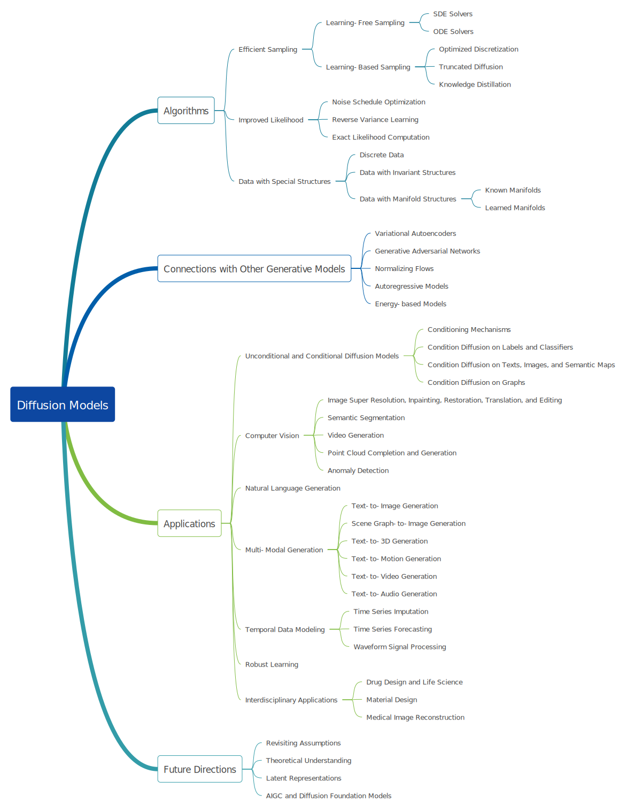
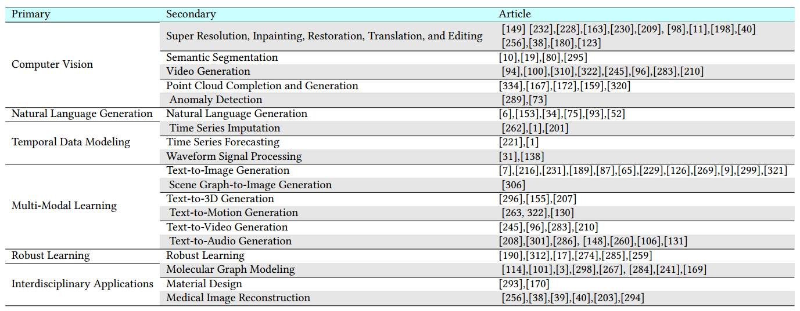
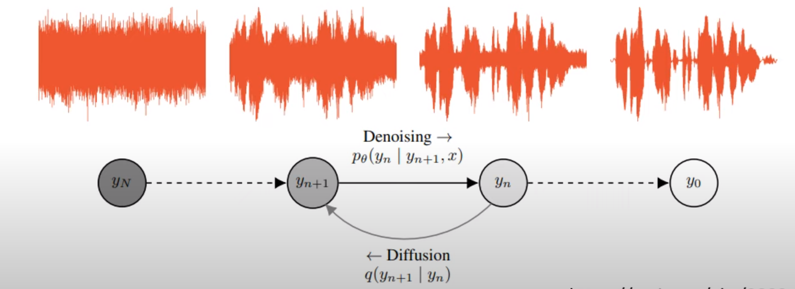
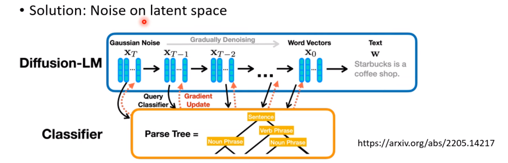

## 1. 介绍

#### 分类

拥有diffusion process 和reverse process过程的diffusion model有三类：

- denoising diffusion probabilistic models 
- score based generative models (SGMs)
- stochastic differential equations (Score SDEs)

彼此之间可以相互转化（reduced）

#### 关键细节

diffusion model近来的三个关键领域：

- efcient sampling
- improved likelihood estimation
- methods for handling data with special structures 

其他：relational data, data with permutation/rotational invariance, and data residing on manifolds

#### 应用范围：

computer vision, natural language process, temporal data modeling, multi-modal learning, robust learning, and interdisciplinary applications

## 2. 数理基础

[diffusion model 综述1](./DM——0.数学原理.md)

[diffusion model 综述2](./DM——0.1.综述.md)

## 7. 应用

### conditioning mechanism

- 非条件扩散模型explore the upper limit of the performance；

- 条件扩散模型则是应用级，便于控制生成的结果；

condition form：labels, classifers, texts, images, semantic maps, graphs   

four kinds of conditioning mechanisms：

- concatenation：concatenate informative guidance with intermediate denoised targets in diffusion process，such as embedding and semantic feature maps
- gradient-based: imcorporates task-related gradient into the diffusion sampling process
- cross-attention: performs attentional message passing between the guidance and diffusion targets, in a layer-wise manner;
- adaptive layer normalization (adaLN) : use adaptive normalization layers  in GANs

### 其他应用

- WaveGrad
  - 
- for Text
  - diffusion-LM
    - 
  - 不加高斯噪声而是其他
    - DiffudER

也许理论是错的，diffusion正确的是把一步到位的自回归模型变为N次到位。

  [Diffusion Model 原理剖析 (4/4) (optional) - YouTube](https://www.youtube.com/watch?v=67_M2qP5ssY)
