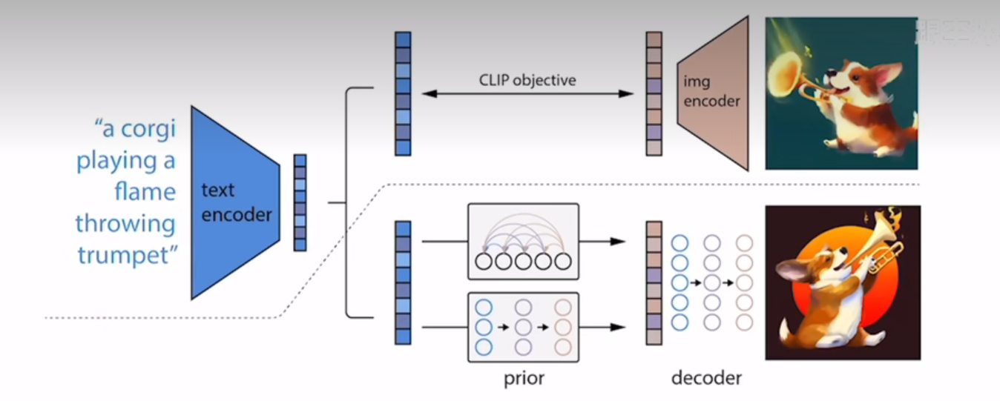
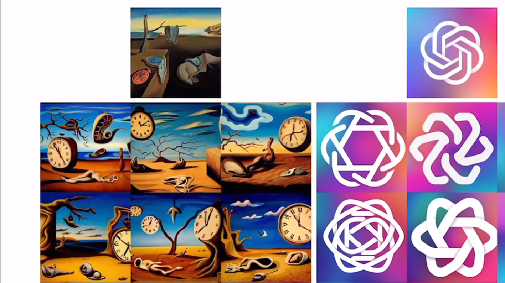
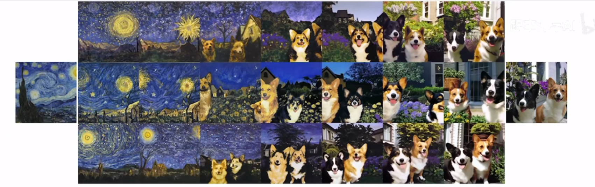
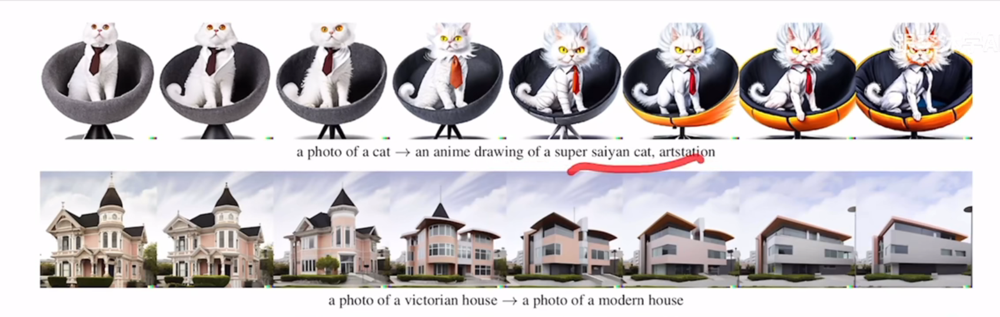
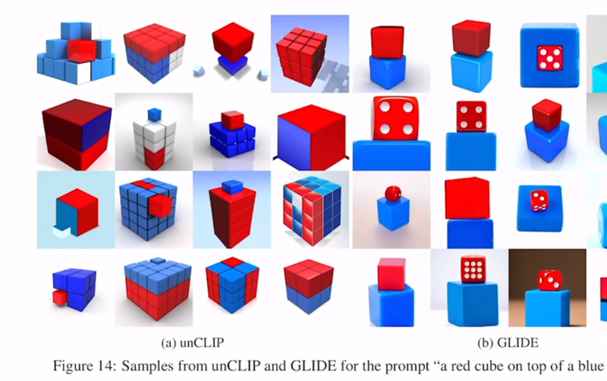

### 1. 介绍

DALL-E2的特点

- 生成的图片原创性，fake image
- 用文本编辑图片
- 风格化图片生成

模型流程：

- 先训练一个CLIP模型（找到文本——图像关联），给定文本得到文本特征，
- 由文本特征生成图像特征；`prior`模型（对比 autoregressive model 和diffusion model，后者更好）
- 以图像特征作为`解码器`输入，得到完整（低分辨率）图像；这一步很重要，增加多样性；解码器为diffusion model
- 低分辨率图像多次上采样，得到最终完整高清图像

DALL-E 2 $\approx$ CLIP + GLIDE

<figure align="center"> top：CLIP（不进行训练和调整）。bottom：DALL-E2主要部分；有两阶段prior和decoder显式生成图像；用监督的方式训练文本特征到图像特征（prior）；再用解码器（diffusion model）生成图片 </figure>

  

### 训练数据集

文本——图像对 $(x,y)$;

### 模型框架

不预测噪声而是直接预测 $z_i$

#### 图生图

### 图片内插

#### 图片文本内插

### 不足与局限性

无法很好结合物体和属性（还不如GLIDE），比如：

图片中的文字顺序不对；

复杂场景的效果不行

属性对不上，

#### 参考

[DALL·E 2（内含扩散模型介绍）【论文精读】_哔哩哔哩_bilibili](https://www.bilibili.com/video/BV17r4y1u77B/?vd_source=51835ba198b79c5277a5fcadc11bd9ff)