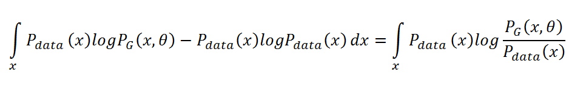
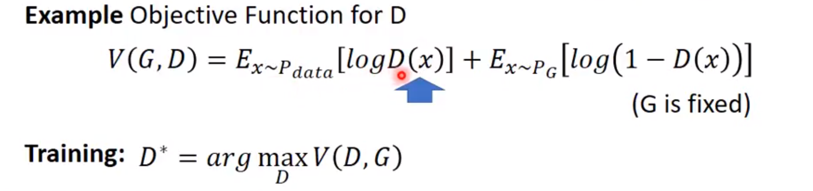

## GAN细节推导

在信息论中，我们可以使用香农熵（Shannon entropy）来对整个概率分布中的不确定性总量进行量化：

.png)

如果我们对于同一个随机变量 x 有两个单独的概率分布 P(x) 和 Q(x)，我们可 以使用 KL 散度（Kullback-Leibler divergence）来衡量这两个分布的差异：

.png)

KL的重要性质：

1. 非负
2.  当且仅当 P 和 Q 在离散型变量的情况下是相同的分布，或者在连续型变量的情况下是 『几乎 处处』 相同的
3. 它经常 被用作分布之间的某种距离，不是真正的距离，因为非对称
4. 选择 D_KL(P||Q) 还是 D_KL(Q||P) 影响很大。

### 引出GAN

若给定一个样本数据的分布 $P_{data}(x)$和生成的数据分布 P_G(x;θ)，那么 GAN 希望能找到一组参数θ使分布$P_g(x;θ)$ 和 $P_{data}(x)$ 之间的距离最短，也就是找到一组生成器参数$\theta$而使得生成器能生成十分逼真的图片。

现在我们可以从训练集抽取一组真实图片来训练 P_G(x;θ) 分布中的参数θ使其能逼近于真实分布

#### 最大似然函数

做法：现在从 $P_{data}(x)$中抽取 m 个真实样本{ $𝑥^1,𝑥^2,…,𝑥^𝑚$}，对于每一个真实样本，我们可以计算 $P_G(x^i;θ)$，即在由θ确定的生成分布中，x^i 样本所出现的概率。因此，我们就可以构建似然函数：

.png)

下面我们就可以最大化似然函数 L 而求得离真实分布最近的生成分布（即最优的参数θ）：

.png)

#### KL散度

在上面的推导中，因为该最优化过程是针对θ的，所以我们添加一项不含θ的积分并不影响最优化效果，即可添加 $-∫P_data(x)logP_data(x)dx$。添加该积分后，我们可以合并这两个积分并构建类似 KL 散度的形式。该过程如下：

这一个积分就是 KL 散度的积分形式，因此，如果我们需要求令生成分布 $P_G(x;θ)$ 尽可能靠近真实分布 $P_data(x)$ 的参数$θ$，那么我们只需要求令 KL 散度最小的参数θ。若取得最优参数θ，那么生成器生成的图像将显得非常真实。

我们的目标：得到一个生成网络G，它的output的概率密度$p_G$尽量接近真实样本分布$p_{data}$。

$$
G*=arg \min_G Div(P_g,P_{data})
$$

**最小化Div**；Div可以是上面的KL；

如何计算？利用一个Discriminator。

如何得到$P_G$和$P_{data}$： sample

如和训练discriminator？

#### 推导存在的问题

下面，我们必须证明该最优化问题有唯一解 G*，并且该唯一解满足 P_G=P_data。不过在开始推导最优判别器和最优生成器之前，我们需要了解 Scott Rome 对原论文推导的观点，他认为原论文忽略了可逆条件，因此最优解的推导不够完美。

在 GAN 原论文中，有一个思想和其它很多方法都不同，即生成器 G 不需要满足可逆条件。Scott Rome 认为这一点非常重要，因为实践中 G 就是不可逆的。而很多证明笔记都忽略了这一点，他们在证明时错误地使用了积分换元公式，而积分换元却又恰好基于 G 的可逆条件。Scott 认为证明只能基于以下等式的成立性：

.png)

该等式来源于测度论中的 Radon-Nikodym 定理，它展示在原论文的命题 1 中，并且表达为以下等式：

.png)

我们看到该讲义使用了积分换元公式，但进行积分换元就必须计算 G^(-1)，而 G 的逆却并没有假定为存在。并且在神经网络的实践中，它也并不存在。可能这个方法在机器学习和统计学文献中太常见了，因此我们忽略了它。

#### 最大化V

第一项：真实样本中的越大越好

第二项：生成的值判别为小值。

最大化 V(D,G) 评估了 P_G 和 P_data 之间的差异或距离。因为在原论文中价值函数可写为在 x 上的积分，即将数学期望展开为积分形式：

1.png)

其实求积分的最大值可以转化为求被积函数的最大值。而求被积函数的最大值是为了求得最优判别器 D，因此不涉及判别器的项都可以看作为常数项。如下所示，P_data(x) 和 P_G(x) 都为标量，因此被积函数可表示为 a*D(x)+b*log(1-D(x))。

.png)

若令判别器 D(x) 等于 y，那么被积函数可以写为：

.png)

为了找到最优的极值点，如果 a+b≠0，我们可以用以下一阶导求解：

.png)

如果我们继续求表达式 f(y) 在驻点的二阶导：

.png)

其中 a,b∈(0,1)。因为一阶导等于零、二阶导小于零，所以我们知道 a/(a+b) 为极大值。若将 a=P_data(x)、b=P_G(x) 代入该极值，那么最优判别器 $D(x)=P_data(x)/(P_data(x)+P_G(x))$。

最后我们可以将价值函数表达式写为：

.png)

如果我们令 D(x)=P_data/(P_data+p_G)，那么我们就可以令价值函数 V(G,D) 取极大值。因为 f(y) 在定义域内有唯一的极大值，最优 D 也是唯一的，并且没有其它的 D 能实现极大值。

其实该最优的 D 在实践中并不是可计算的，但在数学上十分重要。我们并不知道先验的 P_data(x)，所以我们在训练中永远不会用到它。另一方面，它的存在令我们可以证明最优的 G 是存在的，并且在训练中我们只需要逼近 D。

#### 最优生成器

当然 GAN 过程的目标是令 P_G=P_data。这对最优的 D 意味着什么呢？我们可以将这一等式代入 D_G*的表达式中：

.png)

这意味着判别器已经完全困惑了，它完全分辨不出 P_data 和 P_G 的区别

设 P_G=P_data（反向指预先知道最优条件并做推导），我们可以反向推出：

.png)

该值是全局最小值的候选，因为它只有在 P_G=P_data 的时候才出现。我们现在需要从正向证明这一个值常常为最小值，也就是同时满足「当」和「仅当」的条件。现在放弃 P_G=P_data 的假设，对任意一个 G，我们可以将上一步求出的最优判别器 D* 代入到 C(G)=maxV(G,D) 中： 

.png)

因为已知 -log4 为全局最小候选值，所以我们希望构造某个值以使方程式中出现 log2。因此我们可以在每个积分中加上或减去 log2，并乘上概率密度。这是一个十分常见并且不会改变等式的数学证明技巧，因为本质上我们只是在方程加上了 0。

.png)

采用该技巧主要是希望能够构建成含 log2 和 JS 散度的形式，上式化简后可以得到以下表达式：

.png)

因为概率密度的定义，P_G 和 P_data 在它们积分域上的积分等于 1，即：

.png)

此外，根据对数的定义，我们有：

.png)

因此代入该等式，我们可以写为：

.png)

现在，如果读者阅读了前文的 KL 散度（Kullback-Leibler divergence），那么我们就会发现每一个积分正好就是它。具体来说：

.png)

KL 散度是非负的，所以我们马上就能看出来-log4 为 C(G) 的全局最小值。

#### G*是唯一的

从前文可知 KL 散度是非对称的，所以 C(G) 中的 KL(P_data || (P_data+P_G)/2) 左右两项是不能交换的，但如果同时加上另一项 KL(P_G || (P_data+P_G)/2)，它们的和就能变成对称项。这两项 KL 散度的和即可以表示为 JS 散度（Jenson-Shannon divergence）：

.png)

 假设存在两个分布 P 和 Q，且这两个分布的平均分布 M=(P+Q)/2，那么这两个分布之间的 JS 散度为 P 与 M 之间的 KL 散度加上 Q 与 M 之间的 KL 散度再除以 2。

JS 散度的取值为 0 到 log2。若两个分布完全没有交集，那么 JS 散度取最大值 log2；若两个分布完全一样，那么 JS 散度取最小值 0。

因此 C(G) 可以根据 JS 散度的定义改写为：

.png)

这一散度其实就是 Jenson-Shannon 距离度量的平方。根据它的属性：当 P_G=P_data 时，JSD(P_data||P_G) 为 0。综上所述，生成分布当且仅当等于真实数据分布式时，我们可以取得最优生成器

#### 收敛

#### 训练过程

1.参数优化过程

若我们需要寻找最优的生成器，那么给定一个判别器 D，我们可以将 maxV(G,D) 看作训练生成器的损失函数 L(G)。既然设定了损失函数，那么我们就能使用 SGD、Adam 等优化算法更新生成器 G 的参数，梯度下降的参数优化过程如下：

.png)

其中求 L(G) 对$θ_G $的偏导数涉及到求 max{V(G,D)} 的偏导数，这种对 max 函数求微分的方式是存在且可用的。

现在给定一个初始 G_0，我们需要找到令 V(G_0,D) 最大的 $D_0*$，因此判别器更新的过程也就可以看作损失函数为$-V(G,D) $的训练过程。并且由前面的推导可知，V(G,D) 实际上与分布 P_data(x) 和 P_G(x) 之间的 JS 散度只差了一个常数项。因此这样一个循环对抗的过程就能表述为：

- 给定$ G_0$，最大化 V(G_0,D) 以求得 D_0*，即 max[JSD(P_data(x)||P_G0(x)]；
-  固定 $D_0$*，计算θ_G1 ← θ_G0 −η(𝜕V(G,D_0*) /𝜕θ_G) 以求得更新后的 G_1；
- 固定 $G_1$，最大化 V(G_1,D_0*) 以求得 D_1*，即 max[JSD(P_data(x)||P_G1(x)]；
- 固定$ D_1$*，计算θ_G2 ← θ_G1 −η(𝜕V(𝐺,𝐷_0*) /𝜕θ_G) 以求得更新后的 G_2；
- 。。。

2.实际训练过程

根据前面价值函数 V(G,D) 的定义，我们需要求两个数学期望，即 $E[log(D(x))]$ 和 $E[log(1-D(G(z)))]$，其中 x 服从真实数据分布，z 服从初始化分布。但在实践中，我们是没有办法利用积分求这两个数学期望的，所以一般我们能从无穷的真实数据和无穷的生成器中做采样以逼近真实的数学期望。

若现在给定生成器 G，并希望计算 maxV(G,D) 以求得判别器 D，那么我们首先需要从 P_data(x) 采样 m 个样本 {𝑥^1,𝑥^2,…,𝑥^𝑚}，从生成器 P_G(x) 采样 m 个样本 .png)。因此最大化价值函数 V(G,D) 就可以使用以下表达式近似替代：

.png)

 若我们需要计算上述的极大化过程，可以采用等价形式的训练方法。若我们有一个二元分类器 D（参数为θ_d），当然该分类器可以是深度神经网络，那么极大化过程的输出就为该分类器 D(x)。现在我们从 P_data(x) 抽取样本作为正样本，从 P_G(x) 抽取样本作为负样本，同时将逼近负 V(G,D) 的函数作为损失函数，因此我们就将其表述为一个标准的二元分类器的训练过程：

1.png)

在实践中，我们必须使用迭代和数值计算的方法实现极小极大化博弈过程。在训练的内部循环中完整地优化 D 在计算上是不允许的，并且有限的数据集也会导致过拟合。因此我们可以在 k 个优化 D 的步骤和一个优化 G 的步骤间交替进行。那么我们只需慢慢地更新 G，D 就会一直处于最优解的附近，这种策略类似于 SML/PCD 训练的方式。

综上，我们可以描述整个训练过程，对于每一次迭代：

- 从真实数据分布 P_data 抽取 m 个样本
- 从先验分布 P_prior(z) 抽取 m 个噪声样本
- 将噪声样本投入 G 而生成数据 .png)，通过最大化 V 的近似而更新判别器参数θ_d，即极大化 .png) ，且判别器参数的更新迭代式为 .png)

以上是学习判别器 D 的过程。因为学习 D 的过程是计算 JS 散度的过程，并且我们希望能最大化价值函数，所以该步骤会重复 k 次。

- 从先验分布 P_prior(z) 中抽取另外 m 个噪声样本 {z^1,...,z^m}
- 通过极小化 V^tilde 而更新生成器参数θ_g，即极小化 1.png)，且生成器参数的更新迭代式为 .png)

以上是学习生成器参数的过程，这一过程在一次迭代中只会进行一次，因此可以避免更新太多而令 JS 散度上升。

参考： https://www.jiqizhixin.com/articles/2017-10-1-1