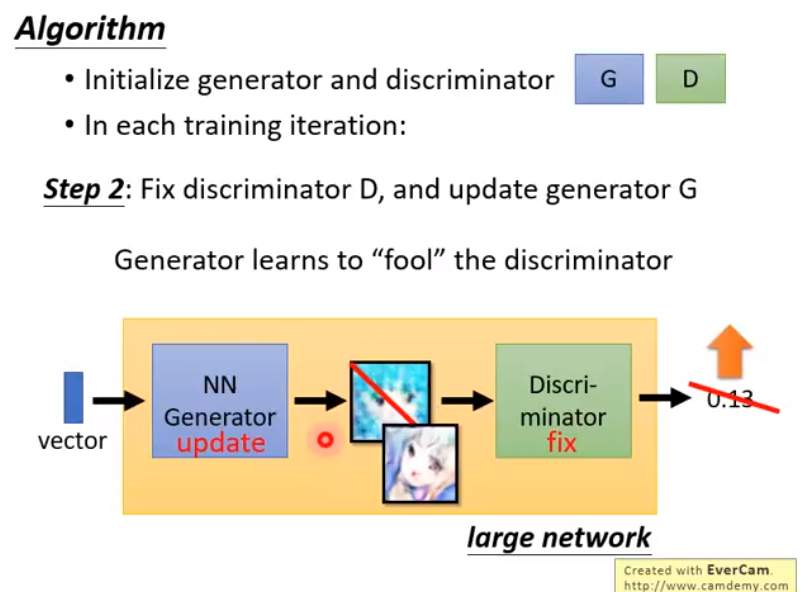
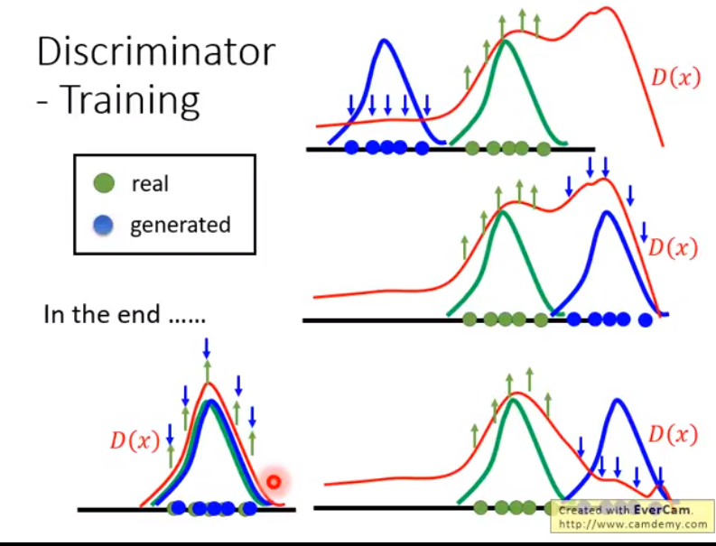
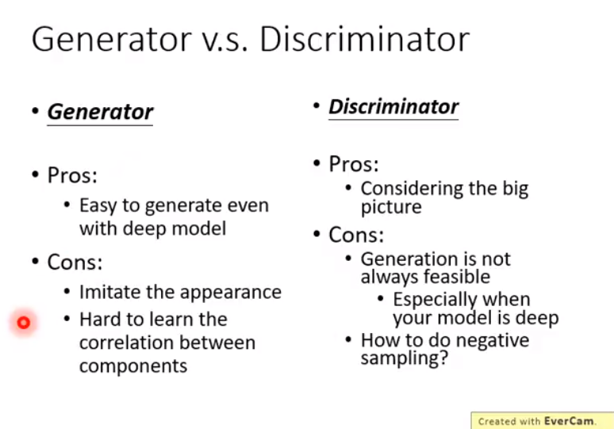

#### 第一步

，固定generator，由随机噪声生成图片；调整discrimination的参数，使得真实图片（从一个真实的database里取出）的输出值大，G生成的图片输出值小；

#### 第二步

固定D，调整G，G和D连成一个大的network，G的输出可以视为network中的一层；调整使得D给G生成的图片高分；

#### loss函数

对判别器而言，让真实图片的输出$D(X^i)$尽量大，让生成图片的输出尽量小$(1-D(\tilde{X}^i))$;

对生成器而言，让生成的图片被D判别的结果$D(G(z^i))$越大越好；

