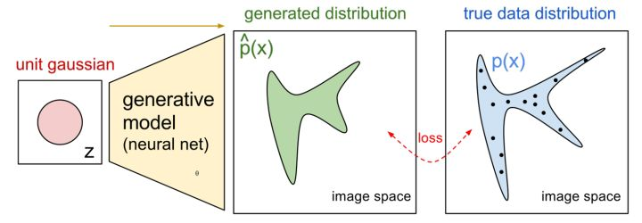
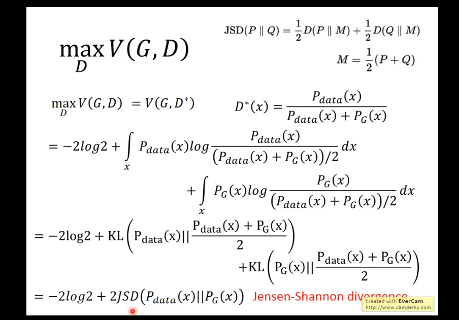
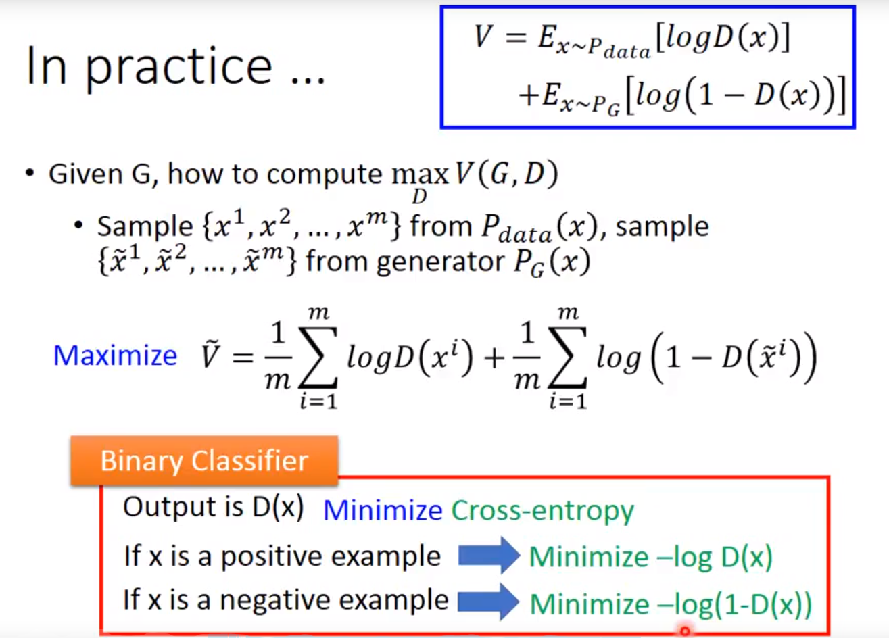
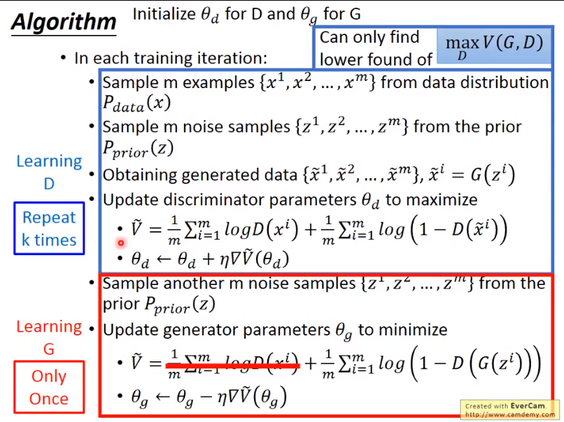
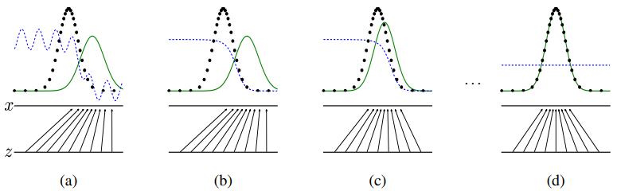

#### 组件

1. **生成器(Generator**)：通过机器生成数据（大部分情况下是图像），目的是“骗过”判别器
2. **判别器(Discriminator**)：判断这张图像是真实的还是机器生成的，目的是找出生成器做的“假数据”

### 过程
#### 第一阶段：固定D，训练G
 对于从训练数据中取样出的真实图片x，判别器D希望D(x)的输出值接近1，即判定训练数据为真实图片
#### 第二阶段：固定G，训练D
给定一个随机噪声z，判别器D希望D(G(z))的输出值接近0，即认定生成器G生成的图片是假的；而生成器G希望D(G(z))的输出值接近1，即G希望能够欺骗D，让D将生成器G生成的样本误判为真实图片。
#### 循环阶段一和二

#### 优点
**3个优势**

能更好建模数据分布（图像更锐利、清晰）
理论上，GANs 能训练任何一种生成器网络。其他的框架需要生成器网络有一些特定的函数形式，比如输出层是高斯的。
无需利用马尔科夫链反复采样，无需在学习过程中进行推断，没有复杂的变分下界，避开近似计算棘手的概率的难题。

**2个缺陷**

难训练，不稳定。生成器和判别器之间需要很好的同步，但是在实际训练中很容易D收敛，G发散。D/G 的训练需要精心的设计。
模式缺失（Mode Collapse）问题。GANs的学习过程可能出现模式缺失，生成器开始退化，总是生成同样的样本点，无法继续学习。
扩展阅读：《为什么训练生成对抗网络如此困难？》阅读这篇文章对数学要求很高

### 内部实现
#### 最大似然估计
最大似然的原理实际上就是选择可以最大化训练数据的似然的模型参数

我们可以把最大似然估计看做是数据生成分布和模型分布之间的KL散度

如下图所示。当我们给神经网络的输入是一个分布（如正态分布），它的输出也可以看做一个分布。

这个过程可以用如下公式来表示：
$$
P_G(x)=\int_zP_{prior}(z)I_{[G(z)=x]}\,\mathrm{d}z \tag{10}
$$

但此时如果使用最大似然估计会存在问题，就是神经网络的参数量太大，想要计算似然(likelihood)来对神经网络的参数进行估计是不现实的。

GAN最大的贡献就是绕开了这个问题，不直接计算似然，而是通过使用判别器D与生成器G的对抗过程，来训练生成器G。

### GAN的形式

下面进行形式化的定义：

$p_g$生成模型的概率分布；

$p_{data}$真实数据概率分布 ；

$p_z(z)$输入噪声变量 ；

$G(z;\theta_g$: G是可微函数；是参数为$\theta_g$的多层感知机 ；

$D(z;\theta_d$: D是可微函数；是参数为$\theta_d$的多层感知机；

D(x)代表x来自数据而不是$p_g$的概率。训练D来最大化D赋给训练样本和从G中取得的样本正确标签的概率。我们同时训练G最小化 $log(1-D(G(z))$。

换句话说，D和G进行如下two-player minimax game：
$$
G^*=arg\  \min_G\ \max_D V(G,D)
$$

V(G,D)是一个函数，给定G和D，V函数会输出一个output；

给定一个Gi，会有一个V（Gi,D)，先在V中挑选最大值；然后再从这些值中中挑选最小的那个，即为G*
$$
\begin{align}
V & = E_{X\sim p_{data}}[logD(x)]+E_{X\sim p_G} [log(1-D(x))] \\
& =\int_x p_{data}\log D(x)dx +\int_xp_G(x)\log(1-D(X))dx \\
& =\int_x[p_{data}(X)\log D(x)+p_G(x)log(1-D(x))]dx
\end{align}
$$

只要中括号中的项最大，则V也最大；

- $p_{data}$：是给定的
- $p_G(x)$：已给定
- 求D使V最大
$$
\begin{align}
f(D)&=a\log (D)+b\log (1-D) \\
\frac{df(D)}{dD}& =a\times\frac{1}{D}+b\times\frac{1}{1-D}\times (-1)=0\\
a\times\frac{1}{D*}& =b\times{1}{1-D*}\\
a\times(1-D*)& =b\times D*\\
a-aD*& =bD*\\
D*& =\frac{a}{a+b}\\
0<D*& =\frac{P_{data}(X)}{P_{data}(x)+P_G(x)}<1
\end{align}
$$

已知D了，那么max V(G,D)为：
$$
\begin{align}
\max_D V(G,D)&=E_{x\sim P_{data}}[log\frac{P_{data}(x){P_{data}(x)+P_G(x)}}]+E_{x\sim P_{G}}[log\frac{P_{G}(x){P_{data}(x)+P_G(x)}}]\\
&=\int_x P_{data}log\frac{P_{data}(x)}{P_{data}(x)+P_G(x)}dx+\int_x P_{G}log\frac{P_G(x)}{P_{data}(x)+P_G(x)}dx
\end{align}
$$

如何使max最小？

$P_{data}(x)=P_G(x)$的时候。

#### Algorithm

如何找到G*使最小？

参考：https://zhuanlan.zhihu.com/p/30107433