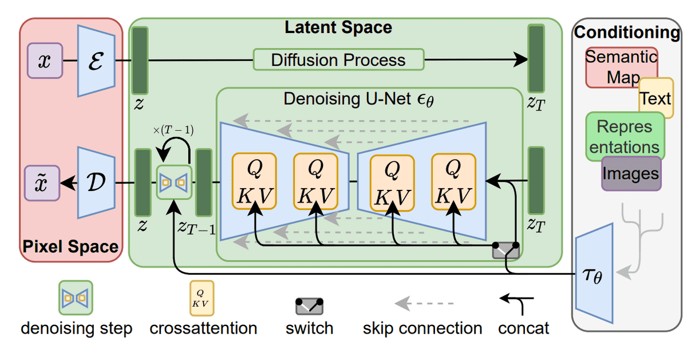

## stable diffusion model

x为输入的高清图像， ${\varepsilon}$ 是编码器，经过diffusion process （加噪声过程）得到噪声图形 $z_T$，然后噪声再去噪还原一个近似图像 $\tilde{x}$，$D$ 为decoder

使用编码器 ${\varepsilon}$ 帮助把512$\times$512的图像（甚至更高分辨率）降维到一个latent space，提高计算效率。不降低质量的同时提高分辨率。

#### 参考

[Stable Diffusion - What, Why, How? - YouTube](https://www.youtube.com/watch?v=ltLNYA3lWAQ&t=5s)