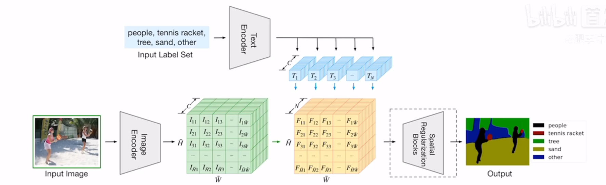

## LSeg
分割CLIP

分类和分割都可以使用CLIP预训练模型，language guided；

### 模型

<figure align="center"> top：文字编码器（直接使用CLIP预训练模型，不微调）。bottom：图像编码器，与有监督的语义分割（transformer）框架一样 </figure>

不是无监督训练！

其zero-shot与有监督结果差别还比较大

## GroupViT 

### 模型

LSeg所用数据集只有十万级别；本文使用图像-文本对实现无监督分类

使用了group（聚类）的想法；

原本CLIP：文本和图片各有一个特征，可以对比学习；

现在：图像有多个聚类中心（多个特征）；所以使用average polling成为一个特征；

### zero-shot

只有8个group，所以最多8类；

设置阈值决定背景类；

### 细节

每一阶段对应不同的聚类中心（有可解释性）；

分割结果好，但最后分类容易出错；

比有监督的结果差的还是很多；

## ViLD

问题：目前目标检测的类别有限

### 模型

<figure align="center"> 第一个为base model（传统模型）；(b)注意需要训练back ground;(c)用CLIP模型和传统监督学习的分类结果做知识蒸馏；(d) </figure>

## GLIP

pass

#### 参考

[CLIP 改进工作串讲（上）【论文精读·42】_哔哩哔哩_bilibili](https://www.bilibili.com/video/BV1FV4y1p7Lm/?spm_id_from=333.788&vd_source=51835ba198b79c5277a5fcadc11bd9ff)