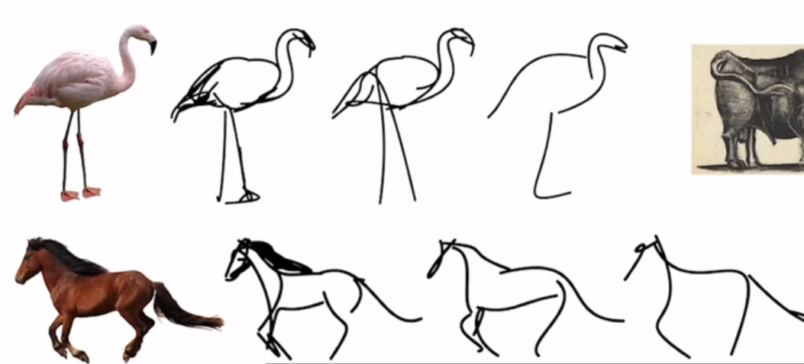
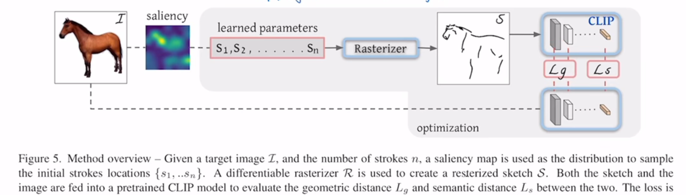
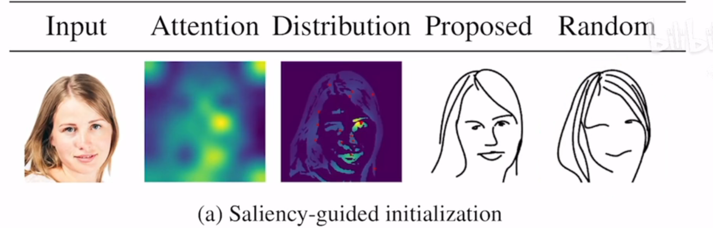
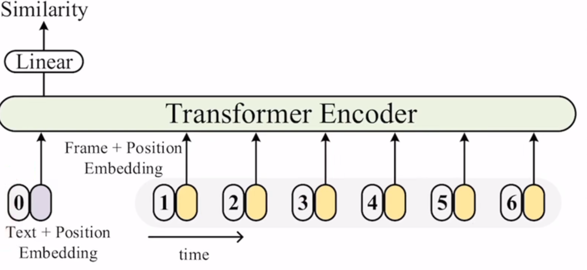
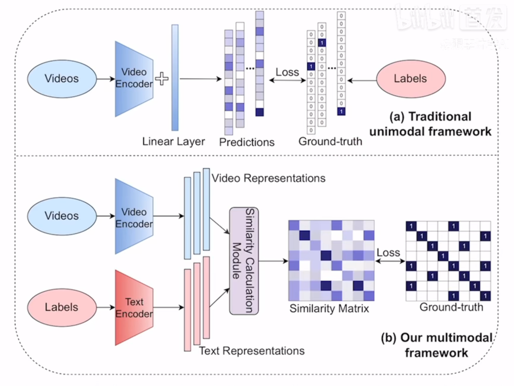
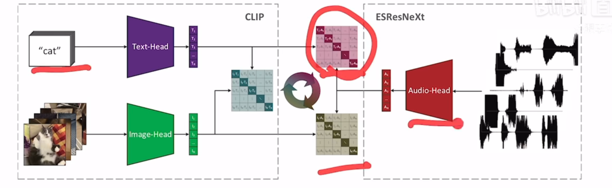

## CLIPasso

保持语义信息的简笔画

之前的方法都是有监督学习（固定数据集），种类不够丰富；

为什么用CLIP：不受图像风格的影响；抽取图像特征的稳健性；

### 方法/模型

#### 贝兹曲线

如何初始化？

效果：

#### loss function

$L_s$：简笔画和原始图像特征尽可能接近

$L_g$：只计算Res50前几层输出（对几何更敏感）的loss

**需要的计算资源小，**

#### 局限性

- 如果有背景，效果不太好；
- 同时生成，而非序列生成（与人绘制的方法不同）
- 笔画数量的选择有限；

## CLIP4clip

视频领域的clip 

视频有多帧，每一帧有一个图像特征，但文字只有一个特征，如何计算相似度？

对比三种不同方法

#### 取平均

无法保留时序特征（没有先后顺序）

#### LSTM/Transformer

融合为一个特征（考虑了时序信息）

#### Tight type

多数时候方法一效果最好，方法三最差，偶尔方法二好；

对视频有效；加入视频数据再训练CLIP效果更好；3D patch更好

## actionCLIP

视频的动作领域

### 模型

<figure align="center"> top：传统模型。bottom：本文模型（CLIP架构） </figure>

用有监督学习的话，一个label代表很多种动作；

本文改进：

- 如何把图像变为视频来计算
- CLIP完全无监督；本有有一些标签；用KL散度而不是交叉熵计算loss

multimodel frame

3阶段：pre-train-prompt-fine tune

## 其他

### CLIP-ViL

把视觉编码器换成CLIP

### AudioCLIP

### PointCLIP

3D点云；把CLIP学到的2D特征迁移到3D（因为3D数据集目前还太少）

### DepthCLIP

把回归问题变为分类问题（7类深度）
