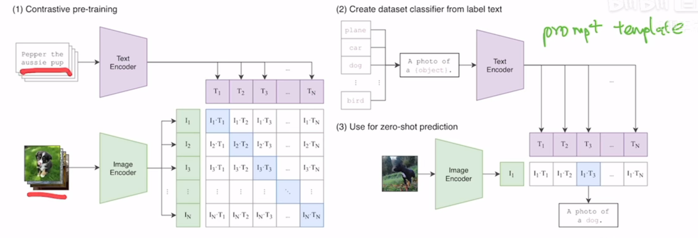
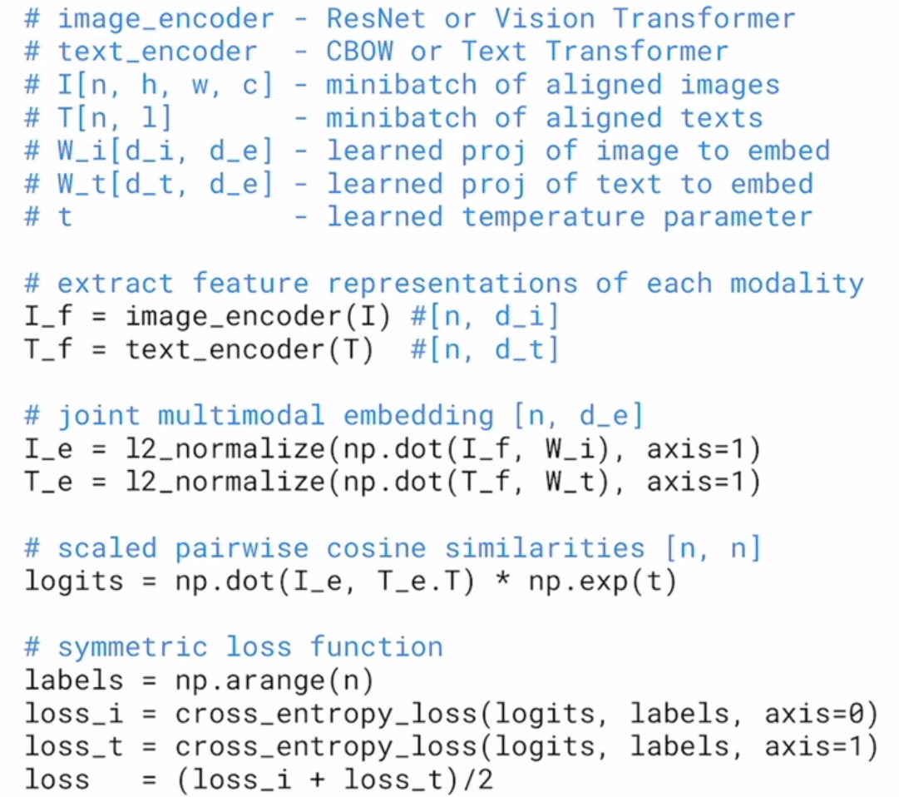

### 模型简介

输入图片-文本对，分别抽取特征，计算两者相关性。

需要正样本（图片-文本对，矩阵对角线元素）和负样本（矩阵非对角线元素）

### zero-shot

prompt template方法

#### 文本编码器

使用句子（而不是单词），因为文本编码器预训练用的句子；

#### 图像编码器

ViT

#### 分类

计算cosine similarity，分数最高的即为分成的类别；

可以自由添加类别（标签） 

### 用途

指导生图

物体检测任务

视频中提取特定物体帧

### 模型

用自监督的NLP模型帮助训练视觉模型

需要足够大的文本-图片数据集（400M）

#### 伪代码

### zero-shot

训练好模型后，可以用文本作为引导；

