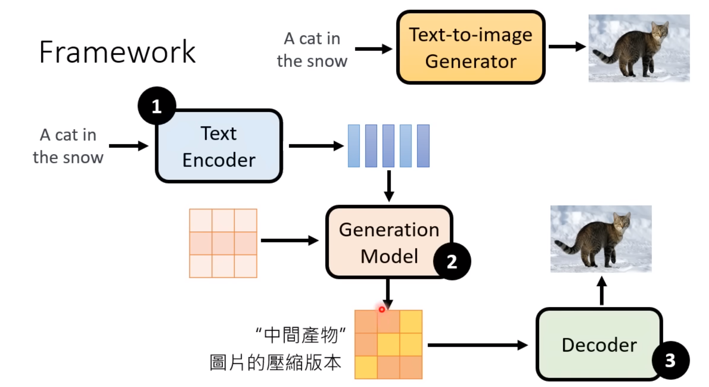
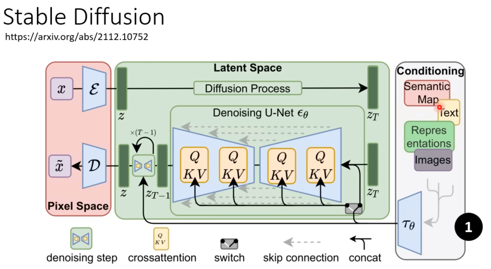
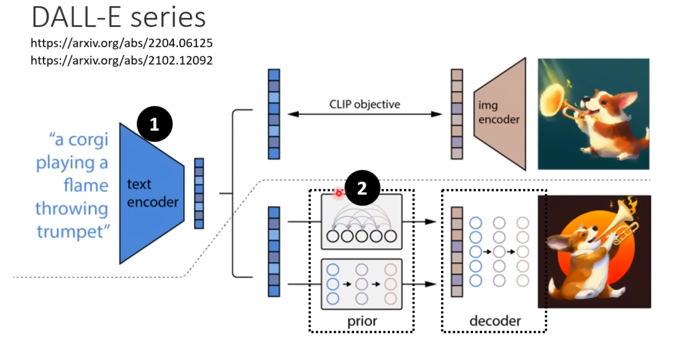
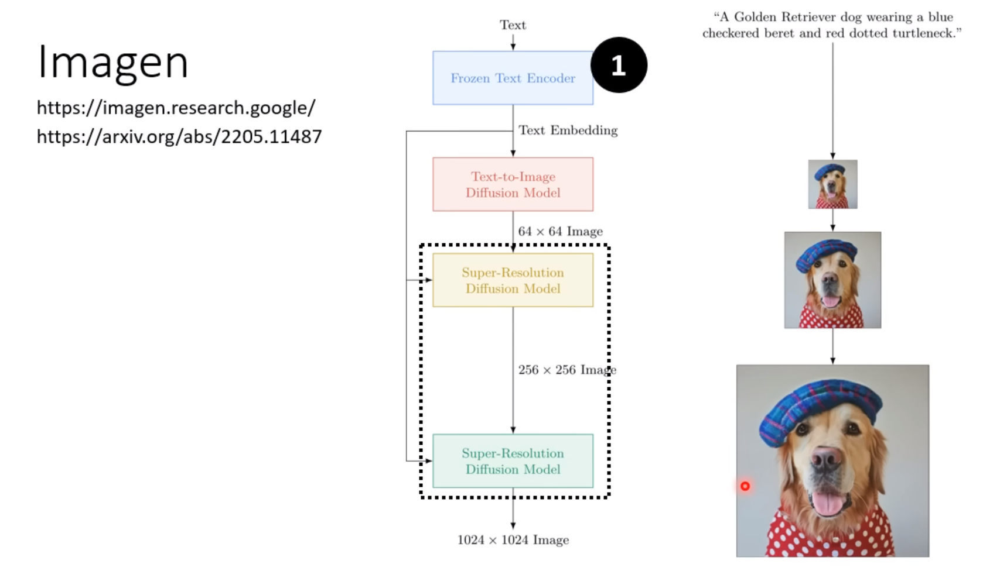
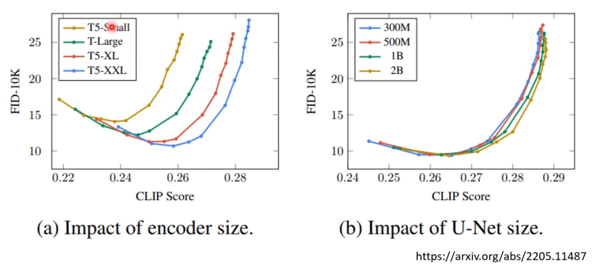
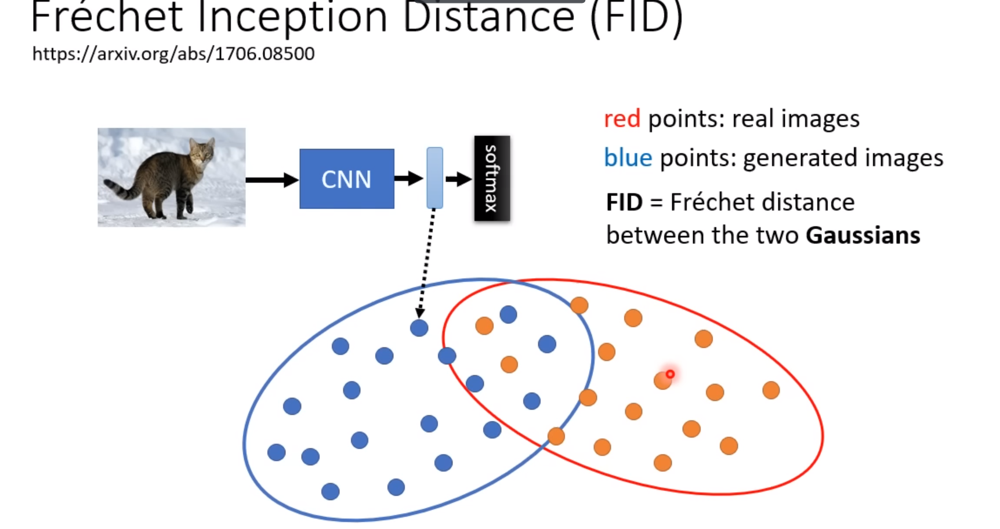
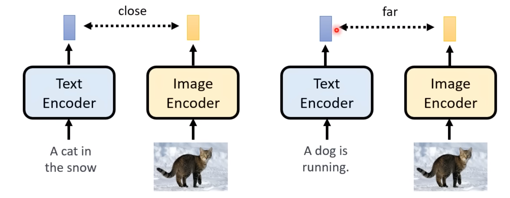
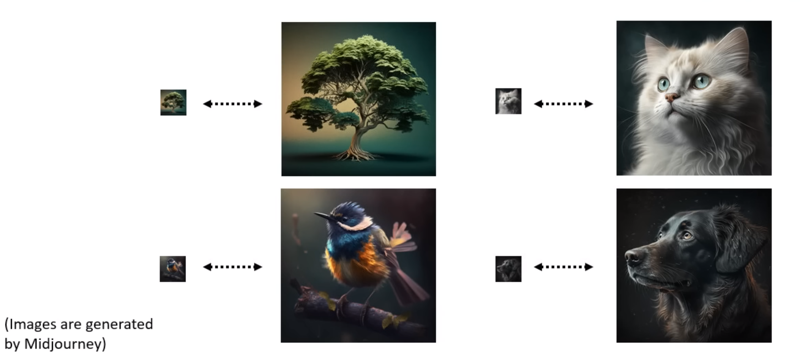
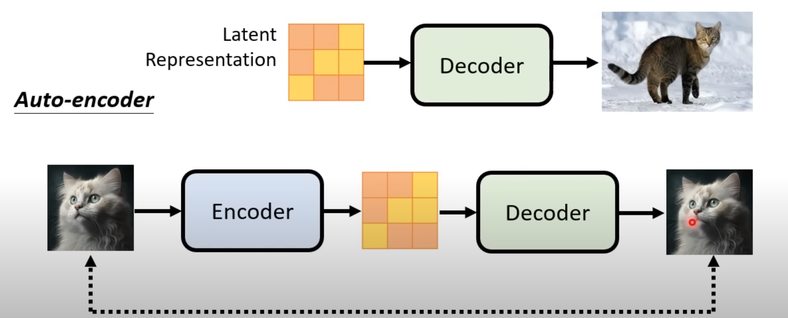

目前最好的生成模型

### 三个部分

经典模型的基础框架：

对于stable diffusion

x为输入的高清图像， ${\varepsilon}$ 是编码器，经过diffusion process （加噪声过程）得到噪声图形 $z_T$，然后噪声再去噪还原一个近似图像 $\tilde{x}$，$D$ 为decoder

使用编码器 ${\varepsilon}$ 帮助把512$\times$512的图像（甚至更高分辨率）降维到一个latent space，提高计算效率。不降低质量的同时提高分辨率。

DALL-E 有两种生成模式：autoregressive或者diffusion

Image先生成小图，再得到更高精度的。

## Text Encoder

该部件对结果影响很大。

左图为不同文字编码器的影响，右边为diffusion model

#### FID

Frechet Inception Distance ：衡量两个分布之间的距离

需要足够大的samples；

#### CLIP

contrastive language-image pre-training：衡量文字和图片关联度；

## Decoder

不需要文字资料，直接从中间产物训练。

#### 中间产物为小图

#### 中间产物为latent representation

## Generation model

与diffusion model的思路基本一致。