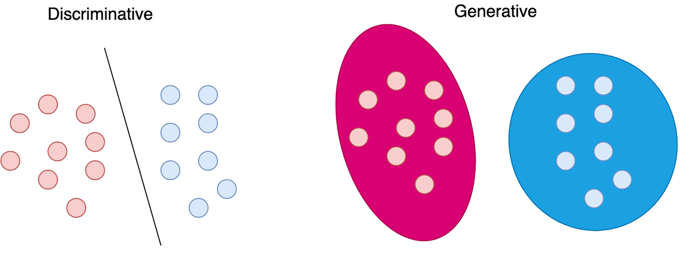
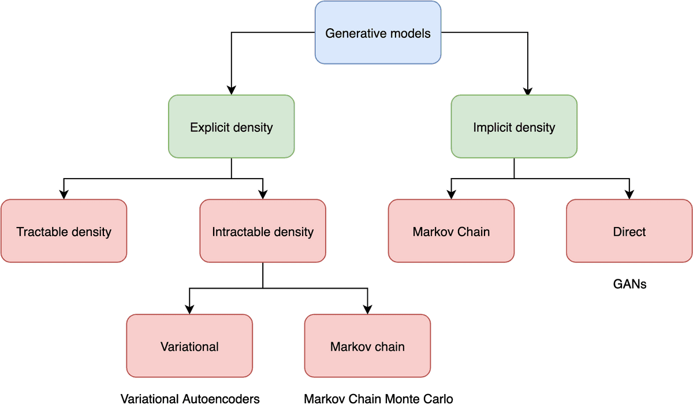
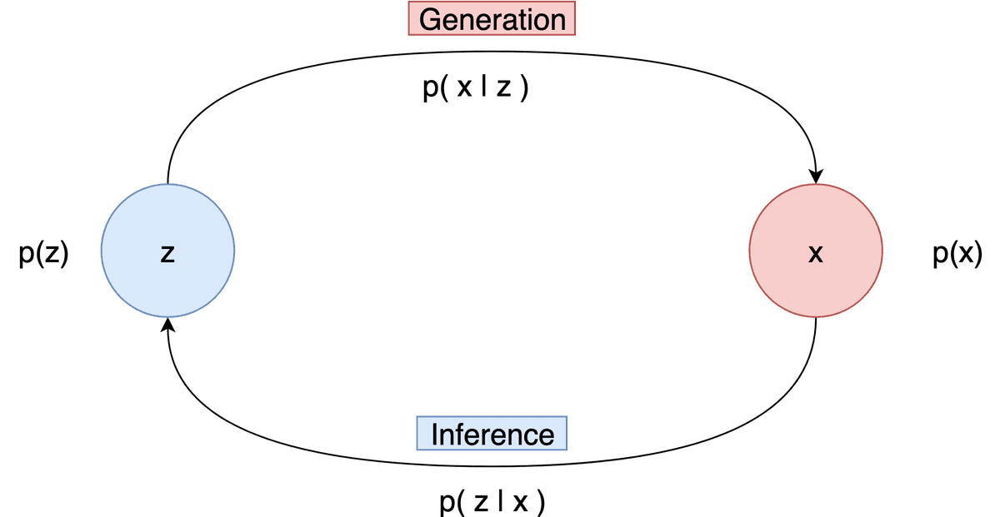

latent variable models 和其经典款 Variational Autoencoders (VAE)

### Discriminative vs Generative models

机器学习可以分为判别模型和生成模型，区别在于所使用地概率表述

#### discriminative models

判别器基于数据点 $x$ 学习 标签 $y$ 的概率，即 $p(y|x)$，需要学习数据到标签的映射（mapping）；这种映射可以用概率分布来描述；

#### generative models

学习数据点的分布（在没有标签的条件下），即 $p(x)$；数据需要“compete” for probability density

#### conditional generative models

learn the probability distribution of the data $x$ conditioned on the labels $y$， 即 $p(x|y)$。the data “compete” for density but for each possible label.

概率综合为1， $\int_X p(x)dx=1$，所以对任意单个点 $x$ 而言，它只是a small piece of the density，需要对抗的时很大的一块。

前述的模型之间是相互联系的，基于贝叶斯规则
$$
p(x|y) = \frac{p(y|x)p(x)}{p(y)}
$$

## Gennerative Models

$p(x)$描述训练数据的分布，并且可以从分布中采样生成新的数据。理想情况下，希望学到的概率 $p(x)$ 和 数据分布 $p_{data}(x)$ 是一样的。为了实现该目标有很多策略

- **explicit density models**：显式计算密度函数 $p$，训练完成后，给模型一个输入点 $x$ ，它会预测该点的 likelihood。所以它是计算准确的密度函数或者说估算它。VAE即是这一种
- **implicit density models**： 不计算 $p(x)$， 而是在模型训练完后从分布中采样。所以是map he underlying distribution，如GAN；

## Latent Variable models

Latent variables是把数据投影到**连续的低维空间**。

在数学形式中，数据点 $x$ 遵循概率分布 $p(x)$，并且被 Latent variables $z$ 映射到分布 $p(z)$ 中；

- 先验分布 $p(z)$ 模拟了latent variables 的行为
- 似然 $p(x|z)$ 定义了latent variable到数据点的映射；
- 联合分布 $p(x,z)=p(x|z)p(z)$ 是先验分布和似然的成绩
- 边缘分布 $p(x)$ 是原始数据点的分布，也是模型的最终目标，描述how possible it is to generate a data point
- 后验分布 $p(z|x)$ 描述从特定数据点得到的latent variables 

注意，我们没有使用标签 $y$

`generation` 是从latent variable $z$ 中计算数据点 $x$，即likelihood $p(x|z)$

`inference`  是从数据点 $x$ 中寻找 latent variable $z$，即后验分布 $p(z|x)$

这两个互为反过程

对于`generation`，从 $p(z)$ 中采样 $z$， 然后 $p(x|z)$中采样 $x$
$$
z\sim p(z)\\
x\sim p(x|z)
$$
对于`inference`，从 $p(x)$ 中采样 $x$， 然后从 $p(z|x)$ 中采样 $z$
$$
x\sim p(x)\\
z\sim p(z|x)
$$
**关键问题在于，如何找到这些分布？**

### 最大似然法

为了使用梯度下降法，需要the gradient of the marginal log-likelihood function
$$
\nabla \log p_\theta(x) = \int p_\theta(z|x) \nabla_\theta \log p_\theta(x,z)dz
$$
需要有后验分布 $p(z|x)$

### 计算后验分布——求解推断问题

推断模型分分两类：tractable and intractable

tractable model很少。

we have an **intractable** problem but we try to approximate the inference.两种方法来近似inference：

- [Markov Chain Monte Carlo](https://en.wikipedia.org/wiki/Markov_chain_Monte_Carlo) methods and
- Variational Inference.

### Variational Inference.

如果想用另一个variational posterior 分布 $q_\phi(z|x)$ 来近似实际的 $p_\theta(z|x)$

**variational lower bound**：近似下边界 $L_{\theta,\phi}(x)$
$$
L_{\theta,\phi}(x) = \mathbb{E}_{q\phi}(z)[\log \frac{p_\theta(x,z)}{q_\phi(z|x)}]\le\log p_\theta(x)
$$
这就是 Evidence Lower Bound (ELBO) 

拓展ELBO，得到
$$
L_{\theta,\phi}(x) = \log p_\theta(x)-\mathbf{KL}(q_\phi(z|x)||p_\theta(z|x))
$$
KL散度也被称为**variational gap**，用于衡量posterior和variational posterior的差异；

训练模型时，会最大化ELBO，也就会增大 $\log p_\theta(x)$ 以及减少variational gap

pass

### variational autoencoder

建立一个NN来参数化 variational posterior $q_\phi(z|x)$ (also known as the Decoder)

使用amortized variational inference来训练这个网络，同时需要另一个网络 inference network（Encoder）参数化 likelihood $p_\theta(x|z)$

假定先验分布 $p(z)$时标准正太分布 $\mathcal{N}(0,1)$，

参考：

[The theory behind Latent Variable Models: formulating a Variational Autoencoder | AI Summer (theaisummer.com)](https://theaisummer.com/latent-variable-models/)