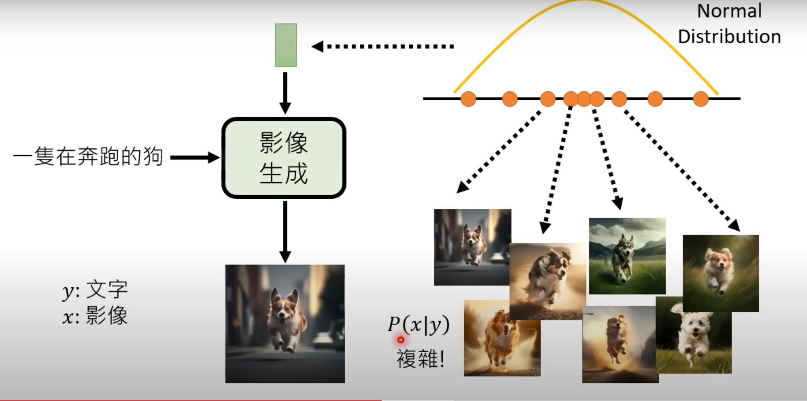
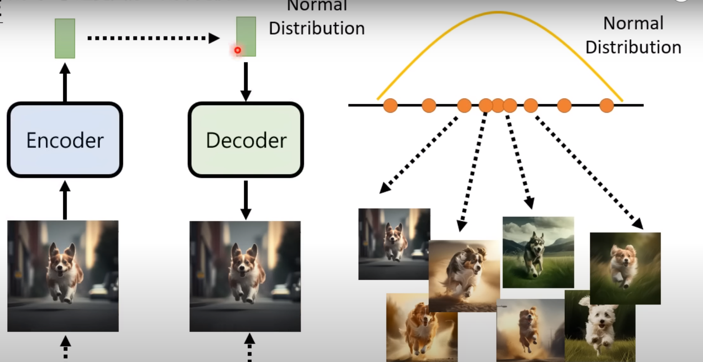
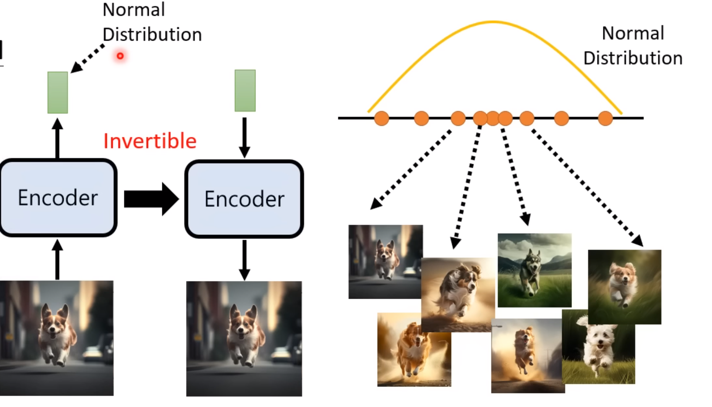
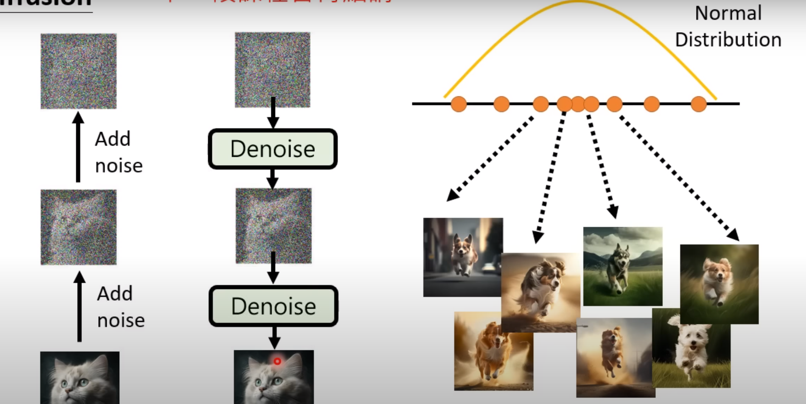
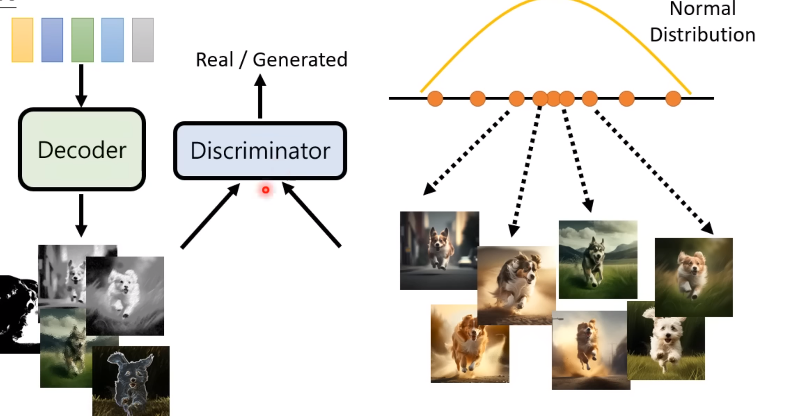
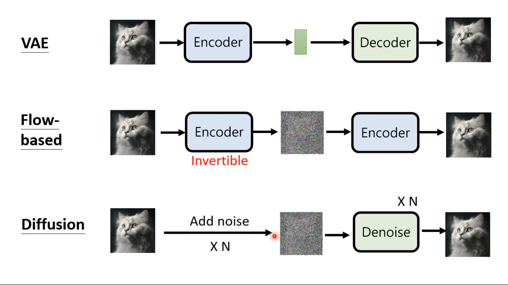
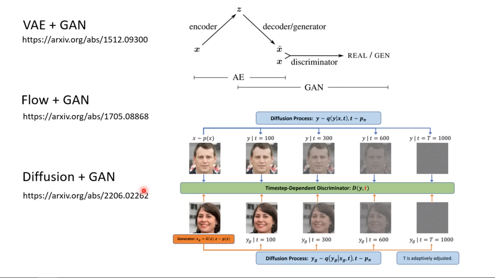

## 图像生成

即文字翻译成图像。

文字信息量少，而图像信息量更大，机器需要补足。

图像生成的关键在于model这个$P(x|y)$函数，使得normal distribution 的采样点对应到不同的图像上。

### 模型

- Variational Auto-encoder（VAE）
- Flow-based Generative model
- Diffusion Model
- Generative Adversarial Network （GAN）

## VAE 

训练 vector 到 图像。

## Flow-base model

首先训练一个 图片 encoder到某种分布，但这个encoder是可逆的，训练好后可以从分布预测图像。

所以输入 和输出是一样大小的；

## Diffusion model

## GAN

