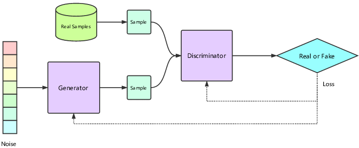
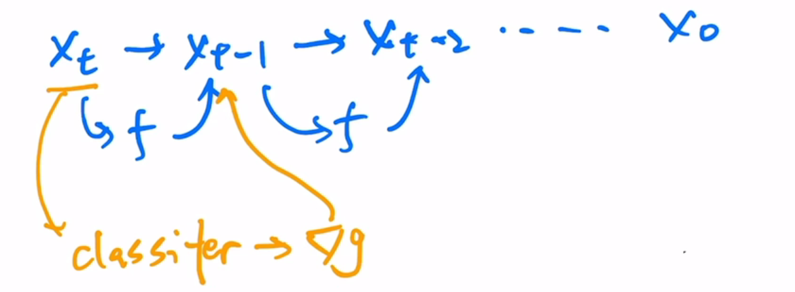

### GAN

- `生成器`：从噪声中生成逼真图片
- `判别器`：二分器，判断真实图像和生成图像

#### 优势

- 非常逼真（判别器是优化目标之一）

#### 缺点

- 训练困难，平衡两个目标，模型容易坍塌
- 多样性不足（多样性来源于随机噪声）
- 非概率模型，非隐式，数学理论不足

### Auto-Encoder

编码器-解码器架构

目标函数是输出与输入尽可能相似（重建过程）

#### denoising auto-encoder（DAE）

在编码器中增加一个小网络，把输入扰乱（污染），在输入编码器中。增加了稳健性；

理论：图像冗余性很高

### Variational Auto-Encoder（VAE）

与AE主要区别在于中间不是一个固定特征$z$，而是一个分布（假定为高斯分布，由 $\mu$ 和 $\Sigma$ 控制），再采样一个$z$出来。把编码器去除，就是一个生成模型了。

多样性非常好。

### VQVAE

不学习分布，而是一个codebook，把encoder的输出 $z_e$ 与codebook对比，取相近的向量$e_k$，得到新的特征图 $z_q$，

但无法做随机采样，不适合生成模型，所以需要再训练一个prior网络

### DALL-E

文本生成图像，基于VQVAE

### diffusion model

 U-Net架构，用同一个模型跑 $t$ 步从噪声逆转回图像

发展历程：

- DDPM：从图像预测到噪声预测，把步数 $t$ （embedding）加入输入中，损失函数就是每一步的真实噪声（正向过程加入的）和预测噪声的差异；由预测均值变为预测方差
- improved DDPM（open AI）：也学习均值；$\beta$由线性变为余弦
- diffusion model beats GAN： 上大模型
- GLIDE： classifier free guide：引导图像生成（加速）；3.5B 参数（比DALL-E参数少但效果更好）
- DALL-E2

### classifier guided diffusion

写实性换多样性，平衡两种性能

也可以用CLIP替换classifier；

### classifier free guideed

生成两个输出，一个有条件，一个无条件，得到从无条件生成结果有优条件生成结果的**方向**。但是训练代价昂贵；

#### 参考

[DALL·E 2（内含扩散模型介绍）【论文精读】_哔哩哔哩_bilibili](https://www.bilibili.com/video/BV17r4y1u77B/?vd_source=51835ba198b79c5277a5fcadc11bd9ff)