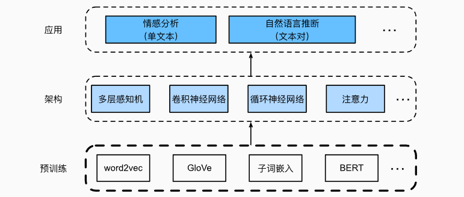

### 自监督训练/预训练

自监督训练模型可以通过有监督地从*海量*文本数据中学习，而不需要*昂贵*的标签标注！

每个单词或子词视为单个词元，可以通过：

- word2vec、GloVe或子词嵌入模型预训练，然后每个词元被表示为一个**与上下文无关**的向量
- Transformer编码器，词元的表示适应于上下文。

预训练好的文本表示可以放入各种深度学习架构，应用于不同自然语言处理任务（本章主要研究上游文本的预训练）

### 词编码

#### one-hot

图像分类中常用，把类别标签编码为一个个矢量，如猫是001,狗是010,

#### word2vec

独热编码的问题是无法表达不同词之间的相似度

[word2vec](https://code.google.com/archive/p/word2vec/)工具是为了解决上述问题而提出的。它将每个词映射到一个固定长度的向量，这些向量能更好地表达不同词之间的相似性和类比关系。word2vec工具包含两个模型，即*跳元模型*（skip-gram） [[Mikolov et al., 2013b\]](https://zh.d2l.ai/chapter_references/zreferences.html#mikolov-sutskever-chen-ea-2013)和*连续词袋*（CBOW） [[Mikolov et al., 2013a\]](https://zh.d2l.ai/chapter_references/zreferences.html#mikolov-chen-corrado-ea-2013)。对于在语义上有意义的表示，它们的训练依赖于条件概率，条件概率可以被看作是使用语料库中一些词来预测另一些单词。由于是不带标签的数据，因此跳元模型和连续词袋都是**自监督模型**。

#### 跳元模型

用一个词生成周围词。

给定中心词“loves”，跳元模型考虑生成*上下文词*“the”、“man”、“him”、“son”的条件概率：

$$P(\textrm{"the"},\textrm{"man"},\textrm{"his"},\textrm{"son"}\mid\textrm{"loves"}).$$

假设上下文词是在给定中心词的情况下独立生成的（即条件独立性）。在这种情况下，上述条件概率可以重写为：
$$
P(\textrm{"the"}\mid\textrm{"loves"})\cdot P(\textrm{"man"}\mid\textrm{"loves"})\cdot P(\textrm{"his"}\mid\textrm{"loves"})\cdot P(\textrm{"son"}\mid\textrm{"loves"}).
$$
在跳元模型中，每个词都有两个d维向量表示

给定中心词wc（词典中的索引c），生成任何上下文词wo（词典中的索引o）的条件概率可以通过对向量点积的softmax操作来建模：
$$
P(w_o \mid w_c) = \frac{\text{exp}(\mathbf{u}_o^\top \mathbf{v}_c)}{ \sum_{i \in \mathcal{V}} \text{exp}(\mathbf{u}_i^\top \mathbf{v}_c)},
$$
跳元模型的似然函数是在给定任何中心词的情况下生成所有上下文词的概率：
$$
\prod_{t=1}^{T} \prod_{-m \leq j \leq m,\ j \neq 0} P(w^{(t+j)} \mid w^{(t)}),
$$
跳元模型参数是词表中每个词的中心词向量和上下文词向量。在训练中，我们通过最大化似然函数（即极大似然估计）来学习模型参数。这相当于最小化以下损失函数：
$$
- \sum_{t=1}^{T} \sum_{-m \leq j \leq m,\ j \neq 0} \text{log}\, P(w^{(t+j)} \mid w^{(t)}).
$$

#### 连续词袋模型

假设中心词是基于其在文本序列中的周围上下文词生成的。即用周围词生成中心词
$$
P(\textrm{"loves"}\mid\textrm{"the"},\textrm{"man"},\textrm{"his"},\textrm{"son"}).
$$
似然函数
$$
\prod_{t=1}^{T}  P(w^{(t)} \mid  w^{(t-m)}, \ldots, w^{(t-1)}, w^{(t+1)}, \ldots, w^{(t+m)}).
$$
