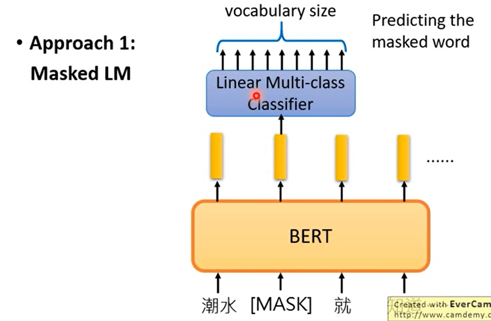

BERT = Encoder of Transformer（只有编码器没有解码器）

learned from a large amount of text without annotation

### masked LM

盖住句子中某一个词；BERT猜测被盖住的词是啥；

把[mask]的词的输出（representation）丢入Linear Multi-class Classifier，即可得到。

如果两个词填在同一个地方没有违和感，那么他们的embedding类似；

### 下一句预测

两个特殊token：

- [SEP]：两个句子的分界
- [CLS]：它的输出丢入线性二分器（Yes or No）；为何在开头？Bert内部不是RNN（无需正向），而是transformer，对距离不敏感。

**注意这两个任务是同时训练的（效果最好）。**

Bert作为获得representation的工具。

### 结合下游任务

预训练好的Bert与下游任务的linear Classifier 一起训练。Bert只需要微调。

#### 任务一：句子情感分析

#### 任务二：每个单词的类别

#### 任务三：自然语言推断

#### 任务四：基于问题的答案

### enhanced representation through knowledge integration（ERNIE）

为中文而设计的。一次盖住一个词而不是字

### Bert每一层

每一层都类似一个pipeline，对应一个子任务，

https://arxiv.org/abs/1905.05950

https://openreview.net/pdf?id=SJzSgnRcKX

### Multilingual BERT

多语言版，104种语言；

