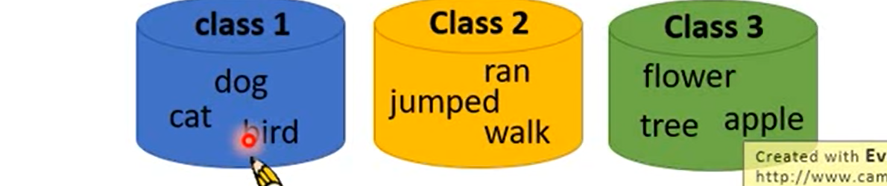
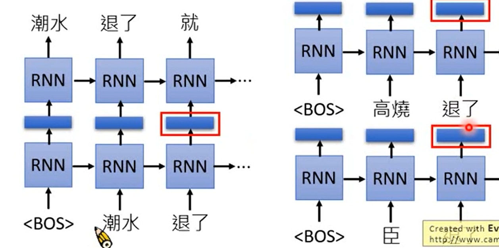
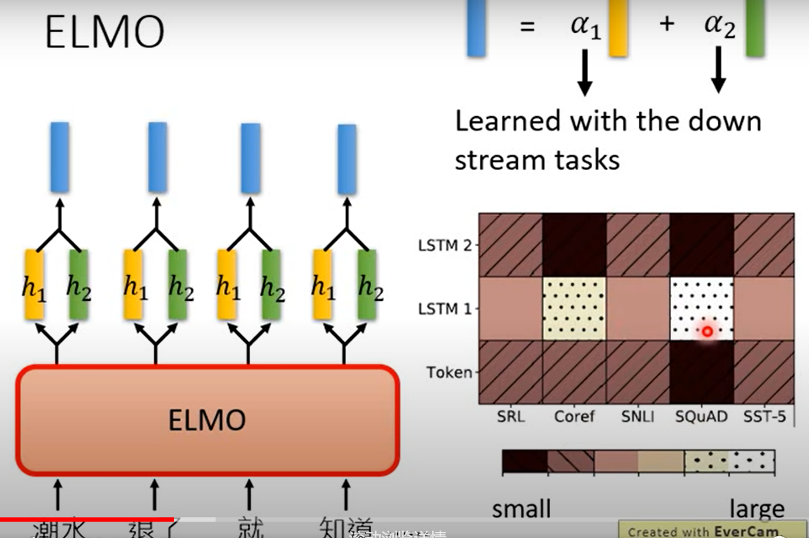

把文字变成向量

### 1-of-N Encoding

```
apple = [1 0 0 0]
bag   = [0 1 0 0 0]
```

### Word Class



### word Embedding

#### 一个词有多个意思

### contextualized word embedding

### Embedding from Language Model（ELMO）

RNN-based language model



只考虑了前文而无后文

在深度网络中，应该使用哪一个embedding？

从多个层中加权叠加。权重系数也是学习得到的。

