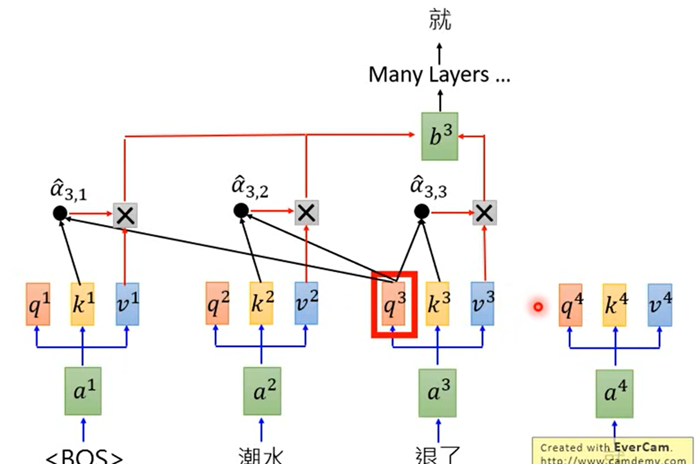

Generative Pre_Training（GPT）

transformer的Decoder（BERT是Encoder）

<figure align="center"> a为token，查询q要与上下文的k做self attention，再与每一个v做乘积求和得到输出 </figure>

### zero-shot learning

- reading comprehension：完全无需标签数据（BERT需要）
- summarization
- translation

## GPT的新意

先在无标注的文本做预训练，然后再用有标注的文本微调。

#### 问题

- 如何设定目标函数？
- transfer另一个子任务

### introduce

transformer比RNN具有更好的迁移性能（transformer更稳定） 

编码器与解码器的区别：解码器由于掩码的存在只能看到前面的词；

（Bert能看到上下文，但中间某些词被遮住了）；GPT只能看到上文，预测（未来的）下文（更难）；

## GPT-2

unsupervised multitask learner

- 做了一个更大数据集 WebText
- 更大的模型参数(34M --> 1.5B)
- **zero shot**(最大卖点)：对下游任务更友好

`多任务学习`：多个输入数据，多个损失函数

### zero shot的关键

输入要足够有代表性，不能在下游任务中出现之前未出现的符号，所以预训练模型需要输入特殊符号

比如promt；

### 训练数据

如何去除无效信息；利用网络中已经有人过滤过的信息（如Reddit网站）

使用四个不同参数的模型，结果表明模型越大，性能越强（暗示性能还有随着模型提升空间）（此时QA问答系统还是很弱）

## GPT-3

few-shot learners：不再是zero-shot

175B 参数；下游任务没有微调（参数太多也难以计算梯度）

- 需要微调产生好结果，可能不代表预训练模型好
- few-shot

### few-shot

比zero-shot强，帮助理解新的任务

但是对于真的有很多下游任务对应的训练数据，也很难将其放入模型中（不更新权重也就是说不能调整或训练了）

### 训练数据

使用更大更脏的common Crawl

- 以其作为负例，用reddit作为正类，得到二分器，获得更多正例
- 去重，使用lsh算法，如果两个文章相似则去除

每一个批次中，common crawl只占60%

### 计算量

数据固定，模型增大，计算量指数增加，精度线性增加

### 局限性

- 只能往前看，训练限制
- 无法分清词的重要性
- 对其他类型的输入（图音像等）无法起效
- **对新任务是重新学还是从记忆库里找类似的东西？**
- 训练太贵；可解释性很差。

#### 参考

[GPT，GPT-2，GPT-3 论文精读【论文精读】_哔哩哔哩_bilibili](https://www.bilibili.com/video/BV1AF411b7xQ/?spm_id_from=333.999.0.0&vd_source=51835ba198b79c5277a5fcadc11bd9ff)