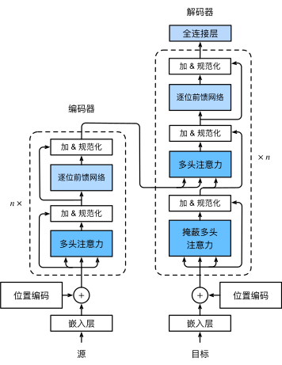

自注意力同时具有并行计算和最短的最大路径长度这两个优势

### 模型

Transformer作为编码器－解码器架构的一个实例。正如所见到的，transformer是由编码器和解码器组成的。与 基于Bahdanau注意力实现的序列到序列的学习相比，transformer的编码器和解码器是基于自注意力的模块叠加而成的，源（输入）序列和目标（输出）序列的*嵌入*（embedding）表示将加上*位置编码*（positional encoding），再分别输入到编码器和解码器中

编码器：多头自注意力、前馈网络、残差连接、层规范化

解码器：解码器还在这两个子层之间插入了第三个子层，称为*编码器－解码器注意力*（encoder-decoder attention）层。

在编码器－解码器注意力中，**查询**来自前一个**解码器层**的输出，而**键和值**来自整个**编码器**的输出。

解码器中的每个位置只能考虑该位置之前的所有位置。这种*掩蔽*（masked）注意力保留了*自回归*（auto-regressive）属性，确保预测仅依赖于已生成的输出词元。

