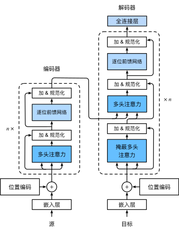

### 1. CNN的问题

对于长序列难以处理（cnn本质是加窗）

multi-attention： 类似CNN中多输出

本质：编码器——解码器结构（但解码器是自回归，即解码器的输出要继续作为输入得到下一个输出。而编码器是全局输入的）

### 2. 模型

Transformer作为`编码器－解码器`架构的一个实例。正如所见到的，transformer是由编码器和解码器组成的。与 基于Bahdanau注意力实现的序列到序列的学习相比，transformer的编码器和解码器是基于自注意力的模块叠加而成的，源（输入）序列和目标（输出）序列的*嵌入*（embedding）表示将加上*位置编码*（positional encoding），再分别输入到编码器和解码器中

编码器：多头自注意力、前馈网络、残差连接、层规范化

解码器：解码器还在这两个子层之间插入了第三个子层，称为*编码器－解码器注意力*（encoder-decoder attention）层。

在编码器－解码器注意力中，**查询**来自前一个**解码器层**的输出，而**键和值**来自整个**编码器**的输出。

解码器中的每个位置只能考虑该位置之前的所有位置。这种*掩蔽*（masked）注意力保留了*自回归*（auto-regressive）属性，确保预测仅依赖于已生成的输出词元。

**自注意力同时具有并行计算和最短的最大路径长度这两个优势**

### 3.1 输入：

input embedding；嵌入层；把word变成向量

positional encoding：位置

### 3.2 编码器

Nx：N个layer，包含两个子层：多头自注意力+MLP；都是残差形式；用固定模型，便于输入输出的尺寸一致；

layerNorm：对梯度求解等有好处

Attention：

#### 前馈神经网络

基于位置的前馈网络对序列中的所有位置的表示进行变换时使用的是同一个多层感知机（MLP），这就是称前馈网络是*基于位置的*（positionwise）的原因。在下面的实现中，输入`X`的形状（批量大小，时间步数或序列长度，隐单元数或特征维度）将被一个两层的感知机转换成形状为（批量大小，时间步数，`ffn_num_outputs`）的输出张量

#### 层规范化

层规范化是基于特征维度进行规范化。；尽管批量规范化在计算机视觉中被广泛应用，但在自然语言处理任务中（输入通常是变长序列）批量规范化通常不如层规范化的效果好。

### 3.3 解码器

和编码器核心是一样的结构

masked multi-head attention：实际输入是全部的，但预测应该只看到t时刻之前的，所以使用一个掩码；

正如在本节前面所述，在掩蔽多头解码器自注意力层（第一个子层）中，查询、键和值都来自上一个解码器层的输出。关于*序列到序列模型*（sequence-to-sequence model），**在训练阶段**，其输出序列的所有位置（时间步）的词元都是已知的；然而，**在预测阶段**，其输出序列的词元是逐个生成的。因此，在任何解码器时间步中，只有生成的词元才能用于解码器的自注意力计算中。为了在解码器中保留自回归的属性，其掩蔽自注意力设定了参数`dec_valid_lens`，以便任何查询都只会与解码器中所有已经生成词元的位置（即直到该查询位置为止）进行注意力计算。

参考：[Transformer论文逐段精读【论文精读】_哔哩哔哩_bilibili](https://www.bilibili.com/video/BV1pu411o7BE/)

后续代码来源：[hyunwoongko/transformer: PyTorch Implementation of "Attention Is All You Need" (github.com)](https://github.com/hyunwoongko/transformer)
