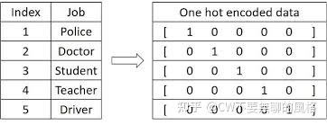
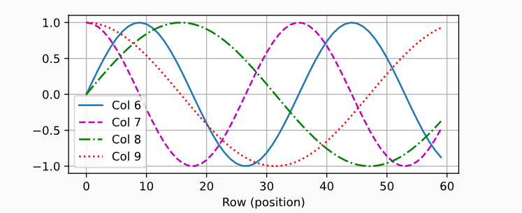
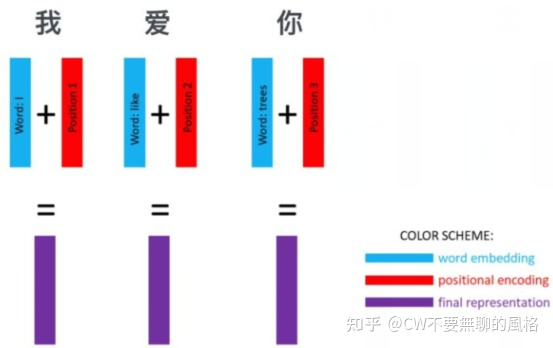

### One-Hot Encoding

在CV中，经常将图片转换为4维（batch, channel, height, weight）张量来表示；

而在NLP中，一般将输入单词用One-Hot形式编码成`序列向量`，这个（一维）向量长度是预定义的词汇表中拥有的单词量（比如中文一般字有数千，长度也就是几千）。向量在向量中有一个为1，其余为0；参见[独热编码](../../基础/数据——独热编码.md)




### Word Embedding

One-Hot 的形式看上去很简洁，也挺美，但劣势在于它很**稀疏**，而且向量很长。同时无法体现出**词与词之间的关系**。

`Word Embedding`使得意思相近的词有相近的表示结果。

如何设计这种方法？一个途径是：设计一个**可学习的权重矩阵W**，将词向量与这个矩阵进行点乘，得到新的表示结果。

其实，可以将这种方式看作是一个 **lookup table**：对于每个 word，进行 word embedding 就相当于一个lookup操作，在表中查出一个对应结果。

在 Pytorch 框架下，可以使用 *torch.nn.Embedding*来实现 word embedding：

```python
class Embeddings(nn.Module):
    def __init__(self, d_model, vocab):
        super(Embeddings, self).__init__()

        self.lut = nn.Embedding(vocab, d_model)
        self.d_model = d_model

    def forward(self, x):
        return self.lut(x) * math.sqrt(self.d_model)
```

其中，*vocab* 代表词汇表中的单词量，one-hot 编码后词向量的长度就是这个值；*d_model*代表权重矩阵的列数，通常为512，就是要将词向量的维度从 *vocab 编码*到 *d_model*。


### Position Embedding

transformer需要加入词在句子中的位置信息，结合了这种方式的词嵌入就是 **Position Embedding** 了

两种方案：

- 通过NN来学习
- 预定义个函数，计算出位置信息

transformer对比两种方案，效果相当，所以选择第二种（减少需要学习的参数）；

#### 绝对位置编码

函数为：
$$
\text{PE}(pos,2i)=sin\left(\frac{pos}{10000^{2i/d_{model}}}\right),\\
\text{PE}(pos,2i+1)=cos\left(\frac{pos}{10000^{2i/d_{model}}}\right).
$$


在位置嵌入矩阵P中， 行代表词元在序列中的位置，列代表位置编码的不同维度。*pos* 代表的是词在句子中的位置，*d*_model 是词向量的维度（通常经过 word embedding 后是512），*2i* 代表的是 *d* 中的偶数维度，(*2i + 1)* 则代表的是奇数维度，这种计算方式使得每一维都对应一个正弦曲线。在下面的例子中，我们可以看到位置嵌入矩阵的第6列和第7列的频率高于第8列和第9列。 第6列和第7列之间的偏移量（第8列和第9列相同）是由于正弦函数和余弦函数的交替。



#### 相对位置编码

可以用一个转换函数表示两个的相对位置
$$
\begin{split}\begin{aligned}
&\begin{bmatrix} \cos(\delta \omega_j) & \sin(\delta \omega_j) \\  -\sin(\delta \omega_j) & \cos(\delta \omega_j) \\ \end{bmatrix}
\begin{bmatrix} p_{i, 2j} \\  p_{i, 2j+1} \\ \end{bmatrix}\\
=&\begin{bmatrix} \cos(\delta \omega_j) \sin(i \omega_j) + \sin(\delta \omega_j) \cos(i \omega_j) \\  -\sin(\delta \omega_j) \sin(i \omega_j) + \cos(\delta \omega_j) \cos(i \omega_j) \\ \end{bmatrix}\\
=&\begin{bmatrix} \sin\left((i+\delta) \omega_j\right) \\  \cos\left((i+\delta) \omega_j\right) \\ \end{bmatrix}\\
=&
\begin{bmatrix} p_{i+\delta, 2j} \\  p_{i+\delta, 2j+1} \\ \end{bmatrix},
\end{aligned}\end{split}
$$


**为何使用三角函数呢？**

由于三角函数的性质： sin(a+b) = sin(a)cos(b) + cos(a)sin(b)、 cos(a+b) = cos(a)cos(b) - sin(a)sin(b)，于是，对于位置 pos+k 处的信息，可以由 pos 位置计算得到，作者认为这样可以让模型更容易地学习到位置信息。

**为何使用这种方式编码能够代表不同位置信息呢？**

由公式可知，**每一维 $i$ 都对应不同周期的正余弦曲线**： 对于不同的两个位置 pos1 和 pos2 ，若它们在某一维 $i$ 上有相同的编码值，则说明这两个位置的差值等于该维所在曲线的周期，即 $|pos1−pos2|=T_i$ 。而对于另一个维度 $j(j\neq i)$ ，由于 $T_j\neq T_i$ ，因此 pos1 和 pos2 在这个维度 $j$ 上的编码值就不会相等，对于其它任意 $k\in\{0,1,2,..,d−1\};k\neq i$ 也是如此。

综上可知，这种编码方式保证了**不同位置在所有维度上不会被编码到完全一样的值**，从而使每个位置都获得独一无二的编码。

### Tokenizer

`spacy是一个NLP的python库

```python
class Tokenizer:

    def __init__(self):
        self.spacy_de = spacy.load('de_core_news_sm')
        self.spacy_en = spacy.load('en_core_web_sm')

    def tokenize_de(self, text):
        """
        Tokenizes German text from a string into a list of strings
        """
        return [tok.text for tok in self.spacy_de.tokenizer(text)]

    def tokenize_en(self, text):
        """
        Tokenizes English text from a string into a list of strings
        """
        return [tok.text for tok in self.spacy_en.tokenizer(text)]

```


### 代码

```python
class TransformerEmbedding(nn.Module):
    """
    token embedding + positional encoding (sinusoid)
    positional encoding can give positional information to network
    """

    def __init__(self, vocab_size, d_model, max_len, drop_prob, device):
        """
        class for word embedding that included positional information
        :param vocab_size: size of vocabulary
        :param d_model: dimensions of model
        """
        super(TransformerEmbedding, self).__init__()
        self.tok_emb = TokenEmbedding(vocab_size, d_model)
        self.pos_emb = PositionalEncoding(d_model, max_len, device)
        self.drop_out = nn.Dropout(p=drop_prob)

    def forward(self, x):
        tok_emb = self.tok_emb(x) # 借用nn.Embedding返回词嵌入结果
        pos_emb = self.pos_emb(x) # 返回位置编码（三角函数。输入为x，但实际使用的是其维度）
        return self.drop_out(tok_emb + pos_emb) # 为何相加？
```

**为何是相加而非拼接(concat)呢？**

这是因为 **Transformer 通常会对原始输入做一个嵌入(embedding)，从而映射到需要的维度，可采用一个变换矩阵做矩阵乘积的方式来实现，上述代码中的输入 x 其实就是已经变换后的表示，而非原输入**。


由变换结果可知，**在原输入上 concat 一个代表位置信息的向量在经过线性变换后 等同于 将原输入经线性变换后直接加上位置编码信息。**




#### 参考：

[Transformer 修炼之道（一）、Input Embedding - 知乎 (zhihu.com)](https://zhuanlan.zhihu.com/p/372279569)

[transformer/transformer_embedding.py at master · hyunwoongko/transformer (github.com)](https://github.com/hyunwoongko/transformer/blob/master/models/embedding/transformer_embedding.py)

[10.6. 自注意力和位置编码 — 动手学深度学习 2.0.0 documentation (d2l.ai)](https://zh.d2l.ai/chapter_attention-mechanisms/self-attention-and-positional-encoding.html)