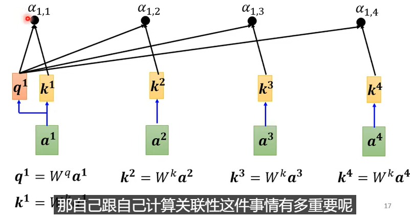
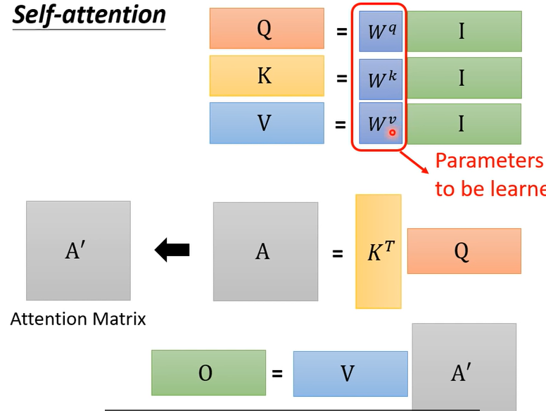
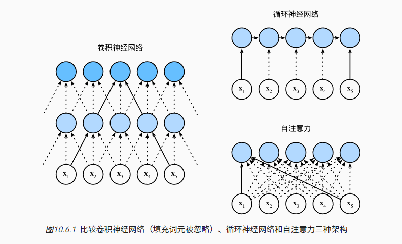

## 1. 注意力

### 生物学中的注意力

非自主性注意力

自主性注意力

### 查询、键、值

“是否包含自主性提示”将注意力机制与全连接层或汇聚层区别开来

在注意力机制的背景下，我们将自主性提示称为*查询*（query）。 给定任何查询，注意力机制通过*注意力汇聚*（attention pooling） 将选择引导至*感官输入*（sensory inputs，例如中间特征表示）

所以关键在于查询的存在？


## 注意力汇聚（池化？）

如何定义Q、K和V

#### Nadaraya-Watson核回归模型

求一个x和y之间的回归模型；假定K为核函数，

$$f(x) = \sum_{i=1}^n \frac{K(x - x_i)}{\sum_{j=1}^n K(x - x_j)} y_i,$$

非参数注意力：使用高斯核。

$$K(u) = \frac{1}{\sqrt{2\pi}} \exp(-\frac{u^2}{2}).$$

参数化注意力(多了一个权重系数w）：

$$\begin{split}\begin{aligned}f(x) &= \sum_{i=1}^n \alpha(x, x_i) y_i \\&= \sum_{i=1}^n \frac{\exp\left(-\frac{1}{2}((x - x_i)w)^2\right)}{\sum_{j=1}^n \exp\left(-\frac{1}{2}((x - x_j)w)^2\right)} y_i \\&= \sum_{i=1}^n \mathrm{softmax}\left(-\frac{1}{2}((x - x_i)w)^2\right) y_i.\end{aligned}\end{split}$$


## 注意力评价函数

令高斯核中的指数部分视为*注意力评分函数*（attention scoring function）， 然后把这个函数的输出结果输入到softmax函数中进行运算。 通过上述步骤，我们将得到与键对应的值的概率分布（即注意力权重）。 最后，注意力汇聚的输出就是基于这些注意力权重的值的加权和。

#### 掩蔽softmax操作

在某些情况下，并非所有的值都应该被纳入到注意力汇聚中，为了去掉某些无意义的序列

#### 加性注意力

为确保无论向量长度如何， 点积的**方差**在不考虑向量长度的情况下仍然是1， 我们将点积除以$\sqrt d$， 则*缩放点积注意力*（scaled dot-product attention）评分函数为：
$$
a(\mathbf q, \mathbf k) = \mathbf{q}^\top \mathbf{k}  /\sqrt{d}.
$$
得到
$$
\mathrm{softmax}\left(\frac{\mathbf Q \mathbf K^\top }{\sqrt{d}}\right) \mathbf V \in \mathbb{R}^{n\times v}.
$$


#### 缩放点积注意力

使用点积可以得到计算效率更高的评分函数， 但是点积操作要求查询和键具有相同的长度d，

[10.3. 注意力评分函数 — 动手学深度学习 2.0.0-beta0 documentation (d2l.ai)](https://zh.d2l.ai/chapter_attention-mechanisms/attention-scoring-functions.html)

## 2. 自注意力机制

自注意力层的输入是特征向量矩阵（比如多个词向量组成的矩阵 ），而在后面的其它层，输入则是前一层的输出。多头自注意力层由多个自注意力层组成，其输出由其中的每个自注意力层的输出拼接而成，我们可以先来看看单个自注意力层的操作。

利用注意力机制来“动态”地生成不同连接的权重，使得权重与数据本身的重要性相关：
$$
Q=W_QX,\, K=W_KX,\, V=W_V X
$$
上式可以看出，$Q,K,V$都是通过$X$做线性变化得到的（即一个`nn.Linea`，不加激活函数)，权重矩阵$W_Q,W_K,W_V$通过注意力来动态调整，因此成为自注意力。也就是说： 由于查询、键和值来自同一组输入(注意这里的输入$X$为矢量），因此被称为 `自注意力`（self-attention）

Q、K、V通过嵌入向量x乘以三个不同权值矩阵$W^Q, W^K, W^V$，这三个矩阵尺寸相同。


#### 输出


$$
Attention(Q,K,V)=\mathrm{softmax}\left(\frac{\mathbf Q \mathbf K^\top }{\sqrt{d}}\right) \mathbf V \in \mathbb{R}^{n\times v}.
$$


这里除以$\sqrt{d}$ 原因是防止Q和K的点积值过大（ $d_k$ 即Q的列数，也是K的行数），避免在经过softmax后梯度太小。

#### 代码

```python
class ScaleDotProductAttention(nn.Module):
    """
    compute scale dot product attention
    Query : given sentence that we focused on (decoder)
    Key : every sentence to check relationship with Qeury(encoder)
    Value : every sentence same with Key (encoder)
    """

    def __init__(self):
        super(ScaleDotProductAttention, self).__init__()
        self.softmax = nn.Softmax(dim=-1)

    def forward(self, q, k, v, mask=None, e=1e-12):
        # input is 4 dimension tensor
        # [batch_size, head, length, d_tensor]
        batch_size, head, length, d_tensor = k.size()

        # 1. dot product Query with Key^T to compute similarity
        k_t = k.transpose(2, 3)  # transpose
        score = (q @ k_t) / math.sqrt(d_tensor)  # scaled dot product

        # 2. apply masking (opt)
        if mask is not None:
            score = score.masked_fill(mask == 0, -10000)

        # 3. pass them softmax to make [0, 1] range
        score = self.softmax(score)

        # 4. multiply with Value
        v = score @ v # @ repsresent matrix multiply

        return v, score
```

### 图示

这里x为标量

attention：计算相似度，可以用dot-product、addictive



之后可以用soft-max归一化，也可以用其他


b的值可能决定于α，那么b越大可能接近于相对应的v的值

输入是I，即原始输入值经过hidden layer得到，，输出是O，self-attention的操作为：




### 比较卷积神经网络、循环神经网络和自注意力

让我们比较下面几个架构，目标都是将由n个词元组成的序列映射到另一个长度相等的序列，其中的每个输入词元或输出词元都由d维向量表示。具体来说，我们将比较的是卷积神经网络、循环神经网络和自注意力这几个架构的计算复杂性、顺序操作和最大路径长度。请注意，顺序操作会妨碍并行计算，而任意的序列位置组合之间的路径越短，则能更轻松地学习序列中的远距离依赖关系 [[Hochreiter et al., 2001\]](https://zh.d2l.ai/chapter_references/zreferences.html#hochreiter-bengio-frasconi-ea-2001)。



总而言之，卷积神经网络和自注意力都拥有并行计算的优势， 而且自注意力的最大路径长度最短。 但是因为其计算复杂度是关于序列长度的二次方，所以在很长的序列中计算会非常慢。

## 3. 多头自注意力

### 介绍

希望模型可以基于相同的注意力机制学习到不同的行为， 然后将不同的行为作为知识组合起来， 捕获序列内各种范围的依赖关系 （例如，短距离依赖和长距离依赖关系）。 因此，允许注意力机制组合使用查询、键和值的不同 *子空间表示*（representation subspaces）可能是有益的。


#### 数学表达

每个注意头：
$$
\mathbf{h}_i = f(\mathbf W_i^{(q)}\mathbf q, \mathbf W_i^{(k)}\mathbf k,\mathbf W_i^{(v)}\mathbf v) \in \mathbb R^{p_v},
$$
W表示可学习的参数，f表示注意力汇聚的函数； f可以是 [10.3节](https://zh.d2l.ai/chapter_attention-mechanisms/attention-scoring-functions.html#sec-attention-scoring-functions)中的 加性注意力和缩放点积注意力。 多头注意力的输出需要经过另一个线性转换， 它对应着h个头连结后的结果，因此其可学习参数是 $W_o$
$$
\begin{split}\mathbf W_o \begin{bmatrix}\mathbf h_1\\\vdots\\\mathbf h_h\end{bmatrix} \in \mathbb{R}^{p_o}.\end{split}
$$


### 代码

```python
class MultiHeadAttention(nn.Module):

    def __init__(self, d_model, n_head):
        super(MultiHeadAttention, self).__init__()
        self.n_head = n_head
        self.attention = ScaleDotProductAttention()
        self.w_q = nn.Linear(d_model, d_model)
        self.w_k = nn.Linear(d_model, d_model)
        self.w_v = nn.Linear(d_model, d_model)
        self.w_concat = nn.Linear(d_model, d_model)

    def forward(self, q, k, v, mask=None):
        # 1. dot product with weight matrices
        q, k, v = self.w_q(q), self.w_k(k), self.w_v(v) # self-attention中q，k，v都是输入x

        # 2. split tensor by number of heads
        q, k, v = self.split(q), self.split(k), self.split(v)

        # 3. do scale dot product to compute similarity
        out, attention = self.attention(q, k, v, mask=mask)

        # 4. concat and pass to linear layer
        out = self.concat(out)
        out = self.w_concat(out)

        # 5. visualize attention map
        # TODO : we should implement visualization

        return out

    def split(self, tensor):
        """
        split tensor by number of head
        :param tensor: [batch_size, length, d_model]
        :return: [batch_size, head, length, d_tensor]
        """
        batch_size, length, d_model = tensor.size()

        d_tensor = d_model // self.n_head
        # copy `d_tesnor` weights for multi head.
        tensor = tensor.view(batch_size, length, self.n_head, d_tensor).transpose(1, 2)  
        # it is similar with group convolution (split by number of heads)

        return tensor

    def concat(self, tensor):
        """
        inverse function of self.split(tensor : torch.Tensor)
        :param tensor: [batch_size, head, length, d_tensor]
        :return: [batch_size, length, d_model]
        """
        batch_size, head, length, d_tensor = tensor.size()
        d_model = head * d_tensor

        tensor = tensor.transpose(1, 2).contiguous().view(batch_size, length, d_model)
        return tensor
```


## 其他

## attention vs CNN

attention不需要人为指定filter


**对比RNN：可以并行处理**

### 应用

- seq2seq问题都可以用transformer
  - 比如做文章总结

### universal transformer

RNN架构，每个neural用transformer

#### 参考

[Transformer 修炼之道（二）、Encoder - 知乎 (zhihu.com)](https://zhuanlan.zhihu.com/p/372308377)

[10.6. 自注意力和位置编码 — 动手学深度学习 2.0.0 documentation (d2l.ai)](https://zh.d2l.ai/chapter_attention-mechanisms/self-attention-and-positional-encoding.html)

[10.5. 多头注意力 — 动手学深度学习 2.0.0 documentation (d2l.ai)](https://zh.d2l.ai/chapter_attention-mechanisms/multihead-attention.html)

[【機器學習2021】自注意力機制 (Self-attention) (下) - YouTube](https://www.youtube.com/watch?v=gmsMY5kc-zw)