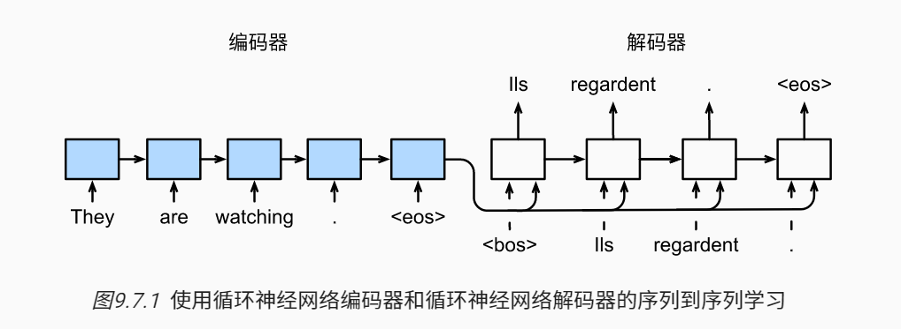
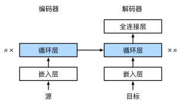

### 循环网络的模型

特定的“<eos>”表示序列结束词元。 一旦输出序列生成此词元，模型就会停止预测。

### 损失函数

类似于语言模型，可以使用softmax来获得分布， 并通过计算交叉熵损失函数来进行优化

现在，我们可以通过扩展softmax交叉熵损失函数来遮蔽不相关的预测。 最初，所有预测词元的掩码都设置为1。 一旦给定了有效长度，与填充词元对应的掩码将被设置为0。 最后，将所有词元的损失乘以掩码，以过滤掉损失中填充词元产生的不相关预测。

#### 参考

[9.7. 序列到序列学习（seq2seq） — 动手学深度学习 2.0.0 documentation (d2l.ai)](https://zh.d2l.ai/chapter_recurrent-modern/seq2seq.html)