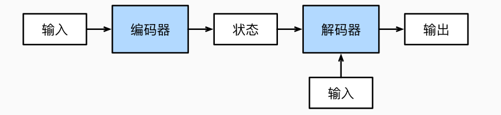

机器翻译中，其输入和输出都是长度可变的序列，

**编码器**：接受长度可变的序列作为输入，并转换为具有固定形状的编码状态；

**解码器**：将固定形状的编码状态映射到长度可变的序列




```python
class Transformer(nn.Module):

    def __init__(self, src_pad_idx, trg_pad_idx, trg_sos_idx, enc_voc_size, dec_voc_size, d_model, n_head, max_len,
                 ffn_hidden, n_layers, drop_prob, device):
        super().__init__()
        self.src_pad_idx = src_pad_idx
        self.trg_pad_idx = trg_pad_idx
        self.trg_sos_idx = trg_sos_idx
        self.device = device
        self.encoder = Encoder(d_model=d_model,
                               n_head=n_head,
                               max_len=max_len,
                               ffn_hidden=ffn_hidden,
                               enc_voc_size=enc_voc_size,
                               drop_prob=drop_prob,
                               n_layers=n_layers,
                               device=device)

        self.decoder = Decoder(d_model=d_model,
                               n_head=n_head,
                               max_len=max_len,
                               ffn_hidden=ffn_hidden,
                               dec_voc_size=dec_voc_size,
                               drop_prob=drop_prob,
                               n_layers=n_layers,
                               device=device)

    def forward(self, src, trg):
        src_mask = self.make_pad_mask(src, src, self.src_pad_idx, self.src_pad_idx)

        src_trg_mask = self.make_pad_mask(trg, src, self.trg_pad_idx, self.src_pad_idx)

        trg_mask = self.make_pad_mask(trg, trg, self.trg_pad_idx, self.trg_pad_idx) * \
                   self.make_no_peak_mask(trg, trg)

        enc_src = self.encoder(src, src_mask)
        output = self.decoder(trg, enc_src, trg_mask, src_trg_mask)
        return output

    def make_pad_mask(self, q, k, q_pad_idx, k_pad_idx):
        len_q, len_k = q.size(1), k.size(1)

        # batch_size x 1 x 1 x len_k
        k = k.ne(k_pad_idx).unsqueeze(1).unsqueeze(2) # ne对比对应元素，相同为false
        # batch_size x 1 x len_q x len_k
        k = k.repeat(1, 1, len_q, 1)

        # batch_size x 1 x len_q x 1
        q = q.ne(q_pad_idx).unsqueeze(1).unsqueeze(3)
        # batch_size x 1 x len_q x len_k
        q = q.repeat(1, 1, 1, len_k)

        mask = k & q
        return mask

    def make_no_peak_mask(self, q, k):
        len_q, len_k = q.size(1), k.size(1)

        # len_q x len_k
        mask = torch.tril(torch.ones(len_q, len_k)).type(torch.BoolTensor).to(self.device)

        return mask
```


### 训练

```python
"""
@author : Hyunwoong
@when : 2019-10-22
@homepage : https://github.com/gusdnd852
"""
import math
import time

from torch import nn, optim
from torch.optim import Adam

from data import *
from models.model.transformer import Transformer
from util.bleu import idx_to_word, get_bleu
from util.epoch_timer import epoch_time


def count_parameters(model):
    return sum(p.numel() for p in model.parameters() if p.requires_grad)


def initialize_weights(m):
    if hasattr(m, 'weight') and m.weight.dim() > 1:
        nn.init.kaiming_uniform(m.weight.data)


model = Transformer(src_pad_idx=src_pad_idx,
                    trg_pad_idx=trg_pad_idx,
                    trg_sos_idx=trg_sos_idx,
                    d_model=d_model,
                    enc_voc_size=enc_voc_size,
                    dec_voc_size=dec_voc_size,
                    max_len=max_len,
                    ffn_hidden=ffn_hidden,
                    n_head=n_heads,
                    n_layers=n_layers,
                    drop_prob=drop_prob,
                    device=device).to(device)

print(f'The model has {count_parameters(model):,} trainable parameters')
model.apply(initialize_weights)
optimizer = Adam(params=model.parameters(),
                 lr=init_lr,
                 weight_decay=weight_decay,
                 eps=adam_eps)

scheduler = optim.lr_scheduler.ReduceLROnPlateau(optimizer=optimizer,
                                                 verbose=True,
                                                 factor=factor,
                                                 patience=patience)

criterion = nn.CrossEntropyLoss(ignore_index=src_pad_idx)


def train(model, iterator, optimizer, criterion, clip):
    model.train()
    epoch_loss = 0
    for i, batch in enumerate(iterator):
        src = batch.src
        trg = batch.trg

        optimizer.zero_grad()
        output = model(src, trg[:, :-1])
        output_reshape = output.contiguous().view(-1, output.shape[-1])
        trg = trg[:, 1:].contiguous().view(-1)

        loss = criterion(output_reshape, trg)
        loss.backward()
        torch.nn.utils.clip_grad_norm_(model.parameters(), clip)
        optimizer.step()

        epoch_loss += loss.item()
        print('step :', round((i / len(iterator)) * 100, 2), '% , loss :', loss.item())

    return epoch_loss / len(iterator)


def evaluate(model, iterator, criterion):
    model.eval()
    epoch_loss = 0
    batch_bleu = []
    with torch.no_grad():
        for i, batch in enumerate(iterator):
            src = batch.src
            trg = batch.trg
            output = model(src, trg[:, :-1])
            output_reshape = output.contiguous().view(-1, output.shape[-1])
            trg = trg[:, 1:].contiguous().view(-1)

            loss = criterion(output_reshape, trg)
            epoch_loss += loss.item()

            total_bleu = []
            for j in range(batch_size):
                try:
                    trg_words = idx_to_word(batch.trg[j], loader.target.vocab)
                    output_words = output[j].max(dim=1)[1]
                    output_words = idx_to_word(output_words, loader.target.vocab)
                    bleu = get_bleu(hypotheses=output_words.split(), reference=trg_words.split())
                    total_bleu.append(bleu)
                except:
                    pass

            total_bleu = sum(total_bleu) / len(total_bleu)
            batch_bleu.append(total_bleu)

    batch_bleu = sum(batch_bleu) / len(batch_bleu)
    return epoch_loss / len(iterator), batch_bleu


def run(total_epoch, best_loss):
    train_losses, test_losses, bleus = [], [], []
    for step in range(total_epoch):
        start_time = time.time()
        train_loss = train(model, train_iter, optimizer, criterion, clip)
        valid_loss, bleu = evaluate(model, valid_iter, criterion)
        end_time = time.time()

        if step > warmup:
            scheduler.step(valid_loss)

        train_losses.append(train_loss)
        test_losses.append(valid_loss)
        bleus.append(bleu)
        epoch_mins, epoch_secs = epoch_time(start_time, end_time)

        if valid_loss < best_loss:
            best_loss = valid_loss
            torch.save(model.state_dict(), 'saved/model-{0}.pt'.format(valid_loss))

        f = open('result/train_loss.txt', 'w')
        f.write(str(train_losses))
        f.close()

        f = open('result/bleu.txt', 'w')
        f.write(str(bleus))
        f.close()

        f = open('result/test_loss.txt', 'w')
        f.write(str(test_losses))
        f.close()

        print(f'Epoch: {step + 1} | Time: {epoch_mins}m {epoch_secs}s')
        print(f'\tTrain Loss: {train_loss:.3f} | Train PPL: {math.exp(train_loss):7.3f}')
        print(f'\tVal Loss: {valid_loss:.3f} |  Val PPL: {math.exp(valid_loss):7.3f}')
        print(f'\tBLEU Score: {bleu:.3f}')


if __name__ == '__main__':
    run(total_epoch=epoch, best_loss=inf)
```

### 测试

```python
import math
from collections import Counter

import numpy as np

from data import *
from models.model.transformer import Transformer
from util.bleu import get_bleu, idx_to_word


def count_parameters(model):
    return sum(p.numel() for p in model.parameters() if p.requires_grad)


model = Transformer(src_pad_idx=src_pad_idx,
                    trg_pad_idx=trg_pad_idx,
                    trg_sos_idx=trg_sos_idx,
                    d_model=d_model,
                    enc_voc_size=enc_voc_size,
                    dec_voc_size=dec_voc_size,
                    max_len=max_len,
                    ffn_hidden=ffn_hidden,
                    n_head=n_heads,
                    n_layers=n_layers,
                    drop_prob=0.00,
                    device=device).to(device)

print(f'The model has {count_parameters(model):,} trainable parameters')


def test_model(num_examples):
    iterator = test_iter
    model.load_state_dict(torch.load("./saved/model-saved.pt"))

    with torch.no_grad():
        batch_bleu = []
        for i, batch in enumerate(iterator):
            src = batch.src
            trg = batch.trg
            output = model(src, trg[:, :-1])

            total_bleu = []
            for j in range(num_examples):
                try:
                    src_words = idx_to_word(src[j], loader.source.vocab)
                    trg_words = idx_to_word(trg[j], loader.target.vocab)
                    output_words = output[j].max(dim=1)[1]
                    output_words = idx_to_word(output_words, loader.target.vocab)

                    print('source :', src_words)
                    print('target :', trg_words)
                    print('predicted :', output_words)
                    print()
                    bleu = get_bleu(hypotheses=output_words.split(), reference=trg_words.split())
                    total_bleu.append(bleu)
                except:
                    pass

            total_bleu = sum(total_bleu) / len(total_bleu)
            print('BLEU SCORE = {}'.format(total_bleu))
            batch_bleu.append(total_bleu)

        batch_bleu = sum(batch_bleu) / len(batch_bleu)
        print('TOTAL BLEU SCORE = {}'.format(batch_bleu))


if __name__ == '__main__':
    test_model(num_examples=batch_size)
```


#### 参考：

[10.7. Transformer — 动手学深度学习 2.0.0 documentation (d2l.ai)](https://zh.d2l.ai/chapter_attention-mechanisms/transformer.html)

[transformer/transformer.py at master · hyunwoongko/transformer (github.com)](https://github.com/hyunwoongko/transformer/blob/master/models/model/transformer.py)

[9.6. 编码器-解码器架构 — 动手学深度学习 2.0.0 documentation (d2l.ai)](https://zh.d2l.ai/chapter_recurrent-modern/encoder-decoder.html)