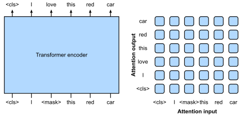
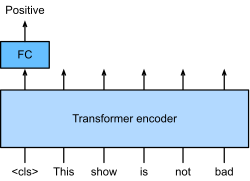
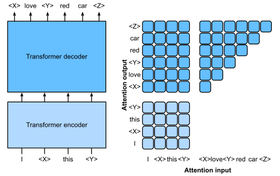
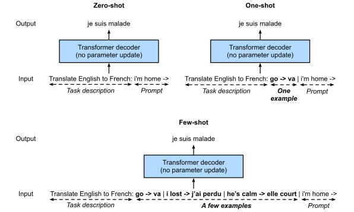

Transformer最重要特征：性能随数据量和模型尺寸增大（似乎还没有见顶）；基于Transformer的语言模型的性能随着模型参数、训练标记和训练计算量的增加而呈幂律扩展([Kaplan *et al.*, 2020](https://d2l.ai/chapter_references/zreferences.html#id488))。

Transformer有三个模式：*encoder-only*, *encoder-decoder*, and *decoder-only*

### Encoder-Only

#### Pretraining BERT

<figure align="center"> Left：Pretraining BERT with masked language modeling. ，掩码的token由上下文来预测；Right：Transformer自编码器中的注意力模式，Each token along the vertical axis attends to all input tokens along the horizontal axis </figure>

Bert是“bidirectional encoder”（双向编码器），根据上下文来推断被掩盖的token

#### Fine-Tuning BERT

在下游任务中，BERT可以通过fine-tuning来针对single text or text pairs。此时需要一个额外的层（随机初始化）加入BERT中

Moreover, BERT inspired Transformer pretraining in computer vision, such as with vision Transformers ([Dosovitskiy *et al.*, 2021](https://d2l.ai/chapter_references/zreferences.html#id60)), Swin Transformers ([Liu *et al.*, 2021](https://d2l.ai/chapter_references/zreferences.html#id458)), and MAE (masked autoencoders) ([He *et al.*, 2022](https://d2l.ai/chapter_references/zreferences.html#id485))

### Encoder-Decoder

Encoder是把输入转化为一个相同数量的representation，所以 encoder-only mode无法应用随机长度的任务比如机器翻译。

Transformer原始架构可以（i）条件化编码器的输出，encoder-decoder cross-attention允许目标token加入到所有 输入token中；（ii）通过*causal* attention（masked multi-head attention ）条件化解码器的输出，any target token can only attend to *past* and *present* tokens in the target sequence。

为了在带标签的数据中 pretrain encoder-decoder Transformers，BART ([Lewis *et al.*, 2019](https://d2l.ai/chapter_references/zreferences.html#id480)) and T5 ([Raffel *et al.*, 2020](https://d2l.ai/chapter_references/zreferences.html#id474)) are two concurrently proposed encoder-decoder Transformers pretrained on large-scale text corpora.

#### Pretraining T5

<figure align="center"> Left：Pretraining T5，原始句子为I love this red car,；Right：Attention pattern，下边为编码器自注意力，all input tokens attend to each other;在encoder-decoder cross-attention (upper rectangle)中， each target token attends to all input tokens；在解码器自注意力中 (upper triangle), each target token attends to present and past target tokens only (causal)。 </figure>

### Decoder-Only

该模式取出来整个编码器和encoder-decoder cross-attention。该模式已经成为大语言模型的主流。

#### GPT 和GPT-2

使用Transformer 解码器作为 backbone ([Radford *et al.*, 2018](https://d2l.ai/chapter_references/zreferences.html#id224))

这是一个自回归语言模型；只能用上文来预测下文；

GPT-2：pre-normalization (discussed in [Section 11.8.3](https://d2l.ai/chapter_attention-mechanisms-and-transformers/vision-transformer.html#subsec-vit-encoder)) and improved initialization and weight-scaling were adopted

#### GPT-3

GPT-2已经显示了未经微调即可应用到下游任务的前景，这让计算更有效率。

a pretrained language model may generate the task output as a sequence *without parameter update*, conditional on an input sequence with the task description, task-specific input-output examples, and a prompt (task input). This learning paradigm is called *in-context learning* ([Brown *et al.*, 2020](https://d2l.ai/chapter_references/zreferences.html#id473)), which can be further categorized into *zero-shot*, *one-shot*, and *few-shot*, when there is no, one, and a few task-specific input-output examples, respectively ([Fig. 11.9.7](https://d2l.ai/chapter_attention-mechanisms-and-transformers/large-pretraining-transformers.html#fig-gpt-3-xshot)).

#### 参考

[11.9. Large-Scale Pretraining with Transformers — Dive into Deep Learning 1.0.0-beta0 documentation (d2l.ai)](https://d2l.ai/chapter_attention-mechanisms-and-transformers/large-pretraining-transformers.html)
