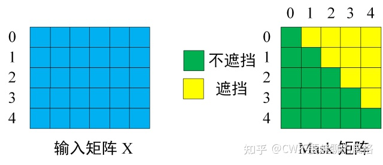

Transformer解码器也是由多个相同的层叠加而成的，并且层中使用了残差连接和层规范化。除了编码器中描述的两个子层之外，解码器还在这两个子层之间插入了第三个子层，称为`编码器－解码器注意力`（encoder-decoder attention）层。在编码器－解码器注意力中，**查询来自前一个解码器层的输出，而键和值来自整个编码器的输出**。在`解码器自注意力`中，查询、**键和值都来自上一个解码器层的输出**。但是，解码器中的每个位置只能考虑该位置之前的所有位置。这种*掩蔽*（masked）注意力保留了*自回归*（auto-regressive）属性，确保预测仅依赖于已生成的输出词元。

### Decoder Layer

```python
class DecoderLayer(nn.Module):

    def __init__(self, d_model, ffn_hidden, n_head, drop_prob):
        super(DecoderLayer, self).__init__()
        self.self_attention = MultiHeadAttention(d_model=d_model, n_head=n_head)
        self.norm1 = LayerNorm(d_model=d_model)
        self.dropout1 = nn.Dropout(p=drop_prob)

        self.enc_dec_attention = MultiHeadAttention(d_model=d_model, n_head=n_head)
        self.norm2 = LayerNorm(d_model=d_model)
        self.dropout2 = nn.Dropout(p=drop_prob)

        self.ffn = PositionwiseFeedForward(d_model=d_model, hidden=ffn_hidden, drop_prob=drop_prob)
        self.norm3 = LayerNorm(d_model=d_model)
        self.dropout3 = nn.Dropout(p=drop_prob)

    def forward(self, dec, enc, t_mask, s_mask):
        # 1. compute self attention
        _x = dec
        x = self.self_attention(q=dec, k=dec, v=dec, mask=t_mask)
        
        # 2. add and norm
        x = self.dropout1(x)
        x = self.norm1(x + _x)

        if enc is not None:
            # 3. compute encoder - decoder attention
            _x = x
            x = self.enc_dec_attention(q=x, k=enc, v=enc, mask=s_mask)
            
            # 4. add and norm
            x = self.dropout2(x)
            x = self.norm2(x + _x)

        # 5. positionwise feed forward network
        _x = x
        x = self.ffn(x)
        
        # 6. add and norm
        x = self.dropout3(x)
        x = self.norm3(x + _x)
        return 
```


### 掩膜（mask）

**掩膜（mask）**的使用**，**目的是**忽略某些位置，不计算与其相关的注意力权重。**

Decoder 是要对序列进行解码预测，所以你不能提前看到要预测的内容，你应当根据当前及之前已解码/预测的内容来推算即将预测的内容。于是，这个mask就是用来遮住后面将要预测的部分。

举个例子，假设当前输入的是 "<Start> I have a dream" (0, 1, 2, 3, 4) 这五个单词组成的向量，那么mask 是一个 5×5 的和注意力权重相同shape的矩阵。但不同于注意力权重矩阵，**mask是一个下三角矩阵，**即矩阵对角线上方部分的值均为0，这样就使得单词 i 不计算与位于其后的单词 i+1, i+2,.. 的关系。



代码中，位于点击注意力计算，利用pytorch的`masked_fill`

> `Tensor.masked_fill_(*mask*, *value*)`
>
> Fills elements of `self` tensor with `value` where `mask` is True. The shape of `mask` must be [broadcastable](https://pytorch.org/docs/1.13/notes/broadcasting.html#broadcasting-semantics) with the shape of the underlying tensor.
>
> - Parameters:
>   **mask** (*BoolTensor*) – the boolean mask
>   **value** ([*float*](https://docs.python.org/3/library/functions.html#float)) – the value to fill in with


```python
class ScaleDotProductAttention(nn.Module):
    """
    compute scale dot product attention
    Query : given sentence that we focused on (decoder)
    Key : every sentence to check relationship with Qeury(encoder)
    Value : every sentence same with Key (encoder)
    """

    def __init__(self):
        super(ScaleDotProductAttention, self).__init__()
        self.softmax = nn.Softmax(dim=-1)

    def forward(self, q, k, v, mask=None, e=1e-12):
        # input is 4 dimension tensor
        # [batch_size, head, length, d_tensor]
        batch_size, head, length, d_tensor = k.size()

        # 1. dot product Query with Key^T to compute similarity
        k_t = k.transpose(2, 3)  # transpose
        score = (q @ k_t) / math.sqrt(d_tensor)  # scaled dot product

        # 2. apply masking (opt)
        if mask is not None:
            score = score.masked_fill(mask == 0, -10000)

        # 3. pass them softmax to make [0, 1] range
        score = self.softmax(score)

        # 4. multiply with Value
        v = score @ v # @ repsresent matrix multiply

        return v, score
```


### Encoer-Decoder Attention

别看这名字挺新颖，**其实它就是多头自注意力**，只不过 **K 和 V 来自 Encoder 的输出，至于 Q：如果是 Decoder 的第一层，则使用（已解码的）输入序列（最开始则是起始字符）；而对于后面的层，则是前面层的输出。**


### Output Generator

这部分实质就是个线性层，将解码的序列映射回原来的空间维度，然后经过softmax（或log-softmax）生成预测概率。

### Decoder

```python
class Decoder(nn.Module):
    def __init__(self, dec_voc_size, max_len, d_model, ffn_hidden, n_head, n_layers, drop_prob, device):
        super().__init__()
        self.emb = TransformerEmbedding(d_model=d_model,
                                        drop_prob=drop_prob,
                                        max_len=max_len,
                                        vocab_size=dec_voc_size,
                                        device=device)

        self.layers = nn.ModuleList([DecoderLayer(d_model=d_model,
                                                  ffn_hidden=ffn_hidden,
                                                  n_head=n_head,
                                                  drop_prob=drop_prob)
                                     for _ in range(n_layers)])

        self.linear = nn.Linear(d_model, dec_voc_size)

    def forward(self, trg, enc_src, trg_mask, src_mask):
        trg = self.emb(trg)

        for layer in self.layers:
            trg = layer(trg, enc_src, trg_mask, src_mask)

        # pass to LM head
        output = self.linear(trg)
        return 
```


#### 参考

[Transformer 修炼之道（三）、Decoder - 知乎 (zhihu.com)](https://zhuanlan.zhihu.com/p/372330923)